# Astra Security Platform — Complete DFD Reference
# All Data Flow Diagrams (Mermaid)
# Generated: 2026-05-09

---

## DFD-00 — Context Diagram (Level 0)
## The entire system as a single process with all external entities

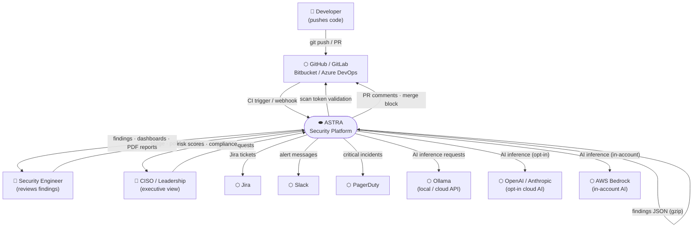

---

## DFD-01 — System Architecture (Level 1)
## Control Plane / Data Plane split with all major subsystems

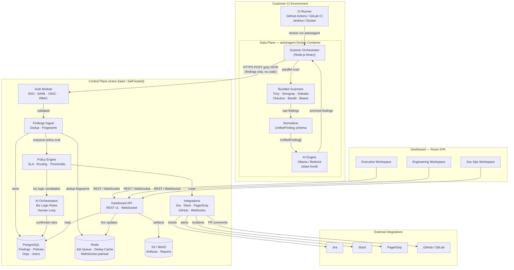

---

## DFD-02 — CI Trigger Flow (Level 2)
## How a git push becomes a scan job

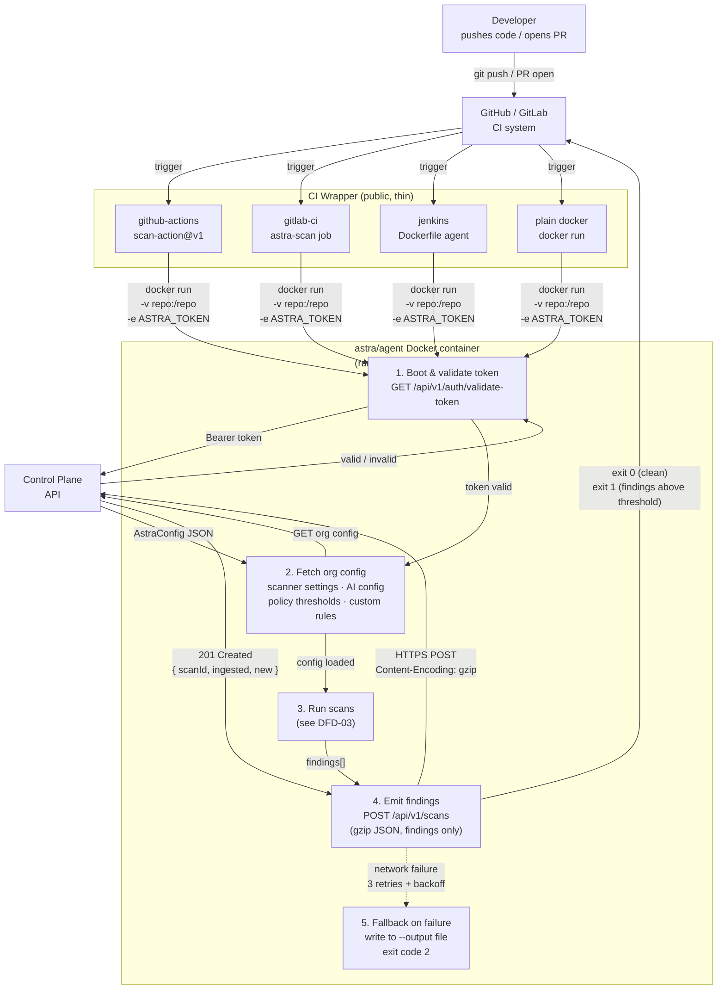

---

## DFD-03 — Scanner Execution Pipeline (Level 2)
## What happens inside the data plane during a scan

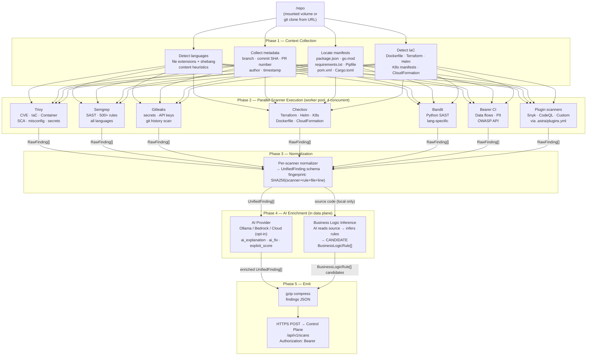

---

## DFD-04 — repo_intel Node (Level 2)
## New: system intelligence before scanning begins

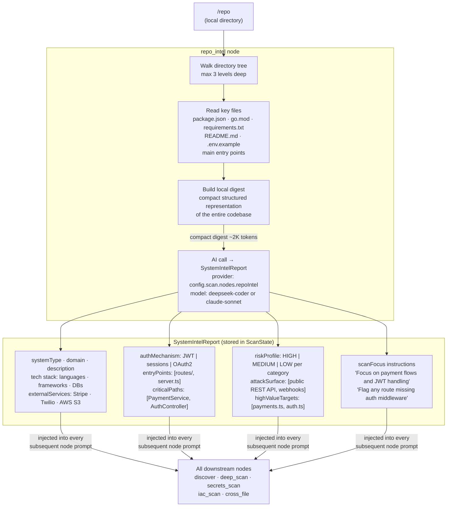

---

## DFD-05 — LangGraph Scan Graph (Level 2)
## The nonlinear DAG pipeline with parallel tracks

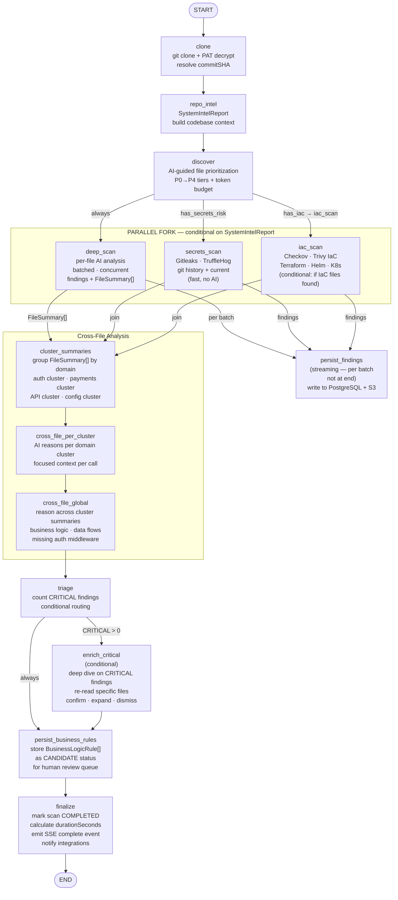

---

## DFD-06 — Job Queue Runtime (Level 2)
## How the PostgreSQL worker actually executes nodes

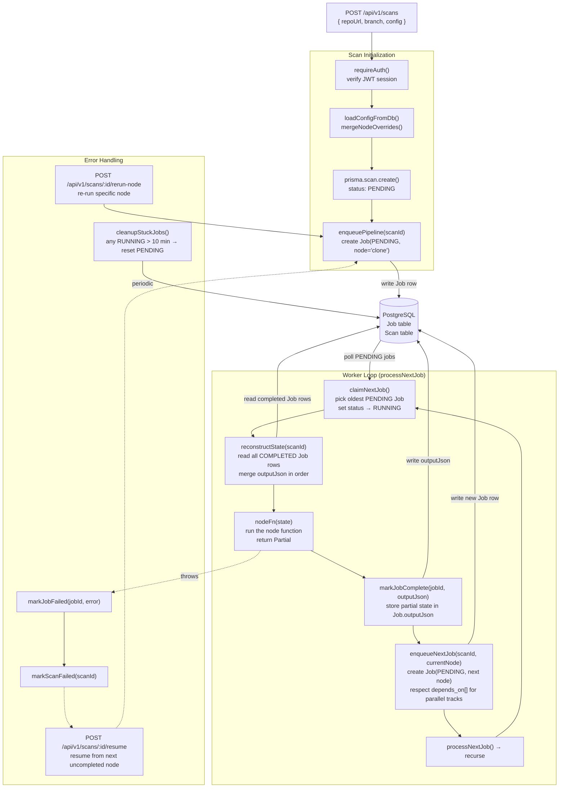

---

## DFD-07 — Control Plane Ingest Pipeline (Level 2)
## What happens when findings arrive at the control plane

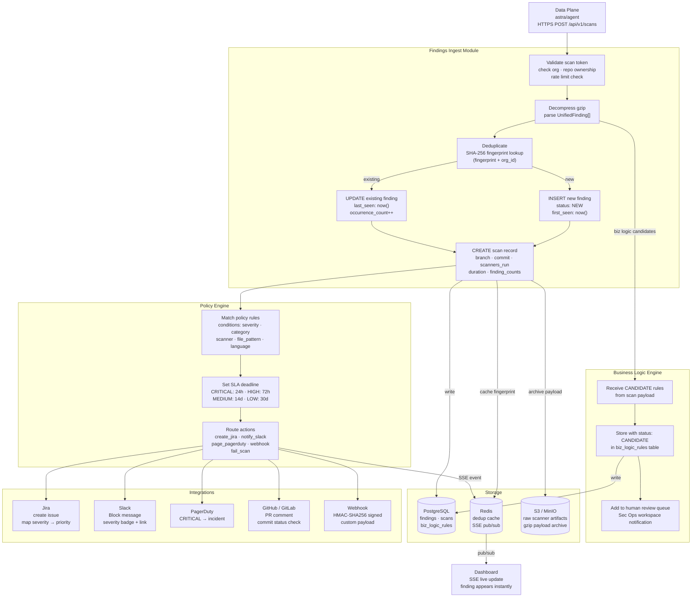

---

## DFD-08 — Authentication & Authorization Flow (Level 2)
## All auth paths: user login, scan token, SSO

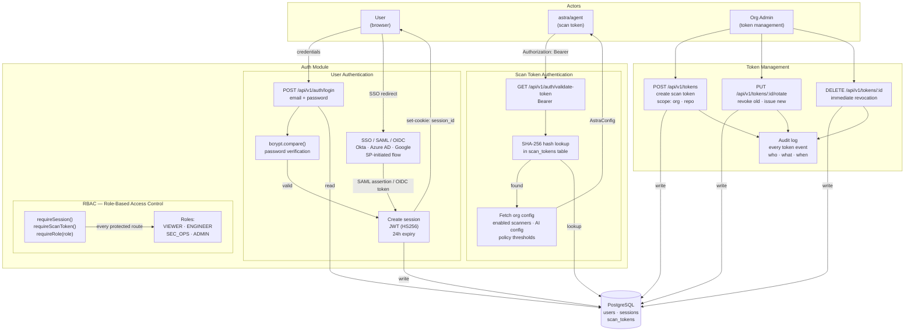

---

## DFD-09 — AI Provider Flow (Level 2)
## How AI calls are made, instrumented, and retried

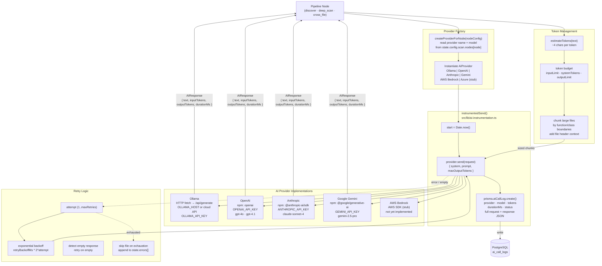

---

## DFD-10 — Business Logic Flaw Engine (Level 2)
## Full lifecycle: inference → human review → enforcement

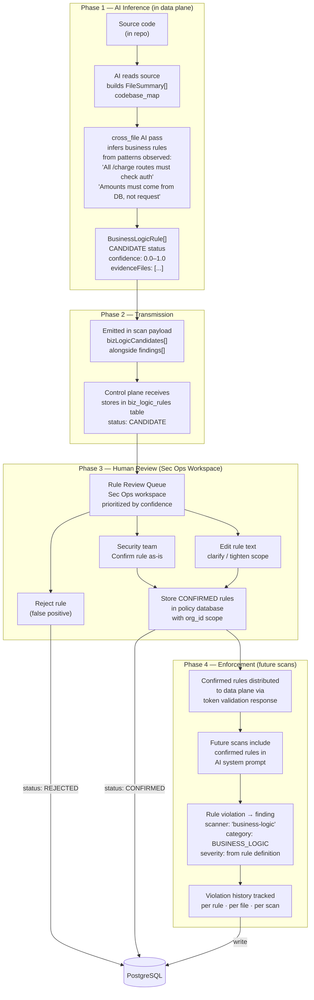

---

## DFD-11 — Finding Triage Pipeline (Level 2)
## From ingest through routing to human resolution

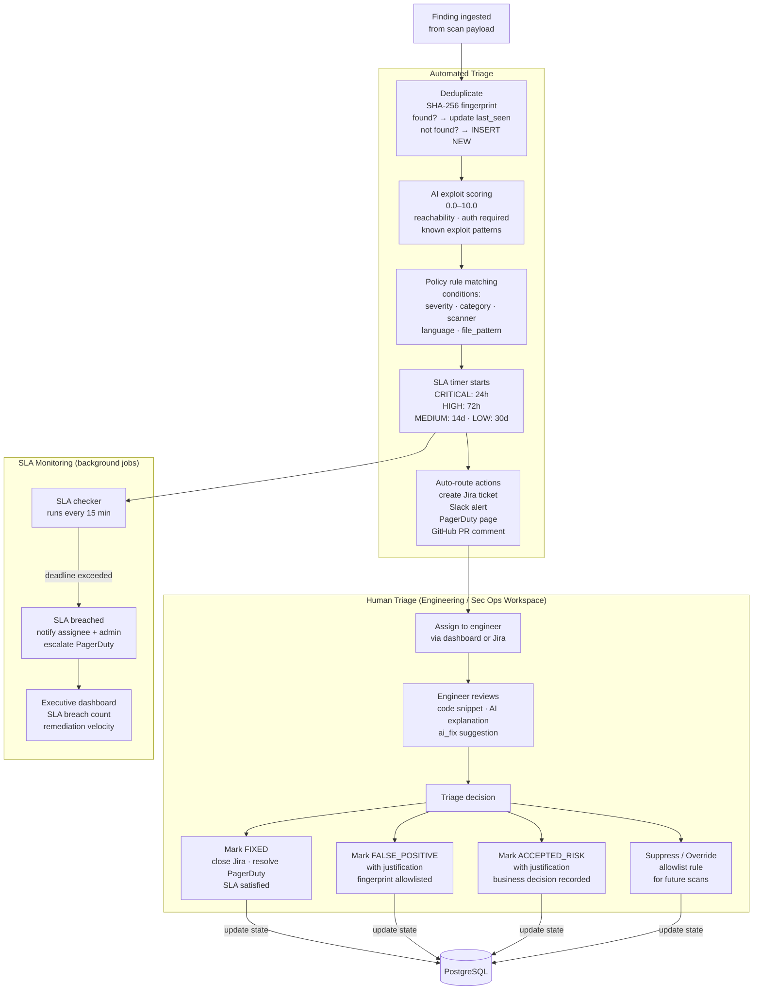

---

## DFD-12 — Data Storage Architecture (Level 2)
## What lives where and why

```mermaid
flowchart TD
    subgraph POSTGRES["PostgreSQL 16 — Source of Truth"]
        ORGS["orgs\nid · name · slug · plan\nai_provider_config (encrypted)\nsso_config · seat_count"]
        USERS["users\nid · org_id · email\npassword_hash · role\nlast_login"]
        REPOS["repos\nid · org_id · name · provider\nprovider_repo_id · default_branch\nlanguages · risk_score"]
        SCAN_TOKENS["scan_tokens\nid · org_id · repo_id\nhash (SHA-256) · name\nlast_used · revoked_at"]
        SCANS["scans\nid · org_id · repo_id\nbranch · commit_sha · pr_number\nstatus · duration_seconds\nscanner_run[] · finding_counts{}"]
        FINDINGS["findings\nid · fingerprint · org_id\nscanner · rule_id · title\nseverity · category · file\nline_start · line_end · code_snippet\ncwe[] · owasp[] · state\nai_explanation · ai_fix · exploit_score\nfirst_seen · last_seen · occurrence_count"]
        POLICIES["policies\nid · org_id · repo_id\nname · conditions{} · actions{}\npriority · enabled"]
        BIZ_RULES["biz_logic_rules\nid · org_id · rule_text\nconfidence · evidence_files[]\nstatus: CANDIDATE|CONFIRMED|REJECTED"]
        JOBS["jobs\nid · scan_id · node · status\ninput_json · output_json\ncreated_at · updated_at"]
        AI_LOGS["ai_call_logs\nid · scan_id · node_id\nprovider · model\ninput_tokens · output_tokens · thinking_tokens\nduration_ms · status\nrequest_json · response_json"]
        AUDIT["audit_log\nid · org_id · user_id\naction · resource_type · resource_id\nbefore{} · after{} · timestamp"]
    end

    subgraph REDIS["Redis 7 — Ephemeral & Real-time"]
        DEDUP_CACHE["Dedup cache\nfingerprint → finding_id\nTTL: 30 days"]
        JOB_QUEUE["Job queue\nBull/BullMQ queues\npending jobs"]
        SSE_PUBSUB["SSE pub/sub\nlive finding notifications\nscan progress updates"]
        SESSIONS["Session store\nJWT session data\nTTL: 24h"]
        RATE_LIMIT["Rate limit counters\nper IP · per token\nTTL: 60s"]
    end

    subgraph S3["S3 / MinIO — Large Objects"]
        ARTIFACTS["Scan artifacts\nraw scanner output JSON\nper scanner per scan"]
        PAYLOADS["Scan payloads\noriginal gzip POST body\ncompressed · 90-day retention"]
        REPORTS["PDF reports\nexecutive reports\ngenerated on demand"]
        SBOM["SBOM exports\nSPDX · CycloneDX\nper repo per scan"]
    end

    FINDINGS -->|"fingerprint lookup"| DEDUP_CACHE
    JOBS -->|"queue pending"| JOB_QUEUE
    FINDINGS -->|"new finding event"| SSE_PUBSUB
    USERS -->|"session data"| SESSIONS
```

---

## DFD-13 — Dashboard Data Flow (Level 2)
## How the React SPA gets and displays data

```mermaid
flowchart TD
    subgraph SPA["React SPA (Next.js 15 App Router)"]
        subgraph EXE["Executive Workspace"]
            RISK_SCORE["Org Risk Score\n0–100 composite\ntrend vs 30 days ago"]
            COMPLIANCE["Compliance Posture\nOWASP Top 10\nCWE Top 25 · SOC 2"]
            TREND_CHART["Finding Trend Chart\nCRITICAL/HIGH/MEDIUM/LOW\nstacked area · 90 days"]
            TOP_REPOS["Top Vulnerable Repos\nrisk score · critical count\nlast scan"]
            SLA_SUMMARY["SLA Breach Summary\ncount by severity\nlink → Sec Ops"]
            VEL["Remediation Velocity\navg time to fix\nby severity · 30 days"]
            PDF_REPORT["Executive PDF Report\ngenerate on demand\nor scheduled email"]
        end

        subgraph ENG["Engineering Workspace"]
            REPO_FINDER["Repo Finder\nsearchable · risk badges"]
            FINDING_LIST["Finding List\nfilter: severity · category\nscanner · state · file · date"]
            FINDING_DETAIL["Finding Detail Panel\ncode snippet · AI explanation\nai_fix · CWE · OWASP\nhistory · PR links"]
            PR_RESULTS["PR Scan Results\nnew vs existing vs resolved\nper PR delta"]
            SUPPRESS_UI["Suppress / Override\nFALSE_POSITIVE\nACCEPTED_RISK + justification"]
        end

        subgraph SECOPS["Sec Ops Workspace"]
            ASSIGN_UI["Finding Assignment\nassign to team members"]
            SLA_TRACKER["SLA Tracker\nsorted by deadline\nbreach countdown timers"]
            JIRA_VIEW["Jira Ticket View\nbi-directional status sync"]
            POLICY_BUILDER["Policy Rule Builder\nno-code condition + action UI"]
            BIZ_QUEUE["Business Logic Rule Queue\nConfirm / Edit / Reject\nCANDIDATE rules"]
            TOKEN_MGR["Scan Token Manager\ncreate · rotate · revoke"]
            AUDIT_LOG["Audit Log\nall user actions\nwho · what · when"]
        end
    end

    subgraph API["Dashboard API"]
        REST["REST v1\n/api/v1/*"]
        WS["WebSocket\nlive updates"]
        GQL["GraphQL (Enterprise)\ncustom queries"]
    end

    subgraph PUSH["Real-time Push"]
        SSE["SSE stream\n/api/v1/scans/:id/progress"]
        PUBSUB["Redis pub/sub\nfinding events"]
    end

    PG[("PostgreSQL")]
    S3[("S3")]

    RISK_SCORE & COMPLIANCE & TREND_CHART & TOP_REPOS & SLA_SUMMARY & VEL -->|"GET"| REST
    PDF_REPORT -->|"POST"| REST
    REPO_FINDER & FINDING_LIST & FINDING_DETAIL & PR_RESULTS -->|"GET"| REST
    SUPPRESS_UI -->|"PATCH"| REST
    ASSIGN_UI & SLA_TRACKER & JIRA_VIEW & TOKEN_MGR & AUDIT_LOG -->|"GET/POST/PATCH"| REST
    POLICY_BUILDER -->|"GET/POST/PUT"| REST
    BIZ_QUEUE -->|"GET/POST (confirm/reject)"| REST
    REST -->|"query"| PG
    REST -->|"read artifacts"| S3
    WS & SSE -->|"subscribe"| PUBSUB
    PUBSUB -->|"publish"| WS & SSE
    FINDING_LIST & TREND_CHART -->|"WebSocket"| WS
```

---

## DFD-14 — Integrations Flow (Level 2)
## How findings route to external systems

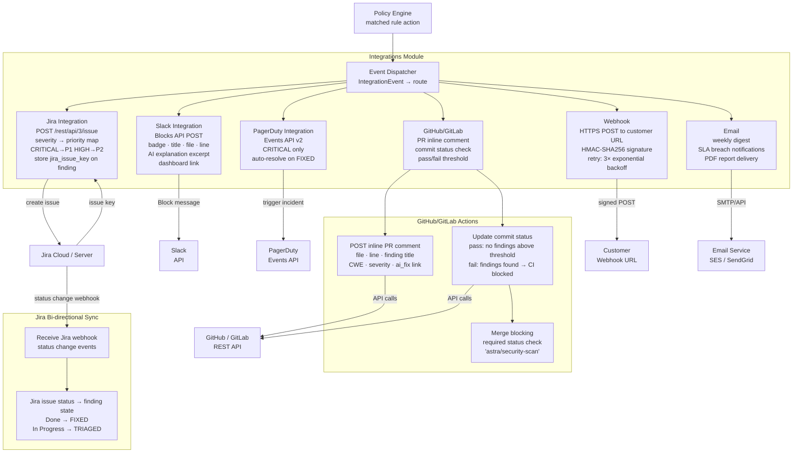

---

## DFD-15 — Deployment Architecture (Level 2)
## How Astra is packaged and deployed in all three modes

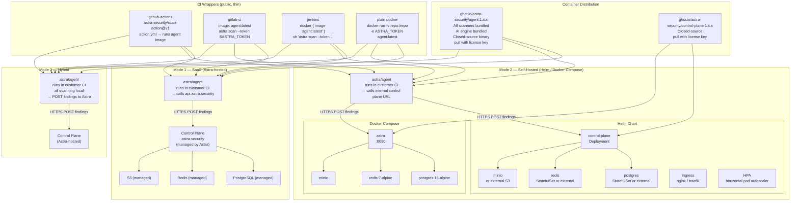

---

## DFD-16 — Security Data Boundary (Level 2)
## What crosses the data plane / control plane boundary — and what never does

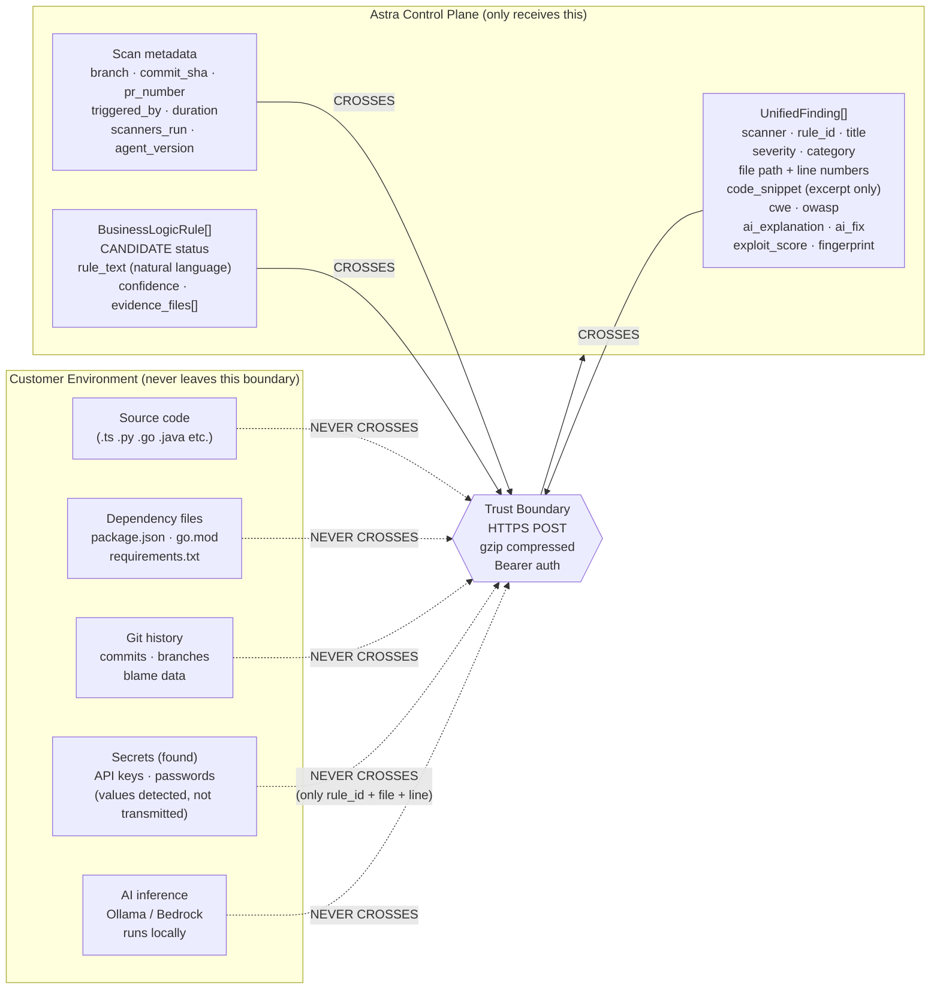

---

## DFD-17 — Agentic Auto-Fix Flow (Level 2)
## How Astra generates and proposes code fixes

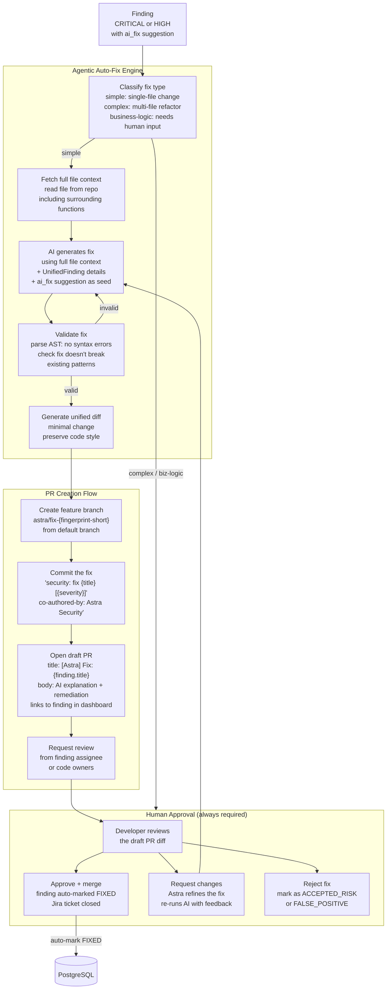

---

## DFD-18 — MCP / AI Agent Integration (Level 2)
## How Astra acts as the security policy layer for AI coding agents

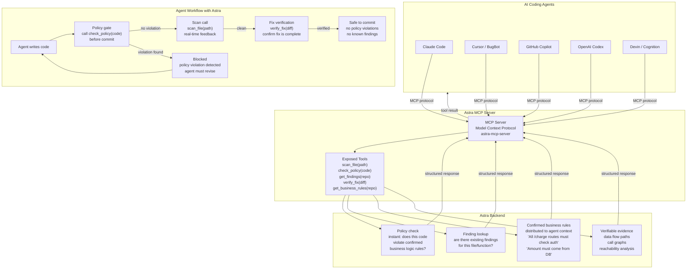

---

## DFD-19 — Observability & Monitoring (Level 2)
## How Astra monitors itself and exposes telemetry

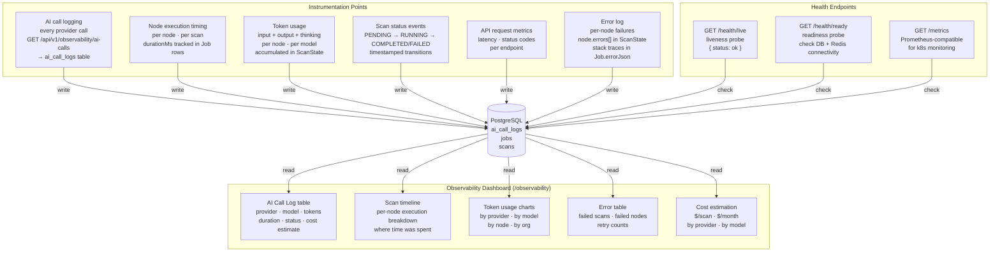
