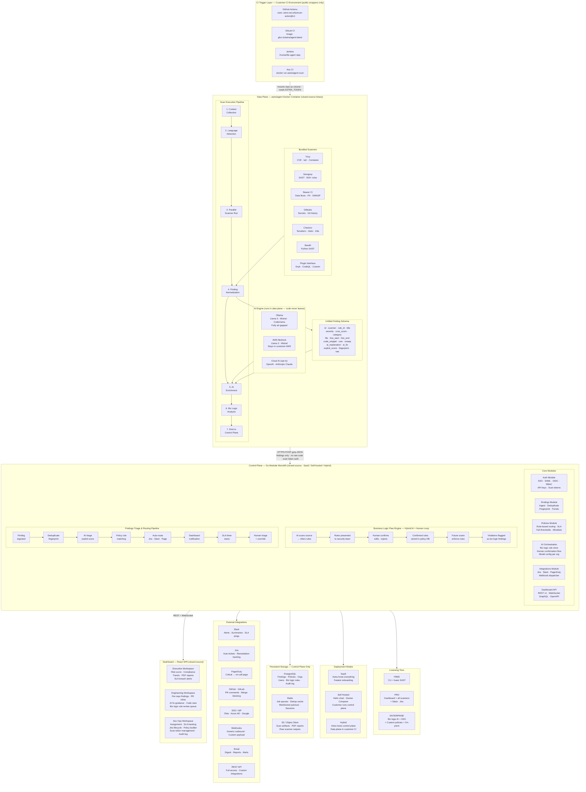

# Astra Security Platform — Infrastructure Diagram

> Full system architecture: Control/Data plane separated, AI-augmented, multi-deployment, closed-source.

## Layer Summary

| Layer | Where it runs | Source visibility |
|---|---|---|
| CI wrapper (action.yml) | Customer CI | Public (zero logic) |
| Data plane agent | Customer CI (Docker container) | Closed-source binary |
| Control plane | Astra-hosted or self-hosted | Closed-source |
| Dashboard | Browser (React SPA) | Closed-source |
| PostgreSQL · Redis · S3 | Control plane infra only | N/A |

## Supported Languages (v1)

Python · JavaScript · TypeScript · Java · Go · Ruby · Rust · Scala · R · Terraform · Dockerfile · YAML

## AI Provider Options (per org, configurable)

| Provider | Where AI runs | Code leaves customer env? |
|---|---|---|
| Ollama (local) | Data plane | No |
| AWS Bedrock | Data plane (customer's AWS) | No |
| OpenAI / Anthropic | Cloud (opt-in only) | Yes — org must explicitly enable |
