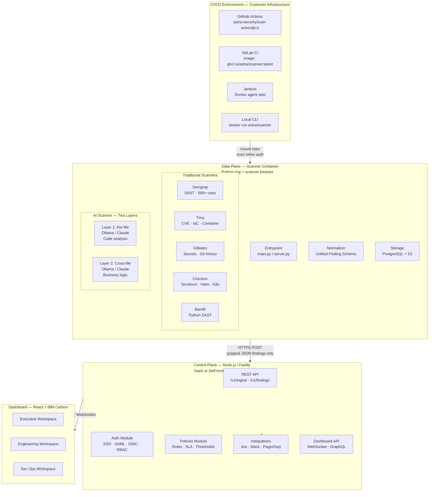

# Astra Security Platform — Architecture Overview

## High-Level System Architecture

---

## Component Responsibilities

| Component | Language | Responsibility |
|-----------|----------|----------------|
| Data Plane Agent | Python | Clone repo, run scanners, AI enrichment, normalize, store |
| Control Plane API | Node.js / Fastify | Auth, findings ingestion, policies, integrations |
| Dashboard | React + Carbon | 3 role-based workspaces, scan triggers, findings display |
| PostgreSQL | SQL | Findings, policies, orgs, users, audit log |
| Redis | In-memory | Job queues, dedup cache, WebSocket pub/sub |
| S3/MinIO | Object store | Scan artifacts, raw scanner outputs, PDF reports |
| Ollama | Go / C++ | Local AI inference (optional sidecar) |

---

## Data Flow Summary

1. **Trigger**: CI pipeline or dashboard initiates scan
2. **Clone**: Data Plane clones repo (or mounts from volume)
3. **Scan**: Traditional scanners run in parallel
4. **AI**: Per-file scan → cross-file business logic analysis
5. **Normalize**: All findings mapped to Unified Finding Schema
6. **Store**: Findings saved to PostgreSQL + raw artifacts to S3
7. **Emit**: Normalized findings POSTed to Control Plane
8. **Display**: Dashboard shows findings with AI explanations and fixes
