# Astra — Data Plane Execution Flow

## Scanner Pipeline (Hyper-Granular)

```mermaid
flowchart TD
    START(["Scan Triggered"]) --> CLONE["1. Clone Repository\ngit clone --depth 1 <repo-url>"]
    
    CLONE --> DETECT["2. Language Detection\nWalk file tree, identify languages"]
    
    DETECT --> PARALLEL["3. Parallel Scanner Execution"]
    
    subgraph TRADITIONAL["Traditional Scanners (asyncio.parallel)"]
        direction LR
        S1["Semgrep\n--config=auto\nJSON output"]
        S2["Trivy\nfs --scanners vuln,misconfig,secret\nJSON output"]
        S3["Gitleaks\ndetect --report-format json"]
        S4["Checkov\n-d /repo --framework all\nJSON output"]
        S5["Bandit\n-r /repo -f json"]
    end
    
    PARALLEL --> TRADITIONAL
    
    TRADITIONAL --> COLLECT["4. Collect Raw Results\nParse JSON from each scanner"]
    
    COLLECT --> WALK["5. File Walker\nEnumerate code files\nSkip: node_modules, .git, vendor, dist"]
    
    WALK --> CHUNK["6. File Chunker\nSplit large files for AI context window"]
    
    CHUNK --> AI1["7. AI Layer 1: Per-file Deep Scan\nFor each code file:\n  → Send to Ollama/Claude\n  → Receive: vulnerabilities + file_summary"]
    
    AI1 --> MAP["8. Build Codebase Map\nAggregate all file_summaries\ninto structured representation"]
    
    MAP --> AI2["9. AI Layer 2: Cross-file Business Logic\nSend codebase_map to AI:\n  → Cross-file attack paths\n  → Missing auth middleware\n  → Privilege escalation\n  → Broken access control\n  → Data flow issues"]
    
    AI2 --> MERGE["10. Merge All Findings\nTraditional + AI Layer 1 + AI Layer 2"]
    
    MERGE --> NORM["11. Normalize to Unified Schema\nMap every finding to:\n  id, scanner, rule_id, title,\n  severity, category, file,\n  line_start, line_end, code_snippet,\n  cwe, owasp, ai_explanation,\n  ai_fix, exploit_score, fingerprint"]
    
    NORM --> DEDUP["12. Deduplicate\nSHA-256 fingerprint per\n(scanner + rule_id + file + line)"]
    
    DEDUP --> ENRICH["13. AI Enrichment (Optional)\nFor HIGH/CRITICAL findings:\n  → Generate fix code\n  → Calculate exploitability score"]
    
    ENRICH --> STORE["14. Persist Findings\n  → PostgreSQL (structured data)\n  → S3 (raw scanner outputs)"]
    
    STORE --> EMIT["15. Emit to Control Plane\nHTTPS POST /v1/ingest\nGzipped JSON, scan token auth"]
    
    EMIT --> END(["Scan Complete"])
    
    style START fill:#0f62fe,color:#fff
    style END fill:#0f62fe,color:#fff
    style TRADITIONAL fill:#f4f4f4,stroke:#161616
    style AI1 fill:#e0e0e0,stroke:#161616
    style AI2 fill:#e0e0e0,stroke:#161616
```

---

## Execution Timing

| Phase | Parallel? | Estimated Duration |
|-------|-----------|-------------------|
| Clone repo | No | 5-30s |
| Language detection | No | 1-2s |
| Traditional scanners | Yes | 30-120s |
| AI Layer 1 (per-file) | Yes (batched) | 60-300s |
| AI Layer 2 (cross-file) | No | 10-30s |
| Normalize + dedup | No | 1-2s |
| AI enrichment | Yes | 30-60s |
| Store + emit | No | 2-5s |
| **Total** | — | **2-8 minutes** |

---

## Resource Requirements

| Resource | CLI Mode | Server Mode |
|----------|----------|-------------|
| CPU | 2-4 cores | 4-8 cores |
| RAM | 4-8 GB | 8-16 GB |
| Disk | 2 GB (repo + tools) | 10 GB (persistent) |
| GPU | Optional (speeds up AI) | Optional |
| Network | Outbound HTTPS only | Inbound + outbound |
