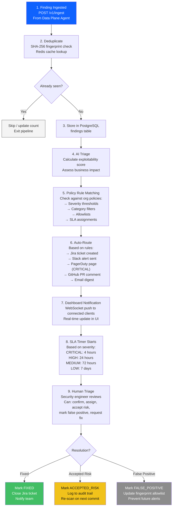
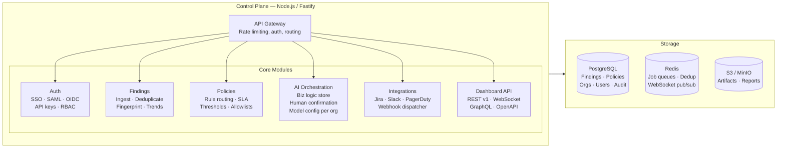

# Astra — Control Plane Flow

## Findings Ingestion & Triage Pipeline



---

## Control Plane API Endpoints

### Authentication
```
POST /v1/auth/login          → SSO/OAuth login
POST /v1/auth/token          → API key exchange
GET  /v1/auth/me             → Current user profile
```

### Findings
```
GET  /v1/findings            → List findings (paginated, filtered)
GET  /v1/findings/:id        → Single finding detail
POST /v1/findings/:id/triage → Update finding status
GET  /v1/findings/trends     → Trending data for dashboard
```

### Scans
```
POST /v1/scans               → Trigger new scan
GET  /v1/scans               → List scan history
GET  /v1/scans/:id           → Scan detail + findings
GET  /v1/scans/:id/status    → Real-time scan status
```

### Policies
```
GET  /v1/policies            → List org policies
POST /v1/policies            → Create new policy
PUT  /v1/policies/:id        → Update policy
DELETE /v1/policies/:id      → Delete policy
```

### Business Logic Rules
```
GET  /v1/biz-logic/rules     → List inferred rules
POST /v1/biz-logic/rules/:id/confirm → Confirm rule
POST /v1/biz-logic/rules/:id/reject  → Reject rule
```

### Integrations
```
POST /v1/integrations/jira/configure
POST /v1/integrations/slack/configure
POST /v1/integrations/pagerduty/configure
POST /v1/integrations/webhook/configure
```

---

## Control Plane Modules


