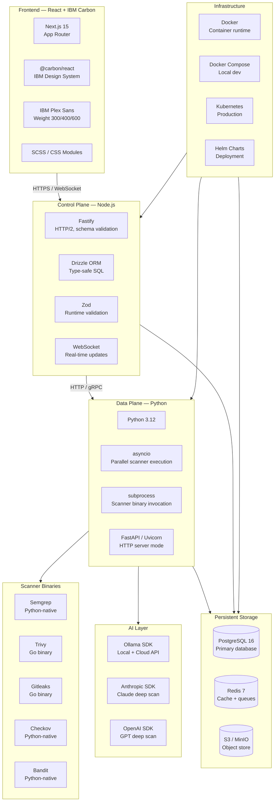

# Astra — Technology Stack

## Full Stack Diagram

---

## Stack Rationale

### Frontend: Next.js + IBM Carbon
- **Why Next.js 15**: App Router, Server Components, API routes in one framework
- **Why IBM Carbon**: Enterprise-grade, IBM's design system, 0px border-radius, weight-300 display type
- **IBM Plex Sans**: Free/open-source SIL OFL, distinctive weight-300 for display

### Control Plane: Node.js + Fastify
- **Why Node.js**: User's stack preference, consistent with frontend
- **Why Fastify**: 3x faster than Express, built-in schema validation, HTTP/2 support
- **Why Drizzle**: Type-safe SQL, better than Prisma for complex queries, lighter weight
- **Why Zod**: Runtime validation, works with both Fastify and TypeScript

### Data Plane: Python
- **Why Python**: Semgrep, Bandit, Checkov are Python-native (importable as libraries)
- **Better subprocess handling**: For invoking Trivy, Gitleaks, Bearer
- **Ollama Python SDK**: First-class support for local + cloud inference
- **Anthropic/OpenAI SDKs**: Native Python libraries for deep scanning

### Storage
- **PostgreSQL**: Relational data (findings, policies, users, audit log)
- **Redis**: Job queues, dedup cache, WebSocket pub/sub, sessions
- **S3/MinIO**: Raw scanner outputs, PDF reports, scan artifacts

### Infrastructure
- **Docker**: Container runtime for both Data Plane and Control Plane
- **Docker Compose**: Local development and self-hosted deployments
- **Kubernetes + Helm**: Production SaaS deployments

---

## Language Support Matrix

| Language | Semgrep | Trivy | Gitleaks | Checkov | Bandit | AI Scan |
|----------|---------|-------|----------|---------|--------|---------|
| Python | ✅ | ✅ | ✅ | ❌ | ✅ | ✅ |
| JavaScript/TypeScript | ✅ | ✅ | ✅ | ❌ | ❌ | ✅ |
| Java | ✅ | ✅ | ✅ | ❌ | ❌ | ✅ |
| Go | ✅ | ✅ | ✅ | ❌ | ❌ | ✅ |
| Ruby | ✅ | ✅ | ✅ | ❌ | ❌ | ✅ |
| Rust | ✅ | ✅ | ✅ | ❌ | ❌ | ✅ |
| Terraform | ✅ | ✅ | ✅ | ✅ | ❌ | ✅ |
| Dockerfile | ✅ | ✅ | ✅ | ✅ | ❌ | ✅ |
| YAML/JSON | ✅ | ✅ | ✅ | ✅ | ❌ | ✅ |
| Helm/K8s | ✅ | ✅ | ✅ | ✅ | ❌ | ✅ |

---

## AI Provider Comparison

| Provider | Model | Speed | Cost | Privacy | Use Case |
|----------|-------|-------|------|---------|----------|
| Ollama Local | deepseek-coder:6.7b | Slow | Free | Air-gapped | Per-file scan |
| Ollama Local | llama3:8b | Slow | Free | Air-gapped | Business logic |
| Ollama Cloud | deepseek-coder | Fast | Low | Cloud-hosted | Per-file scan |
| Ollama Cloud | llama3 | Fast | Low | Cloud-hosted | Business logic |
| Anthropic Claude | claude-sonnet-4-6 | Fast | High | Cloud (opt-in) | Deep scan |
| OpenAI | gpt-4o | Fast | High | Cloud (opt-in) | Deep scan |
