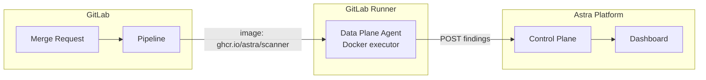
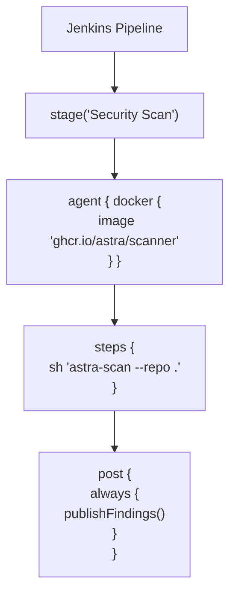
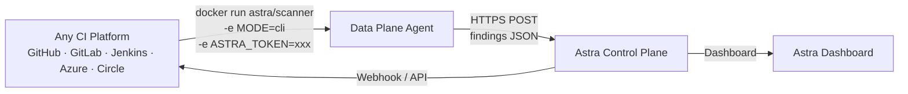

# Astra — CI/CD Integration Flow

## GitHub Actions Integration

```mermaid
sequenceDiagram
    actor Dev as Developer
    participant GH as GitHub
    participant GHA as GitHub Actions
    participant DP as Data Plane Agent
    participant OLL as Ollama
    participant CP as Control Plane
    participant SL as Slack
    participant JI as Jira

    Dev->>GH: Push code / Open PR
    GH->>GHA: Trigger workflow
    
    rect rgb(240, 244, 248)
        Note over GHA,DP: Data Plane Execution
        GHA->>DP: docker run astra/scanner
        DP->>DP: git clone --depth 1
        DP->>DP: Run Semgrep, Trivy, Gitleaks
        DP->>OLL: AI per-file scan
        OLL-->>DP: File findings + summaries
        DP->>OLL: AI cross-file analysis
        OLL-->>DP: Business logic findings
        DP->>DP: Normalize + deduplicate
    end
    
    DP->>CP: POST /v1/ingest (findings)
    
    rect rgb(248, 244, 240)
        Note over CP,JI: Control Plane Processing
        CP->>CP: Deduplicate fingerprint
        CP->>CP: AI triage + scoring
        CP->>CP: Policy rule matching
        
        alt CRITICAL finding found
            CP->>SL: Alert: CRITICAL finding
            CP->>JI: Create ticket: P0
        else HIGH finding
            CP->>JI: Create ticket: P1
        end
        
        CP->>GH: PR comment with findings
    end
    
    CP-->>GHA: Scan complete (status)
    GHA->>GH: Update PR checks
    
    alt Fail threshold exceeded
        GH->>Dev: Block merge
    else Pass
        GH->>Dev: Allow merge
    end
```



---

## GitLab CI Integration



### .gitlab-ci.yml Example

```yaml
stages:
  - scan

astra-scan:
  stage: scan
  image: ghcr.io/astra/scanner:latest
  variables:
    MODE: cli
    ASTRA_TOKEN: $ASTRA_API_TOKEN
    OLLAMA_API_KEY: $OLLAMA_API_KEY
  script:
    - astra-scan --repo . --branch $CI_COMMIT_REF_NAME
  artifacts:
    reports:
      sast: astra-findings.json
  allow_failure: true
```

---

## Jenkins Integration



### Jenkinsfile Example

```groovy
pipeline {
    agent any
    stages {
        stage('Security Scan') {
            agent {
                docker {
                    image 'ghcr.io/astra/scanner:latest'
                    args '-v /var/run/docker.sock:/var/run/docker.sock'
                }
            }
            steps {
                sh '''
                    export MODE=cli
                    export ASTRA_TOKEN=credentials('astra-token')
                    astra-scan --repo . --branch ${env.BRANCH_NAME}
                '''
            }
            post {
                always {
                    publishHTML([
                        reportDir: 'astra-report',
                        reportFiles: 'index.html',
                        reportName: 'Astra Security Report'
                    ])
                }
            }
        }
    }
}
```

---

## Generic CI Integration (Any Platform)



### Universal Docker Command

```bash
docker run --rm \
  -v $(pwd):/repo \
  -e MODE=cli \
  -e ASTRA_TOKEN=${ASTRA_TOKEN} \
  -e OLLAMA_API_KEY=${OLLAMA_API_KEY} \
  -e POSTGRES_URL=${POSTGRES_URL} \
  ghcr.io/astra/scanner:latest \
  astra-scan --repo /repo --branch ${BRANCH_NAME}
```

---

## Scan Action Wrapper (Minimal Public Code)

The public-facing CI wrapper contains ZERO business logic. It's just a thin shell that pulls and runs the closed-source Docker image.

```yaml
# .github/workflows/astra-scan.yml (public wrapper)
name: Astra Security Scan
on: [push, pull_request]
jobs:
  scan:
    runs-on: ubuntu-latest
    steps:
      - uses: actions/checkout@v4
      - uses: astra-security/scan-action@v1
        with:
          token: ${{ secrets.ASTRA_TOKEN }}
          ollama-api-key: ${{ secrets.OLLAMA_API_KEY }}
```

```typescript
// scan-action/src/main.ts (public, minimal)
import * as exec from '@actions/exec';

async function run() {
  const token = core.getInput('token');
  const ollamaKey = core.getInput('ollama-api-key');
  
  await exec.exec('docker', [
    'run', '--rm',
    '-v', `${process.env.GITHUB_WORKSPACE}:/repo`,
    '-e', `ASTRA_TOKEN=${token}`,
    '-e', `OLLAMA_API_KEY=${ollamaKey}`,
    '-e', `MODE=cli`,
    'ghcr.io/astra/scanner:latest'
  ]);
}
```

All scanner logic, AI enrichment, normalization lives inside the **closed-source Docker image**. The public wrapper is just a launcher.
