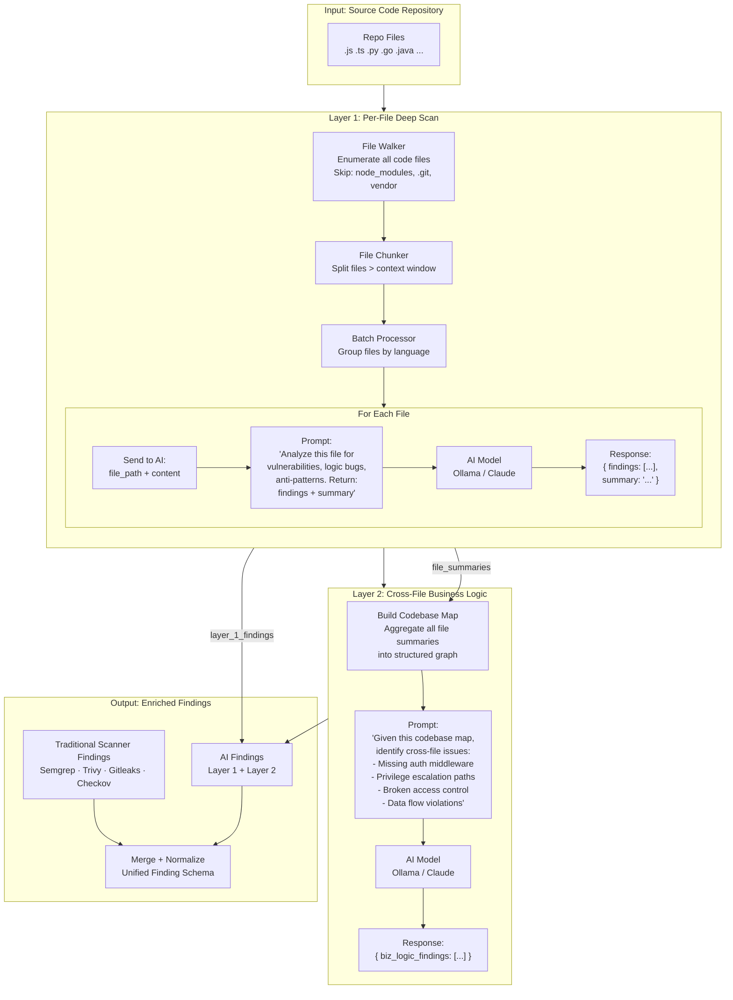
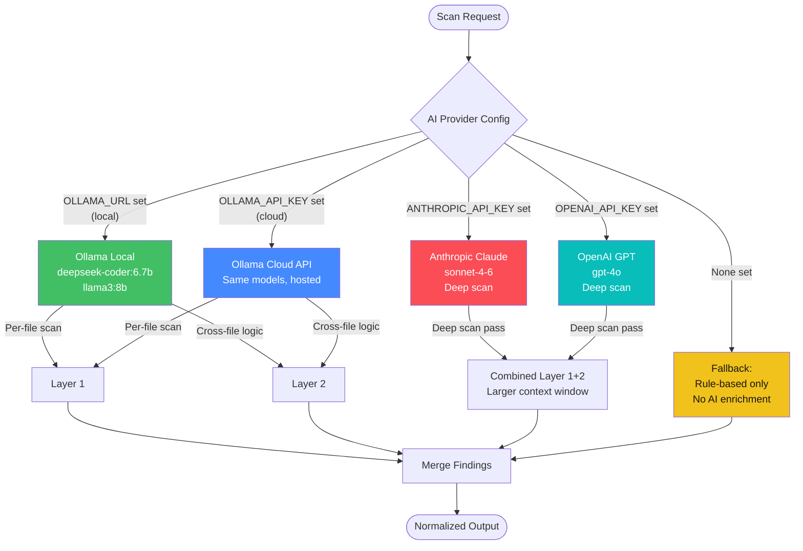
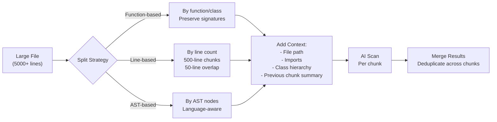

# Astra — AI Scanning Pipeline

## Two-Layer AI Architecture



---

## AI Prompt Engineering

### Layer 1: Per-File Scan Prompt

```python
SYSTEM_PROMPT = """You are an expert application security engineer.
Analyze the provided source code file for vulnerabilities,
security anti-patterns, and logic bugs.

Focus on:
- SQL injection, XSS, command injection
- Authentication bypasses
- Insecure data handling
- Business logic flaws
- Missing input validation

For each finding, provide:
1. Title (concise)
2. Severity (critical/high/medium/low/info)
3. Category (injection/auth/secrets/etc)
4. Line numbers
5. Brief explanation
6. Suggested fix

Also provide a 2-3 sentence summary of the file's security posture."""

FILE_PROMPT = f"""File: {file_path}
Language: {language}

```
{code_content}
```

Respond in JSON format:
{{
  "findings": [
    {{
      "title": "...",
      "severity": "high",
      "category": "injection",
      "line_start": 42,
      "line_end": 48,
      "explanation": "...",
      "fix": "..."
    }}
  ],
  "summary": "This file handles user input but lacks validation..."
}}
"""
```

### Layer 2: Cross-File Business Logic Prompt

```python
SYSTEM_PROMPT = """You are an expert at analyzing application architecture
for security flaws that span multiple files.

Given a codebase map (file summaries, not raw code),
identify:
- Missing authentication/authorization middleware
- Privilege escalation paths
- Broken access control between routes
- Insecure data flows between components
- Race conditions in business logic
- Missing audit logging

For each finding, specify which files are involved."""

MAP_PROMPT = f"""Codebase Map:
{json.dumps(codebase_map, indent=2)}

Respond in JSON format:
{{
  "biz_logic_findings": [
    {{
      "title": "Missing auth on admin routes",
      "severity": "critical",
      "description": "Admin routes in admin.py lack middleware...",
      "affected_files": ["app/routes/admin.py", "app/middleware/auth.py"],
      "confidence": 0.92
    }}
  ]
}}
"""
```

---

## AI Provider Selection Logic



---

## Chunking Strategy

Large files exceed LLM context windows. Chunking splits them intelligently:



### Chunking Configuration

```python
CHUNK_CONFIG = {
    "max_tokens_per_chunk": 4000,      # Leave room for response
    "overlap_lines": 50,                # Context between chunks
    "preserve_function_boundaries": True,
    "preserve_class_boundaries": True,
    "include_imports_in_every_chunk": True,
    "language_specific": {
        "python": {"split_on": ["def ", "class ", "async def "]},
        "javascript": {"split_on": ["function ", "const ", "class "]},
        "go": {"split_on": ["func ", "type "]},
    }
}
```
