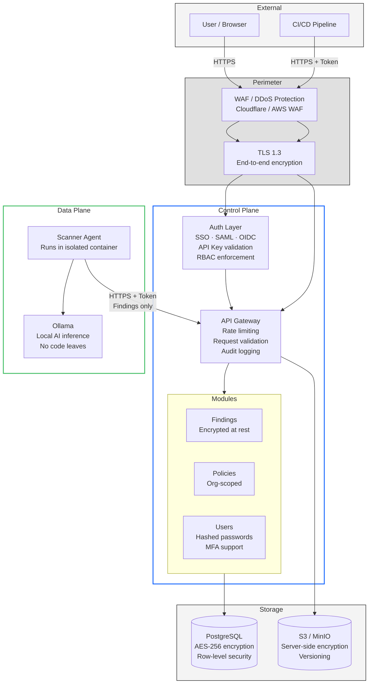
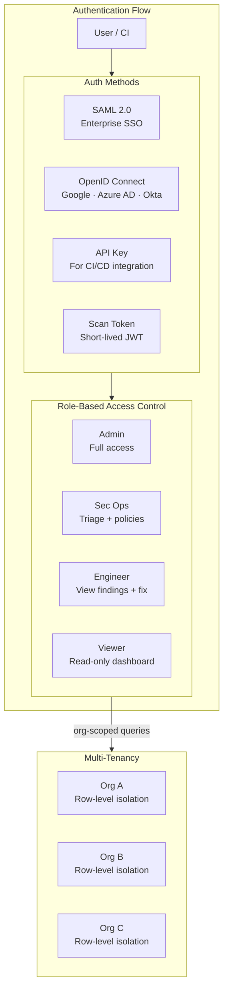
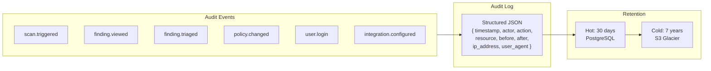

# Astra — Security & Data Flow Model

## Zero-Trust Security Architecture



---

## Data Flow — What Leaves the Customer Environment

```mermaid
graph LR
    subgraph CUSTOMER["Customer Environment"]
        REPO["Source Code\nNEVER leaves"]
        DP["Data Plane Agent"]
    end
    
    subgraph TRANSIT["Transit"]
        FINDINGS["Normalized Findings JSON\nHTTPS + TLS 1.3\nGzip compressed"]
    end
    
    subgraph ASTRA["Astra Control Plane"]
        CP["Control Plane"]
        DB[("PostgreSQL"]
    end
    
    REPO -->|"scan"| DP
    DP -->|"extract"| FINDINGS
    FINDINGS -->|"POST /v1/ingest"| CP
    CP --> DB
    
    style REPO fill:#fa4d56,color:#fff
    style FINDINGS fill:#42be65,color:#fff
```

### What Gets Transmitted

| Data | Leaves Customer? | Notes |
|------|------------------|-------|
| Raw source code | ❌ NO | Stays in Data Plane container |
| File paths | ✅ YES | Relative paths only |
| Line numbers | ✅ YES | For locating findings |
| Code snippets | ✅ YES | 5-10 lines around finding only |
| Scanner metadata | ✅ YES | Rule IDs, severity, categories |
| AI explanations | ✅ YES | Generated by AI, not raw code |
| AI fix suggestions | ✅ YES | Generated code snippets |
| Business logic rules | ✅ YES | Inferred rules, not raw code |
| Scan artifacts | ❌ NO | Stored in customer S3/MinIO |

---

## Authentication & Authorization



### Permission Matrix

| Action | Admin | Sec Ops | Engineer | Viewer |
|--------|-------|---------|----------|--------|
| Trigger scan | ✅ | ✅ | ❌ | ❌ |
| View findings | ✅ | ✅ | ✅ | ✅ |
| Triage finding | ✅ | ✅ | ❌ | ❌ |
| Create policy | ✅ | ✅ | ❌ | ❌ |
| Manage integrations | ✅ | ✅ | ❌ | ❌ |
| View AI fix | ✅ | ✅ | ✅ | ❌ |
| Export reports | ✅ | ✅ | ✅ | ❌ |
| Manage users | ✅ | ❌ | ❌ | ❌ |
| Configure AI models | ✅ | ❌ | ❌ | ❌ |

---

## Audit Logging



---

## Compliance Posture

| Requirement | Implementation |
|-------------|----------------|
| **Data Residency** | Self-hosted option keeps all data on-prem |
| **Encryption at Rest** | PostgreSQL AES-256, S3 SSE-S3 |
| **Encryption in Transit** | TLS 1.3 for all connections |
| **Access Logging** | Every API call logged with actor + timestamp |
| **Data Retention** | Configurable per-org (30 days to 7 years) |
| **Right to Deletion** | Full org data purge via admin API |
| **SOC 2 Type II** | Roadmap: Q3 2026 |
| **ISO 27001** | Roadmap: Q4 2026 |
