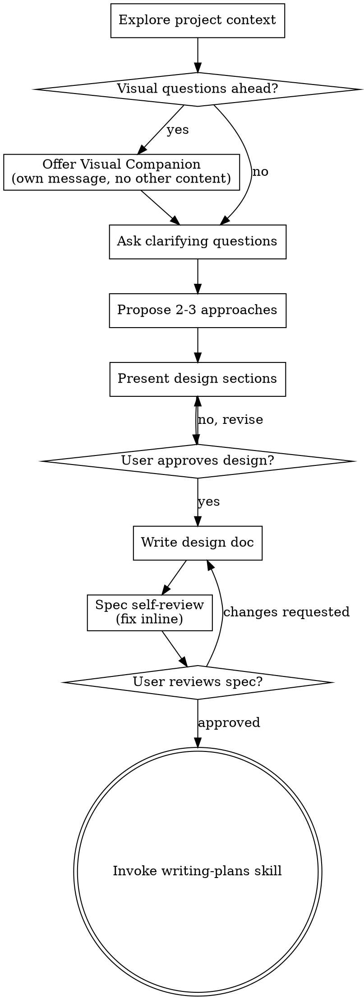

# Astra platform build kickoff

**Session ID:** ses_2063c9e4cffexsjFQz6HD2f69A
**Created:** 5/5/2026, 8:10:24 PM
**Updated:** 5/7/2026, 7:16:53 PM

---

## Assistant (Build · glm-5.1:cloud · 19.7s)

Done. Added `gemma4:31b-cloud` and `gemma3:27b-cloud` to the `cloud-ollama` provider in `astra.config.json` — both with 131K context, thinking support, and now selectable in the Configuration page model dropdown.

---

## User

Can we add streaming for chat UI??? 

---

## Assistant (Build · glm-5.1:cloud · 8.4s)

**Tool: skill**

**Input:**
```json
{
  "name": "brainstorming"
}
```

**Output:**
```
<skill_content name="brainstorming">
# Skill: brainstorming

# Brainstorming Ideas Into Designs

Help turn ideas into fully formed designs and specs through natural collaborative dialogue.

Start by understanding the current project context, then ask questions one at a time to refine the idea. Once you understand what you're building, present the design and get user approval.

<HARD-GATE>
Do NOT invoke any implementation skill, write any code, scaffold any project, or take any implementation action until you have presented a design and the user has approved it. This applies to EVERY project regardless of perceived simplicity.
</HARD-GATE>

## Anti-Pattern: "This Is Too Simple To Need A Design"

Every project goes through this process. A todo list, a single-function utility, a config change — all of them. "Simple" projects are where unexamined assumptions cause the most wasted work. The design can be short (a few sentences for truly simple projects), but you MUST present it and get approval.

## Checklist

You MUST create a task for each of these items and complete them in order:

1. **Explore project context** — check files, docs, recent commits
2. **Offer visual companion** (if topic will involve visual questions) — this is its own message, not combined with a clarifying question. See the Visual Companion section below.
3. **Ask clarifying questions** — one at a time, understand purpose/constraints/success criteria
4. **Propose 2-3 approaches** — with trade-offs and your recommendation
5. **Present design** — in sections scaled to their complexity, get user approval after each section
6. **Write design doc** — save to `docs/superpowers/specs/YYYY-MM-DD-<topic>-design.md` and commit
7. **Spec self-review** — quick inline check for placeholders, contradictions, ambiguity, scope (see below)
8. **User reviews written spec** — ask user to review the spec file before proceeding
9. **Transition to implementation** — invoke writing-plans skill to create implementation plan

## Process Flow



**The terminal state is invoking writing-plans.** Do NOT invoke frontend-design, mcp-builder, or any other implementation skill. The ONLY skill you invoke after brainstorming is writing-plans.

## The Process

**Understanding the idea:**

- Check out the current project state first (files, docs, recent commits)
- Before asking detailed questions, assess scope: if the request describes multiple independent subsystems (e.g., "build a platform with chat, file storage, billing, and analytics"), flag this immediately. Don't spend questions refining details of a project that needs to be decomposed first.
- If the project is too large for a single spec, help the user decompose into sub-projects: what are the independent pieces, how do they relate, what order should they be built? Then brainstorm the first sub-project through the normal design flow. Each sub-project gets its own spec → plan → implementation cycle.
- For appropriately-scoped projects, ask questions one at a time to refine the idea
- Prefer multiple choice questions when possible, but open-ended is fine too
- Only one question per message - if a topic needs more exploration, break it into multiple questions
- Focus on understanding: purpose, constraints, success criteria

**Exploring approaches:**

- Propose 2-3 different approaches with trade-offs
- Present options conversationally with your recommendation and reasoning
- Lead with your recommended option and explain why

**Presenting the design:**

- Once you believe you understand what you're building, present the design
- Scale each section to its complexity: a few sentences if straightforward, up to 200-300 words if nuanced
- Ask after each section whether it looks right so far
- Cover: architecture, components, data flow, error handling, testing
- Be ready to go back and clarify if something doesn't make sense

**Design for isolation and clarity:**

- Break the system into smaller units that each have one clear purpose, communicate through well-defined interfaces, and can be understood and tested independently
- For each unit, you should be able to answer: what does it do, how do you use it, and what does it depend on?
- Can someone understand what a unit does without reading its internals? Can you change the internals without breaking consumers? If not, the boundaries need work.
- Smaller, well-bounded units are also easier for you to work with - you reason better about code you can hold in context at once, and your edits are more reliable when files are focused. When a file grows large, that's often a signal that it's doing too much.

**Working in existing codebases:**

- Explore the current structure before proposing changes. Follow existing patterns.
- Where existing code has problems that affect the work (e.g., a file that's grown too large, unclear boundaries, tangled responsibilities), include targeted improvements as part of the design - the way a good developer improves code they're working in.
- Don't propose unrelated refactoring. Stay focused on what serves the current goal.

## After the Design

**Documentation:**

- Write the validated design (spec) to `docs/superpowers/specs/YYYY-MM-DD-<topic>-design.md`
  - (User preferences for spec location override this default)
- Use elements-of-style:writing-clearly-and-concisely skill if available
- Commit the design document to git

**Spec Self-Review:**
After writing the spec document, look at it with fresh eyes:

1. **Placeholder scan:** Any "TBD", "TODO", incomplete sections, or vague requirements? Fix them.
2. **Internal consistency:** Do any sections contradict each other? Does the architecture match the feature descriptions?
3. **Scope check:** Is this focused enough for a single implementation plan, or does it need decomposition?
4. **Ambiguity check:** Could any requirement be interpreted two different ways? If so, pick one and make it explicit.

Fix any issues inline. No need to re-review — just fix and move on.

**User Review Gate:**
After the spec review loop passes, ask the user to review the written spec before proceeding:

> "Spec written and committed to `<path>`. Please review it and let me know if you want to make any changes before we start writing out the implementation plan."

Wait for the user's response. If they request changes, make them and re-run the spec review loop. Only proceed once the user approves.

**Implementation:**

- Invoke the writing-plans skill to create a detailed implementation plan
- Do NOT invoke any other skill. writing-plans is the next step.

## Key Principles

- **One question at a time** - Don't overwhelm with multiple questions
- **Multiple choice preferred** - Easier to answer than open-ended when possible
- **YAGNI ruthlessly** - Remove unnecessary features from all designs
- **Explore alternatives** - Always propose 2-3 approaches before settling
- **Incremental validation** - Present design, get approval before moving on
- **Be flexible** - Go back and clarify when something doesn't make sense

## Visual Companion

A browser-based companion for showing mockups, diagrams, and visual options during brainstorming. Available as a tool — not a mode. Accepting the companion means it's available for questions that benefit from visual treatment; it does NOT mean every question goes through the browser.

**Offering the companion:** When you anticipate that upcoming questions will involve visual content (mockups, layouts, diagrams), offer it once for consent:
> "Some of what we're working on might be easier to explain if I can show it to you in a web browser. I can put together mockups, diagrams, comparisons, and other visuals as we go. This feature is still new and can be token-intensive. Want to try it? (Requires opening a local URL)"

**This offer MUST be its own message.** Do not combine it with clarifying questions, context summaries, or any other content. The message should contain ONLY the offer above and nothing else. Wait for the user's response before continuing. If they decline, proceed with text-only brainstorming.

**Per-question decision:** Even after the user accepts, decide FOR EACH QUESTION whether to use the browser or the terminal. The test: **would the user understand this better by seeing it than reading it?**

- **Use the browser** for content that IS visual — mockups, wireframes, layout comparisons, architecture diagrams, side-by-side visual designs
- **Use the terminal** for content that is text — requirements questions, conceptual choices, tradeoff lists, A/B/C/D text options, scope decisions

A question about a UI topic is not automatically a visual question. "What does personality mean in this context?" is a conceptual question — use the terminal. "Which wizard layout works better?" is a visual question — use the browser.

If they agree to the companion, read the detailed guide before proceeding:
`skills/brainstorming/visual-companion.md`

Base directory for this skill: file:///root/.cache/opencode/packages/superpowers@git+https:/github.com/obra/superpowers.git/node_modules/superpowers/skills/brainstorming
Relative paths in this skill (e.g., scripts/, reference/) are relative to this base directory.
Note: file list is sampled.

<skill_files>
<file>/root/.cache/opencode/packages/superpowers@git+https:/github.com/obra/superpowers.git/node_modules/superpowers/skills/brainstorming/scripts/frame-template.html</file>
<file>/root/.cache/opencode/packages/superpowers@git+https:/github.com/obra/superpowers.git/node_modules/superpowers/skills/brainstorming/scripts/stop-server.sh</file>
<file>/root/.cache/opencode/packages/superpowers@git+https:/github.com/obra/superpowers.git/node_modules/superpowers/skills/brainstorming/scripts/server.cjs</file>
<file>/root/.cache/opencode/packages/superpowers@git+https:/github.com/obra/superpowers.git/node_modules/superpowers/skills/brainstorming/scripts/helper.js</file>
<file>/root/.cache/opencode/packages/superpowers@git+https:/github.com/obra/superpowers.git/node_modules/superpowers/skills/brainstorming/scripts/start-server.sh</file>
<file>/root/.cache/opencode/packages/superpowers@git+https:/github.com/obra/superpowers.git/node_modules/superpowers/skills/brainstorming/spec-document-reviewer-prompt.md</file>
<file>/root/.cache/opencode/packages/superpowers@git+https:/github.com/obra/superpowers.git/node_modules/superpowers/skills/brainstorming/visual-companion.md</file>
</skill_files>
</skill_content>
```

---

## Assistant (Build · glm-5.1:cloud · 18.0s)

**Tool: todowrite**

**Input:**
```json
{
  "todos": [
    {
      "content": "Explore project context — check chat UI, provider streaming support, existing SSE patterns",
      "priority": "high",
      "status": "in_progress"
    },
    {
      "content": "Ask clarifying questions about streaming scope",
      "priority": "high",
      "status": "pending"
    },
    {
      "content": "Propose 2-3 approaches with trade-offs",
      "priority": "high",
      "status": "pending"
    },
    {
      "content": "Present design for approval",
      "priority": "medium",
      "status": "pending"
    },
    {
      "content": "Write design doc",
      "priority": "medium",
      "status": "pending"
    },
    {
      "content": "Implement streaming chat",
      "priority": "medium",
      "status": "pending"
    }
  ]
}
```

**Output:**
```
[
  {
    "content": "Explore project context — check chat UI, provider streaming support, existing SSE patterns",
    "status": "in_progress",
    "priority": "high"
  },
  {
    "content": "Ask clarifying questions about streaming scope",
    "status": "pending",
    "priority": "high"
  },
  {
    "content": "Propose 2-3 approaches with trade-offs",
    "status": "pending",
    "priority": "high"
  },
  {
    "content": "Present design for approval",
    "status": "pending",
    "priority": "medium"
  },
  {
    "content": "Write design doc",
    "status": "pending",
    "priority": "medium"
  },
  {
    "content": "Implement streaming chat",
    "status": "pending",
    "priority": "medium"
  }
]
```

---

## Assistant (Build · glm-5.1:cloud · 155.4s)

**Tool: task**

**Input:**
```json
{
  "description": "Explore chat and streaming code",
  "prompt": "I need to understand the current chat implementation in this Astra app to plan adding streaming support. Please read and summarize the following files, focusing on:\n\n1. `/root/astra/astra-app/src/lib/ai-chat.ts` — How chat messages are sent, what provider API is used\n2. `/root/astra/astra-app/src/providers/factory.ts` — How providers are instantiated, what configs they take\n3. `/root/astra/astra-app/src/providers/ollama.ts` — The Cloud Ollama provider implementation (also check for any other ollama-related provider files)\n4. `/root/astra/astra-app/src/components/AiChatSidebar.tsx` or any chat UI component — How the chat UI renders messages\n5. `/root/astra/astra-app/src/app/api/v1/chat/route.ts` — The chat API endpoint\n6. `/root/astra/astra-app/src/app/api/v1/scans/[id]/chat/route.ts` — Scan-level chat endpoint\n7. `/root/astra/astra-app/src/app/api/v1/findings/[id]/chat/route.ts` — Finding-level chat endpoint\n8. Any existing SSE or streaming patterns in `/root/astra/astra-app/src/app/api/v1/scans/[id]/stream/route.ts`\n\nFor each file, tell me:\n- What it does\n- Key functions/exports\n- How it handles the AI response (is it a single await or does it already support streaming?)\n- What data shape it returns\n\nReturn a concise summary so I can understand the current architecture before making design decisions.",
  "subagent_type": "explore"
}
```

**Output:**
```
task_id: ses_1fc4bf480ffekR7MotXhXuWjJE (for resuming to continue this task if needed)

<task_result>
Here is a concise architectural summary of the current chat implementation:

---

## 1. `/root/astra/astra-app/src/lib/ai-chat.ts` — Chat Message Orchestrator

**What it does:** Central utility that resolves the chat provider/model from config, builds a system prompt (with optional finding context), and sends a single non-streaming AI request.

**Key exports:**
- `sendChatMessage(userMessage, context?)` — the only exported function.

**How it handles the AI response:** Entirely **non-streaming** (single `await`). It:
1. Calls `getChatProvider()` which reads config, creates/caches an `AIProvider` instance.
2. Calls `buildSystemPrompt()` to inject finding details into the prompt.
3. Calls `instrumentedSend(provider, request, context)` which delegates to `provider.send()` and logs the call to the DB.
4. Returns `{ text, inputTokens, outputTokens, durationMs }`.

**Data shape returned:**
```ts
{ text: string; inputTokens: number; outputTokens: number; durationMs: number }
```

---

## 2. `/root/astra/astra-app/src/providers/factory.ts` — Provider Factory

**What it does:** Creates `AIProvider` instances from config objects.

**Key exports:**
- `createProvider(config)` — switch on `providerId` to instantiate one of 7 providers: `cloud-ollama`, `hosted-ollama`, `openai`, `anthropic`, `bedrock`, `azure-ai-foundry`, `langgraph`.
- `createProviderForNode(nodeName, config)` — convenience wrapper for scan pipeline nodes (discover/deepScan/crossFile).

**Config shape (ProviderCreateConfig):**
```ts
{ providerId, providerConfig: { baseURL?, apiKeyEnv?, models }, modelId, modelConfig }
```

**Stream awareness:** None. Factory creates providers but knows nothing about streaming.

---

## 3. `/root/astra/astra-app/src/providers/cloud-ollama.ts` — Cloud Ollama Provider

**What it does:** Wraps the `ollama` npm client pointed at `https://api.ohmyllama.com` (with Bearer auth). Implements `AIProvider`.

**Key details:**
- Uses `this.client.generate({ ... stream: false })` — **hardcoded non-streaming**.
- Has retry logic with exponential backoff (up to 3 retries for `fetch_failed`, `ECONNRESET`, `429`, `503`).
- Returns `AIResponse { text, inputTokens, outputTokens, thinkingTokens: 0, durationMs }`.

**`/root/astra/astra-app/src/providers/hosted-ollama.ts`** is nearly identical but:
- Defaults to `http://localhost:11434`.
- No retry logic — just a single `await this.client.generate({ stream: false })`.

**Both Ollama providers use `ollama.generate()` (not `ollama.chat()`)**, which is a completion-style API, not a conversational one. This means full prompt is sent each time — there is no conversation history management at the provider level.

---

## 4. Chat UI Components

### `AiChatProvider.tsx` — Global Slide-Out Chat Panel

**What it does:** React context provider that renders a floating "FAB" button and a 420px-wide slide-in chat panel. Uses `useAiChat()` context to let any component trigger the panel open with optional `findingId`/`scanId` context.

**How it sends messages:**
- `handleSend()` POSTs `{ content }` to `/api/v1/chat` or `/api/v1/findings/${findingId}/chat`.
- **Waits for the entire response** (`await res.json()`), then replaces the optimistic user message with the server-returned pair `[userMsg, aiMsg]`.
- Shows a static "Thinking..." indicator while `sending === true`.
- **No streaming.** The entire AI response appears at once once the POST resolves.

**Message shape:**
```ts
{ id: string; role: 'user' | 'assistant'; content: string; createdAt: string }
```

### `ScanChat.tsx` — Inline Scan Chat Widget

**What it does:** Similar to `AiChatProvider` but embedded inline on scan detail pages. Fetches `/api/v1/scans/${scanId}/chat` (GET for history, POST to send). Same non-streaming pattern: `await res.json()` then append both messages.

---

## 5. `/root/astra/astra-app/src/app/api/v1/chat/route.ts` — General Chat Endpoint

**What it does:** Next.js API route for the global (non-scan, non-finding) chat.

**Key behavior:**
- `GET` — returns `{ messages: AiConversation[] }` filtered by `userId` with `scanId: null, findingId: null`.
- `POST` — creates a `user` message in DB, calls `sendChatMessage(content, { userId })`, creates an `assistant` message in DB, returns `{ messages: [userMsg, aiMsg] }`.

**Response shape:** `{ messages: [{ id, role, content, createdAt, ... }] }`

**Non-streaming.** The client waits for the full response.

---

## 6. `/root/astra/astra-app/src/app/api/v1/scans/[id]/chat/route.ts` — Scan-Level Chat

Nearly identical to the general chat endpoint, but:
- Filters/persists messages with `scanId`.
- Enriches the system prompt context by providing a synthetic "finding" object describing the scan (repo URL, branch, finding count).
- Returns same `{ messages: [userMsg, aiMsg] }` shape.

---

## 7. `/root/astra/astra-app/src/app/api/v1/findings/[id]/chat/route.ts` — Finding-Level Chat

Nearly identical to general chat, but:
- Filters/persists messages with `findingId`.
- Loads the actual `Finding` from the DB and passes its full details into `sendChatMessage` context so the AI can reference specific severity, file, CWE, OWASP, exploitation scenario, remediation, etc.
- Returns same `{ messages: [userMsg, aiMsg] }` shape.

---

## 8. `/root/astra/astra-app/src/app/api/v1/scans/[id]/stream/route.ts` — SSE Scan Progress Stream

**What it does:** The **only existing SSE/streaming endpoint** in the app. It streams scan job progress to the client using `text/event-stream`.

**Key pattern:**
```
new ReadableStream({
  start(controller) {
    const encoder = new TextEncoder();
    const send = (event, data) => {
      controller.enqueue(encoder.encode(`event: ${event}\ndata: ${JSON.stringify(data)}\n\n`));
    };
    // ... polling loop ...
  }
})
return new Response(stream, { headers: { 'Content-Type': 'text/event-stream', ... } });
```

It polls the DB every 1 second, sends `job_update`, `node_started`, `scan_complete`, or `scan_failed` events, and exits when the scan finishes or the client disconnects (`request.signal.aborted`).

**Events emitted:** `connected`, `job_update`, `node_started`, `scan_complete`, `scan_failed`.

---

## 9. `/root/astra/astra-app/src/providers/base.ts` — Provider Interface

**What it does:** Defines the `AIProvider` contract.

```ts
interface AIProvider {
  id: string;
  send(request: AIRequest): Promise<AIResponse>;  // single-shot, no streaming
  estimateTokens(text: string): number;
  getModelInfo(): ModelInfo;
  testConnection(): Promise<{ connected: boolean; latencyMs: number; error?: string }>;
}

interface AIRequest  { system, prompt, maxOutputTokens?, temperature?, topP?, topK?, ... }
interface AIResponse { text, inputTokens, outputTokens, thinkingTokens, durationMs }
```

**There is no `sendStream()` method.** The interface is purely request/response.

---

## 10. `/root/astra/astra-app/src/lib/ai-instrumentation.ts` — Observability Wrapper

**What it does:** Wraps `provider.send()` with logging and writes every call (success or failure) to `prisma.aiCallLog` with full details (prompts, token counts, latency, status, error).

**Key point for streaming:** Currently records `response.text` as a single string. A streaming refactor would need to accumulate tokens and compute totals after the stream completes.

---

## Architecture Summary & Streaming Implications

| Layer | Current | Streaming Impact |
|-------|---------|------------------|
| **Provider interface (`base.ts`)** | `send(): Promise<AIResponse>` — single-shot | Needs a new `sendStream(): AsyncIterable<AIChunk>` or similar |
| **Ollama providers** | `stream: false` on `ollama.generate()` | Can flip to `stream: true` and yield chunks; or switch to `ollama.chat()` for conversational API |
| **OpenAI provider** | `client.chat.completions.create()` — single-shot | Can add `stream: true` to get `AsyncIterable<ChatCompletionChunk>` |
| **`sendChatMessage()`** | Returns `{ text, inputTokens, outputTokens, durationMs }` | Needs a streaming variant that returns an async iterable or uses SSE |
| **API routes** | `POST` returns `{ messages: [...] }` after full completion | Need a streaming variant that uses `ReadableStream` + `text/event-stream` (pattern exists in scan stream) |
| **UI components** | `await res.json()` then render both messages | Need `EventSource` or `fetch` with `ReadableStream` to progressively render tokens; replace "Thinking..." with live token stream |
| **Instrumentation** | Logs single `AIResponse` | Must accumulate chunks and log after stream completes |

**The existing SSE pattern in `/scans/[id]/stream/route.ts`** provides a clear template for how to build a streaming response with `ReadableStream` + `TextEncoder` + `event:` SSE framing. The main work is: (1) adding a streaming method to `AIProvider`, (2) implementing it per-provider, (3) creating streaming API routes, and (4) updating the UI to consume SSE events.
</task_result>
```

---

## Assistant (Build · glm-5.1:cloud · 16.3s)

**Tool: todowrite**

**Input:**
```json
{
  "todos": "[{\"content\":\"Explore project context — check chat UI, provider streaming support, existing SSE patterns\",\"priority\":\"high\",\"status\":\"completed\"},{\" {\"content\":\"Ask clarifying questions about streaming scope\",\"priority\":\"high\",\"status\":\"in_progress\"},{\"content\":\"Propose 2-3 approaches with trade-offs\",\"priority\":\"high\",\"status\":\"pending\"},{\"content\":\"Present design for approval\",\"priority\":\"medium\",\"status\":\"pending\"},{\"content\":\"Write design doc\",\"priority\":\"medium\",\"status\":\"pending\"},{\"content\":\"Implement streaming chat\",\"priority\":\"medium\",\"status\":\"pending\"}]"
}
```

**Error:**
```
The todowrite tool was called with invalid arguments: SchemaError(Expected array, got "[{\"content\":\"Explore project context — check chat UI, provider streaming support, existing SSE patterns\",\"priority\":\"high\",\"status\":\"completed\"},{\" {\"content\":\"Ask clarifying questions about streaming scope\",\"priority\":\"high\",\"status\":\"in_progress\"},{\"content\":\"Propose 2-3 approaches with trade-offs\",\"priority\":\"high\",\"status\":\"pending\"},{\"content\":\"Present design for approval\",\"priority\":\"medium\",\"status\":\"pending\"},{\"content\":\"Write design doc\",\"priority\":\"medium\",\"status\":\"pending\"},{\"content\":\"Implement streaming chat\",\"priority\":\"medium\",\"status\":\"pending\"}]"
  at ["todos"]).
Please rewrite the input so it satisfies the expected schema.
```

---

## Assistant (Build · glm-5.1:cloud · 8.2s)

**Tool: todowrite**

**Input:**
```json
{
  "todos": [
    {
      "content": "Explore project context",
      "priority": "high",
      "status": "completed"
    },
    {
      "content": "Ask clarifying questions about streaming scope",
      "priority": "high",
      "status": "in_progress"
    },
    {
      "content": "Propose 2-3 approaches with trade-offs",
      "priority": "high",
      "status": "pending"
    },
    {
      "content": "Present design for approval",
      "priority": "medium",
      "status": "pending"
    },
    {
      "content": "Write design doc",
      "priority": "medium",
      "status": "pending"
    },
    {
      "content": "Implement streaming chat",
      "priority": "medium",
      "status": "pending"
    }
  ]
}
```

**Output:**
```
[
  {
    "content": "Explore project context",
    "status": "completed",
    "priority": "high"
  },
  {
    "content": "Ask clarifying questions about streaming scope",
    "status": "in_progress",
    "priority": "high"
  },
  {
    "content": "Propose 2-3 approaches with trade-offs",
    "status": "pending",
    "priority": "high"
  },
  {
    "content": "Present design for approval",
    "status": "pending",
    "priority": "medium"
  },
  {
    "content": "Write design doc",
    "status": "pending",
    "priority": "medium"
  },
  {
    "content": "Implement streaming chat",
    "status": "pending",
    "priority": "medium"
  }
]
```

---

## Assistant (Build · glm-5.1:cloud · 51.1s)

Good — I've explored the codebase. Here's what I found:

**Current state:** All 3 chat endpoints (org, scan, finding) use `sendChatMessage()` which calls `provider.send()` — a single `await` that returns the full response at once. The UI shows "Thinking..." then replaces it with the complete response. The only streaming endpoint in the app is `/scans/[id]/stream` which uses SSE with `ReadableStream`.

**Key insight:** Both Ollama providers already use the `ollama` npm package which supports `stream: true`. The SSE pattern already exists in the codebase.

**Tool: question**

**Input:**
```json
{
  "questions": [
    {
      "header": "Streaming scope",
      "options": [
        {
          "description": "Org chat, scan chat, and finding chat all stream. Consistent UX everywhere.",
          "label": "All three (Recommended)"
        },
        {
          "description": "Only the AiChatProvider sidebar gets streaming. ScanChat stays non-streaming.",
          "label": "Global sidebar only"
        }
      ],
      "question": "Which chat contexts should get streaming? All three (org, scan, finding) or just the global chat sidebar?"
    },
    {
      "header": "Provider coverage",
      "options": [
        {
          "description": "Ship fast. Only the active provider streams. Others fall back to non-streaming.",
          "label": "Cloud Ollama only (Recommended)"
        },
        {
          "description": "Stream for both Ollama and OpenAI providers (covers 2 most likely real providers).",
          "label": "Ollama + OpenAI"
        },
        {
          "description": "Implement streaming for every provider (more work, stubs stay non-streaming).",
          "label": "All providers"
        }
      ],
      "question": "Should we implement streaming for all providers or just Cloud Ollama (the active one)?"
    },
    {
      "header": "UI feel",
      "options": [
        {
          "description": "Tokens appear one by one as they arrive, like ChatGPT. Smooth, feels fast.",
          "label": "Typewriter (Recommended)"
        },
        {
          "description": "Tokens appear in batches (every 50-100ms). Slightly less smooth but simpler to implement.",
          "label": "Chunked"
        }
      ],
      "question": "How should streaming tokens appear in the chat?"
    }
  ]
}
```

**Output:**
```
User has answered your questions: "Which chat contexts should get streaming? All three (org, scan, finding) or just the global chat sidebar?"="All three (Recommended)", "Should we implement streaming for all providers or just Cloud Ollama (the active one)?"="All providers", "How should streaming tokens appear in the chat?"="Typewriter (Recommended)". You can now continue with the user's answers in mind.
```

---

## Assistant (Build · glm-5.1:cloud · 9.6s)

**Tool: todowrite**

**Input:**
```json
{
  "todos": [
    {
      "content": "Explore project context",
      "priority": "high",
      "status": "completed"
    },
    {
      "content": "Ask clarifying questions about streaming scope",
      "priority": "high",
      "status": "completed"
    },
    {
      "content": "Propose 2-3 approaches with trade-offs",
      "priority": "high",
      "status": "in_progress"
    },
    {
      "content": "Present design for approval",
      "priority": "medium",
      "status": "pending"
    },
    {
      "content": "Write design doc",
      "priority": "medium",
      "status": "pending"
    },
    {
      "content": "Implement streaming chat",
      "priority": "medium",
      "status": "pending"
    }
  ]
}
```

**Output:**
```
[
  {
    "content": "Explore project context",
    "status": "completed",
    "priority": "high"
  },
  {
    "content": "Ask clarifying questions about streaming scope",
    "status": "completed",
    "priority": "high"
  },
  {
    "content": "Propose 2-3 approaches with trade-offs",
    "status": "in_progress",
    "priority": "high"
  },
  {
    "content": "Present design for approval",
    "status": "pending",
    "priority": "medium"
  },
  {
    "content": "Write design doc",
    "status": "pending",
    "priority": "medium"
  },
  {
    "content": "Implement streaming chat",
    "status": "pending",
    "priority": "medium"
  }
]
```

---

## Assistant (Build · glm-5.1:cloud · 36.1s)

Here are **3 approaches** for the streaming architecture:

---

### Approach A: SSE Endpoint + `sendStream()` on AIProvider (Recommended)

Add a `sendStream()` method to the `AIProvider` interface that returns an `AsyncGenerator<StreamChunk>`. Each provider implements it (Ollama flips `stream: true`, OpenAI uses `stream: true`, Anthropic uses their streaming API, stubs fall back to yielding a single chunk). Create new `/api/v1/chat/stream` SSE endpoints that use `ReadableStream` (same pattern as scan stream). UI uses `fetch` with `ReadableStream` reader for typewriter rendering.

**Pros:** Clean separation — existing `send()` stays for pipeline, `sendStream()` is chat-only. SSE pattern proven in codebase. Each provider owns its streaming logic. Instrumentation can wrap both.

**Cons:** More code — new method on 7 providers, 3 new API routes.

---

### Approach B: Transform Stream Middleware

Keep `send()` but wrap it in a higher-level "stream adapter" that uses the provider SDK's native streaming when available, else falls back to splitting the non-streaming response into fake chunks. Single streaming endpoint handles all providers.

**Pros:** Fewer changes to provider interface. Single streaming route handles all providers.

**Cons:** Loss of type safety — can't know at compile time if a provider truly streams. Fake chunks from non-streaming providers mean no real latency benefit. Harder to instrument correctly.

---

### Approach C: Replace `send()` with Unified Streaming

Make `send()` always return an `AsyncGenerator`. Non-streaming callers collect all chunks. Streaming callers iterate. Single API shape everywhere.

**Pros:** One interface to rule them all. Every consumer gets streaming "for free".

**Cons:** **Breaking change** for every caller (pipeline nodes, instrumentation, existing 3 chat endpoints). Massive refactor risk. Pipeline doesn't need streaming — adds complexity for zero benefit there.

---

**My recommendation: Approach A.** It's the cleanest separation — the pipeline keeps its simple request/response path, chat gets streaming where it makes sense, each provider controls its implementation, and the SSE pattern already exists in the codebase.

**Tool: question**

**Input:**
```json
{
  "questions": [
    {
      "header": "Architecture choice",
      "options": [
        {
          "description": "Add sendStream() to AIProvider, new SSE endpoints, UI consumes ReadableStream. Cleanest separation.",
          "label": "Approach A (Recommended)"
        },
        {
          "description": "Keep send(), wrap in streaming adapter. Less code but fake streams for non-streaming providers.",
          "label": "Approach B"
        },
        {
          "description": "Make send() always return AsyncGenerator. Breaking change for all callers.",
          "label": "Approach C"
        }
      ],
      "question": "Which architecture approach do you prefer for streaming chat?"
    }
  ]
}
```

**Output:**
```
User has answered your questions: "Which architecture approach do you prefer for streaming chat?"="Approach A (Recommended)". You can now continue with the user's answers in mind.
```

---

## Assistant (Build · glm-5.1:cloud · 14.0s)

**Tool: todowrite**

**Input:**
```json
{
  "todos": "[{\"content\":\"Explore project context\",\"priority\":high\",\"status\":\"completed\"},{\"content\":\"Ask clarifying questions about streaming scope\",\"priority\":\"high\",\"status\":\"completed\"},{\"content\":\"Propose 2-3 approaches with trade-offs\",\"priority\":\"high\",\"status\":\"completed\"},{\"content\":\"Present design for approval\",\"priority\":\"medium\",\"status\":\"in_progress\"},{\"content\":\"Write design doc\",\"priority\":\"medium\",\"status\":\"pending\"},{\"content\":\"Implement streaming chat\",\"priority\":\"medium\",\"status\":\"pending\"}]"
}
```

**Error:**
```
The todowrite tool was called with invalid arguments: SchemaError(Expected array, got "[{\"content\":\"Explore project context\",\"priority\":high\",\"status\":\"completed\"},{\"content\":\"Ask clarifying questions about streaming scope\",\"priority\":\"high\",\"status\":\"completed\"},{\"content\":\"Propose 2-3 approaches with trade-offs\",\"priority\":\"high\",\"status\":\"completed\"},{\"content\":\"Present design for approval\",\"priority\":\"medium\",\"status\":\"in_progress\"},{\"content\":\"Write design doc\",\"priority\":\"medium\",\"status\":\"pending\"},{\"content\":\"Implement streaming chat\",\"priority\":\"medium\",\"status\":\"pending\"}]"
  at ["todos"]).
Please rewrite the input so it satisfies the expected schema.
```

---

## Assistant (Build · glm-5.1:cloud · 8.9s)

**Tool: todowrite**

**Input:**
```json
{
  "todos": [
    {
      "content": "Explore project context",
      "priority": "high",
      "status": "completed"
    },
    {
      "content": "Ask clarifying questions",
      "priority": "high",
      "status": "completed"
    },
    {
      "content": "Propose approaches",
      "priority": "high",
      "status": "completed"
    },
    {
      "content": "Present design for approval",
      "priority": "medium",
      "status": "in_progress"
    },
    {
      "content": "Write design doc",
      "priority": "medium",
      "status": "pending"
    },
    {
      "content": "Implement streaming chat",
      "priority": "medium",
      "status": "pending"
    }
  ]
}
```

**Output:**
```
[
  {
    "content": "Explore project context",
    "status": "completed",
    "priority": "high"
  },
  {
    "content": "Ask clarifying questions",
    "status": "completed",
    "priority": "high"
  },
  {
    "content": "Propose approaches",
    "status": "completed",
    "priority": "high"
  },
  {
    "content": "Present design for approval",
    "status": "in_progress",
    "priority": "medium"
  },
  {
    "content": "Write design doc",
    "status": "pending",
    "priority": "medium"
  },
  {
    "content": "Implement streaming chat",
    "status": "pending",
    "priority": "medium"
  }
]
```

---

## Assistant (Build · glm-5.1:cloud · 82.9s)

## Design: Streaming Chat (Approach A)

### 1. Provider Layer — `sendStream()` on `AIProvider`

**`src/providers/base.ts`** — Add to the interface:
```ts
interface AIProvider {
  send(request: AIRequest): Promise<AIResponse>;        // existing
  sendStream(request: AIRequest): AsyncGenerator<StreamChunk>;  // NEW
}

type StreamChunk = 
  | { type: 'text'; content: string }
  | { type: 'thinking'; content: string }
  | { type: 'usage'; inputTokens: number; outputTokens: number }
  | { type: 'done'; durationMs: number };
```

Each provider implements `sendStream`:
- **cloud-ollama / hosted-ollama**: Flip to `stream: true` on `ollama.generate()`, yield `text` chunks, emit `usage` + `done` at end
- **openai**: `client.chat.completions.create({ stream: true })`, yield delta content chunks
- **anthropic**: `client.messages.stream()`, yield text + thinking blocks
- **bedrock / azure-ai-foundry / langgraph** (stubs): Fallback — call `send()` internally, yield a single `text` chunk, then `usage` + `done`

### 2. API Layer — 3 New SSE Endpoints

Follow the existing `/scans/[id]/stream` pattern (`ReadableStream` + `TextEncoder` + `event:` framing):

| Endpoint | Purpose |
|---|---|
| `POST /api/v1/chat/stream` | Global org-level streaming chat |
| `POST /api/v1/scans/[id]/chat/stream` | Scan-level streaming chat |
| `POST /api/v1/findings/[id]/chat/stream` | Finding-level streaming chat |

Each endpoint:
1. Reads `request.body` as `ReadableStream`, parses the user message
2. Creates user message in DB
3. Resolves provider via `getChatProvider()` (same config resolution as today)
4. Calls `provider.sendStream(request)` in a `for await` loop
5. Writes each `StreamChunk` as an SSE event: `event: chunk`, `data: { type, content }`
6. On `done` event: creates assistant message in DB, writes `AiCallLog`, sends final `event: complete` with full message
7. On error: sends `event: error` with message, cleans up

**SSE events:** `chunk` (tokens), `complete` (final message with ID, tokens, duration), `error`

### 3. Instrumentation

`instrumentedSendStream()` wraps `provider.sendStream()`:
- Starts timer on first chunk
- Accumulates full response text, token counts
- On `done`: writes single `AiCallLog` with full data (same as `instrumentedSend` today)
- On error: writes `AiCallLog` with status `ERROR`

### 4. UI Layer — Typewriter Rendering

**`AiChatProvider.tsx`** and **`ScanChat.tsx`** both change:
- Replace `POST → await res.json()` with `fetch() → ReadableStream` reader
- On `chunk` events with `type: 'text'`: append content to the assistant message in state → typewriter effect
- On `complete`: replace the accumulated message with the final server message (for ID, timestamp consistency)
- On `error`: show error toast, keep the partial message visible
- Non-streaming fallback: if `sendStream` fails or the browser doesn't support streaming, fall back to original `POST → res.json()` path

### 5. Data Flow Diagram

```
User types message
  → UI: POST /chat/stream (body: { content })
    → API: create user message in DB
    → API: resolve chat provider
    → API: provider.sendStream(request)
      → Provider: stream chunks from Ollama/OpenAI/Anthropic
        → API: SSE event: chunk { type, content }
        → UI: append content to assistant message (typewriter)
      → Provider: done { durationMs }
    → API: create assistant message in DB
    → API: write AiCallLog
    → API: SSE event: complete { messageId, inputTokens, outputTokens, durationMs }
    → UI: finalize message with IDs
```

### 6. Files Changed

| File | Change |
|---|---|
| `src/providers/base.ts` | Add `StreamChunk` types, `sendStream` to interface |
| `src/providers/cloud-ollama.ts` | Implement `sendStream` with `stream: true` |
| `src/providers/hosted-ollama.ts` | Implement `sendStream` with `stream: true` |
| `src/providers/openai.ts` | Implement `sendStream` with `stream: true` |
| `src/providers/anthropic.ts` | Implement `sendStream` with `stream` API |
| `src/providers/bedrock.ts` | Stub: yield single chunk from `send()` |
| `src/providers/azure-ai-foundry.ts` | Stub: yield single chunk from `send()` |
| `src/providers/langgraph.ts` | Stub: yield single chunk from `send()` |
| `src/providers/factory.ts` | No change (factory already returns `AIProvider`) |
| `src/lib/ai-chat.ts` | Add `streamChatMessage()` that returns `ReadableStream` |
| `src/lib/ai-instrumentation.ts` | Add `instrumentedSendStream()` |
| `src/app/api/v1/chat/stream/route.ts` | New — SSE streaming org chat |
| `src/app/api/v1/scans/[id]/chat/stream/route.ts` | New — SSE streaming scan chat |
| `src/app/api/v1/findings/[id]/chat/stream/route.ts` | New — SSE streaming finding chat |
| `src/components/AiChatProvider.tsx` | Consume SSE stream, typewriter rendering |
| `src/components/ScanChat.tsx` | Consume SSE stream, typewriter rendering |

Does this design look right to you? Any changes before I write the spec?

---

## User

If this is the case, how the observabilty is handling this? the AI observabilty is instrumented right? 

---

## Assistant (Build · glm-5.1:cloud · 6.6s)

Good catch — let me trace the instrumentation path precisely.

**Tool: read**

**Input:**
```json
{
  "filePath": "/root/astra/astra-app/src/lib/ai-instrumentation.ts"
}
```

**Output:**
```
<path>/root/astra/astra-app/src/lib/ai-instrumentation.ts</path>
<type>file</type>
<content>
1: import { prisma } from '@/lib/db';
2: import { logger } from '@/lib/structured-logger';
3: import type { AIProvider, AIRequest, AIResponse } from '@/providers/base';
4: 
5: export type InstrumentationSource =
6:   | 'pipeline'
7:   | 'chat'
8:   | 'chat_finding'
9:   | 'chat_scan'
10:   | 'test'
11:   | 'ad_hoc';
12: 
13: export interface InstrumentationContext {
14:   scanId?: string;
15:   jobId?: string;
16:   findingId?: string;
17:   userId?: string;
18:   source: InstrumentationSource;
19:   node?: string;
20:   nodeConfig?: Record<string, unknown>;
21: }
22: 
23: function classifyError(err: unknown): 'ERROR' | 'TIMEOUT' | 'RATE_LIMITED' {
24:   if (err instanceof Error) {
25:     const msg = err.message.toLowerCase();
26:     if (msg.includes('timeout') || msg.includes('timed out') || msg.includes('aborted')) {
27:       return 'TIMEOUT';
28:     }
29:     if (msg.includes('rate limit') || msg.includes('429') || msg.includes('too many requests')) {
30:       return 'RATE_LIMITED';
31:     }
32:   }
33:   return 'ERROR';
34: }
35: 
36: export async function instrumentedSend(
37:   provider: AIProvider,
38:   request: AIRequest,
39:   context: InstrumentationContext,
40: ): Promise<AIResponse> {
41:   const startTime = Date.now();
42:   const modelInfo = provider.getModelInfo();
43: 
44:   const logCtx = {
45:     scanId: context.scanId,
46:     node: context.node,
47:     provider: provider.id,
48:     model: modelInfo.id,
49:     source: context.source,
50:   };
51: 
52:   logger.info(logCtx, `AI call starting: ${context.source}/${context.node || 'direct'}`);
53: 
54:   let response: AIResponse;
55:   let status: 'SUCCESS' | 'ERROR' | 'TIMEOUT' | 'RATE_LIMITED' | 'CANCELLED' = 'SUCCESS';
56:   let error: string | undefined;
57: 
58:   try {
59:     response = await provider.send(request);
60:   } catch (err: unknown) {
61:     const classified = classifyError(err);
62:     status = classified;
63:     error = err instanceof Error ? err.message : String(err);
64:     if (error.length > 10000) error = error.substring(0, 10000) + '... [truncated at 10k for error field]';
65:     const elapsed = Date.now() - startTime;
66: 
67:     logger.error({ ...logCtx, elapsed, status, error }, `AI call failed: ${status}`);
68: 
69:     await prisma.aiCallLog.create({
70:       data: {
71:         scanId: context.scanId,
72:         jobId: context.jobId,
73:         findingId: context.findingId,
74:         userId: context.userId,
75:         source: context.source,
76:         node: context.node,
77:         provider: provider.id,
78:         model: modelInfo.id,
79:         endpoint: modelInfo.id,
80:         sdk: provider.id,
81:         rawRequest: request as any,
82:         systemPrompt: request.system,
83:         userPrompt: request.prompt,
84:         inputTokens: 0,
85:         outputTokens: 0,
86:         thinkingTokens: 0,
87:         latencyMs: elapsed,
88:         temperature: request.temperature ?? null,
89:         thinkingDepth: request.thinkingDepth ?? null,
90:         thinkingBudget: request.thinkingBudget ?? null,
91:         topP: request.topP ?? null,
92:         topK: request.topK ?? null,
93:         maxOutputTokens: request.maxOutputTokens ?? null,
94:         nodeConfig: context.nodeConfig ? (context.nodeConfig as any) : undefined,
95:         status: classified as any,
96:         error,
97:       },
98:     });
99: 
100:     throw err;
101:   }
102: 
103:   const elapsed = Date.now() - startTime;
104: 
105:   logger.info({ ...logCtx, elapsed, inputTokens: response.inputTokens, outputTokens: response.outputTokens, thinkingTokens: response.thinkingTokens }, 'AI call completed');
106: 
107:   await prisma.aiCallLog.create({
108:     data: {
109:       scanId: context.scanId,
110:       jobId: context.jobId,
111:       findingId: context.findingId,
112:       userId: context.userId,
113:       source: context.source,
114:       node: context.node,
115:       provider: provider.id,
116:       model: modelInfo.id,
117:       endpoint: modelInfo.id,
118:       sdk: provider.id,
119:       rawRequest: request as any,
120:       rawResponse: response as any,
121:       systemPrompt: request.system,
122:       userPrompt: request.prompt,
123:       response: response.text,
124:       inputTokens: response.inputTokens,
125:       outputTokens: response.outputTokens,
126:       thinkingTokens: response.thinkingTokens,
127:       latencyMs: elapsed,
128:       temperature: request.temperature ?? null,
129:       thinkingDepth: request.thinkingDepth ?? null,
130:       thinkingBudget: request.thinkingBudget ?? null,
131:       topP: request.topP ?? null,
132:       topK: request.topK ?? null,
133:       maxOutputTokens: request.maxOutputTokens ?? null,
134:       nodeConfig: context.nodeConfig ? (context.nodeConfig as any) : undefined,
135:       status: 'SUCCESS',
136:     },
137:   });
138: 
139:   return response;
140: }

(End of file - total 140 lines)
</content>
```

---

## Assistant (Build · glm-5.1:cloud · 6.6s)

**Tool: read**

**Input:**
```json
{
  "filePath": "/root/astra/astra-app/src/lib/ai-chat.ts"
}
```

**Output:**
```
<path>/root/astra/astra-app/src/lib/ai-chat.ts</path>
<type>file</type>
<content>
1: import { loadConfig } from './config';
2: import { createProvider } from '../providers/factory';
3: import type { AIProvider, AIRequest, AIResponse } from '../providers/base';
4: import type { ChatConfig } from './config';
5: import { instrumentedSend } from '@/lib/ai-instrumentation';
6: import path from 'path';
7: 
8: const CONFIG_PATH = path.join(process.cwd(), 'astra.config.json');
9: 
10: let cachedProvider: AIProvider | null = null;
11: let cachedConfigHash: string = '';
12: 
13: function getDefaultChatConfig(config: ReturnType<typeof loadConfig>): ChatConfig {
14:   const deepScanConfig = config.scan.nodes.deepScan;
15:   return {
16:     provider: deepScanConfig.provider,
17:     model: deepScanConfig.model,
18:     temperature: 0.3,
19:     thinkingDepth: 'low',
20:     thinkingBudget: null,
21:     topP: 0.9,
22:     topK: null,
23:     frequencyPenalty: 0,
24:     presencePenalty: 0,
25:     stopSequences: [],
26:     maxOutputTokens: 2048,
27:     maxRetries: 2,
28:     retryBackoffMs: 1000,
29:     timeoutMs: 30000,
30:     systemPrompt: 'You are Astra, an AI security assistant. You help users understand security findings, vulnerabilities, and remediation strategies. Be concise, technical, and actionable. When discussing findings, reference specific details like severity, file paths, CWE/OWASP identifiers, and provide concrete remediation advice.',
31:   };
32: }
33: 
34: function getChatProvider(): { provider: AIProvider; chatConfig: ChatConfig } {
35:   const config = loadConfig(CONFIG_PATH);
36:   const chatConfig: ChatConfig = config.chat ?? getDefaultChatConfig(config);
37: 
38:   const configHash = `${chatConfig.provider}:${chatConfig.model}:${chatConfig.temperature}`;
39:   if (cachedProvider && configHash === cachedConfigHash) {
40:     return { provider: cachedProvider, chatConfig };
41:   }
42: 
43:   const providerConfig = config.providers[chatConfig.provider];
44:   if (!providerConfig) {
45:     throw new Error(`Chat provider "${chatConfig.provider}" not found in config`);
46:   }
47: 
48:   const modelConfig = providerConfig.models[chatConfig.model];
49:   if (!modelConfig) {
50:     throw new Error(`Chat model "${chatConfig.model}" not found in provider "${chatConfig.provider}"`);
51:   }
52: 
53:   cachedProvider = createProvider({
54:     providerId: chatConfig.provider,
55:     providerConfig,
56:     modelId: chatConfig.model,
57:     modelConfig: {
58:       inputTokenLimit: modelConfig.inputTokenLimit,
59:       outputTokenLimit: chatConfig.maxOutputTokens,
60:       contextWindow: modelConfig.contextWindow,
61:       temperature: chatConfig.temperature,
62:       supportsThinking: modelConfig.supportsThinking,
63:       maxThinkingTokens: modelConfig.maxThinkingTokens ?? 0,
64:     },
65:   });
66:   cachedConfigHash = configHash;
67: 
68:   return { provider: cachedProvider, chatConfig };
69: }
70: 
71: function buildSystemPrompt(
72:   chatConfig: ChatConfig,
73:   context?: {
74:     finding?: {
75:       title: string;
76:       severity: string;
77:       file: string;
78:       lineStart: number;
79:       lineEnd: number;
80:       category: string;
81:       confidence: number;
82:       status: string;
83:       cwe: string[];
84:       owasp: string[];
85:       exploitationScenario: string | null;
86:       remediation: string;
87:       description: string;
88:     };
89:   }
90: ): string {
91:   const basePrompt = chatConfig.systemPrompt || 'You are Astra, an AI security assistant.';
92: 
93:   if (!context?.finding) return basePrompt;
94: 
95:   const f = context.finding;
96:   let prompt = `${basePrompt}\n\nYou are currently discussing a specific security finding:\n\n`;
97:   prompt += `Finding: "${f.title}"\n`;
98:   prompt += `Severity: ${f.severity}\n`;
99:   prompt += `File: ${f.file}:${f.lineStart}-${f.lineEnd}\n`;
100:   prompt += `Category: ${f.category}\n`;
101:   prompt += `Confidence: ${(f.confidence * 100).toFixed(0)}%\n`;
102:   prompt += `Status: ${f.status}\n`;
103:   if (f.cwe.length > 0) prompt += `CWE: ${f.cwe.join(', ')}\n`;
104:   if (f.owasp.length > 0) prompt += `OWASP: ${f.owasp.join(', ')}\n`;
105:   if (f.exploitationScenario) prompt += `\nExploitation scenario:\n${f.exploitationScenario}\n`;
106:   if (f.remediation) prompt += `\nRemediation:\n${f.remediation}\n`;
107:   if (f.description) prompt += `\nDescription:\n${f.description}\n`;
108:   prompt += `\nAnswer the user's questions about this finding. Be specific, reference the details above, and provide actionable advice.`;
109:   return prompt;
110: }
111: 
112: export async function sendChatMessage(
113:   userMessage: string,
114:   context?: {
115:     scanId?: string;
116:     findingId?: string;
117:     userId?: string;
118:     finding?: {
119:       title: string;
120:       severity: string;
121:       file: string;
122:       lineStart: number;
123:       lineEnd: number;
124:       category: string;
125:       confidence: number;
126:       status: string;
127:       cwe: string[];
128:       owasp: string[];
129:       exploitationScenario: string | null;
130:       remediation: string;
131:       description: string;
132:     };
133:   }
134: ): Promise<{ text: string; inputTokens: number; outputTokens: number; durationMs: number }> {
135:   const { provider, chatConfig } = getChatProvider();
136:   const systemPrompt = buildSystemPrompt(chatConfig, context);
137: 
138:   const request: AIRequest = {
139:     system: systemPrompt,
140:     prompt: userMessage,
141:     maxOutputTokens: chatConfig.maxOutputTokens,
142:     temperature: chatConfig.temperature,
143:     topP: chatConfig.topP,
144:     thinkingDepth: chatConfig.thinkingDepth,
145:     thinkingBudget: chatConfig.thinkingBudget,
146:   };
147: 
148:   const response: AIResponse = await instrumentedSend(provider, request, {
149:     scanId: context?.scanId,
150:     findingId: context?.findingId,
151:     userId: context?.userId,
152:     source: context?.findingId ? 'chat_finding' : (context?.scanId ? 'chat_scan' : 'chat'),
153:   });
154:   return {
155:     text: response.text,
156:     inputTokens: response.inputTokens,
157:     outputTokens: response.outputTokens,
158:     durationMs: response.durationMs,
159:   };
160: }

(End of file - total 160 lines)
</content>
```

---

## Assistant (Build · glm-5.1:cloud · 18.2s)

You're right to flag this. Here's how it works now and how it needs to change:

**Current observability flow (non-streaming):**
`sendChatMessage()` → `instrumentedSend()` → `provider.send()` → returns full `AIResponse` → `instrumentedSend` writes ONE `AiCallLog` with full data (request, response, tokens, latency, status)

**With streaming, the problem is:**
We can't write the `AiCallLog` until the stream completes — we don't have `response.text`, `outputTokens`, or `durationMs` until the last chunk. But we still need full observability with **no truncation**.

**The design handles this correctly:**

The new `instrumentedSendStream()` will:

1. **Start timer** when the first chunk arrives
2. **Accumulate** the full response text and token counts in memory as chunks stream through
3. **Yield each chunk** to the SSE endpoint (the UI sees typewriter text immediately)
4. **On `done` event**: write a single `AiCallLog` with the full accumulated data — same schema, same detail level, same "no truncation" guarantee as `instrumentedSend`
5. **On error**: write an `AiCallLog` with status ERROR, partial response text captured up to the failure point, and the error message

So the observable behavior is: each streaming chat call produces exactly **one** `AiCallLog` row (just like today), with the same full fidelity. The only difference is timing — it's written after the stream completes rather than after a single `await`.

From the **AiCallTable / Observability page's perspective**, nothing changes. It queries the same model, gets the same fields, shows the same data. The fact that the response was streamed is transparent to the observability UI.

Want me to proceed with writing the spec, or does this address your concern?

---

## User

yes

---

## Assistant (Build · glm-5.1:cloud · 7.0s)

**Tool: todowrite**

**Input:**
```json
{
  "todos": [
    {
      "content": "Explore project context",
      "priority": "high",
      "status": "completed"
    },
    {
      "content": "Ask clarifying questions",
      "priority": "high",
      "status": "completed"
    },
    {
      "content": "Propose approaches",
      "priority": "high",
      "status": "completed"
    },
    {
      "content": "Present design for approval",
      "priority": "medium",
      "status": "completed"
    },
    {
      "content": "Write design doc",
      "priority": "high",
      "status": "in_progress"
    },
    {
      "content": "Implement streaming chat",
      "priority": "medium",
      "status": "pending"
    }
  ]
}
```

**Output:**
```
[
  {
    "content": "Explore project context",
    "status": "completed",
    "priority": "high"
  },
  {
    "content": "Ask clarifying questions",
    "status": "completed",
    "priority": "high"
  },
  {
    "content": "Propose approaches",
    "status": "completed",
    "priority": "high"
  },
  {
    "content": "Present design for approval",
    "status": "completed",
    "priority": "medium"
  },
  {
    "content": "Write design doc",
    "status": "in_progress",
    "priority": "high"
  },
  {
    "content": "Implement streaming chat",
    "status": "pending",
    "priority": "medium"
  }
]
```

---

## Assistant (Build · glm-5.1:cloud · 20.3s)

**Tool: bash**

**Input:**
```json
{
  "command": "mkdir -p /root/astra/astra-app/docs/superpowers/specs",
  "description": "Create specs directory"
}
```

**Output:**
```
(no output)
```

---

## Assistant (Build · glm-5.1:cloud · 105.7s)

**Tool: write**

**Input:**
```json
{
  "filePath": "/root/astra/astra-app/docs/superpowers/specs/2026-05-07-streaming-chat-design.md",
  "content": "# Streaming Chat Design\n\n**Date:** 2026-05-07\n**Version:** 2.4.0\n**Status:** Approved\n\n## Context\n\nAll three chat endpoints (org, scan, finding) currently return complete responses after a single `await`. The UI shows a static \"Thinking...\" indicator, then replaces it with the full response. This feels slow even when the model is actively generating tokens.\n\n## Decision\n\nAdd typewriter-style streaming to all chat contexts using Approach A: `sendStream()` on `AIProvider` + SSE endpoints + ReadableStream consumption in the UI.\n\n## Scope\n\n- **All three chat contexts**: org, scan, finding\n- **All providers**: cloud-ollama, hosted-ollama, openai, anthropic get real streaming; bedrock, azure-ai-foundry, langgraph (stubs) fall back to single-chunk yield\n- **UI**: Both `AiChatProvider` (global sidebar) and `ScanChat` (inline scan chat) get typewriter rendering\n\n## Architecture\n\n### 1. Provider Layer — `sendStream()` on `AIProvider`\n\nAdd to `src/providers/base.ts`:\n\n```ts\nexport type StreamChunk =\n  | { type: 'text'; content: string }\n  | { type: 'thinking'; content: string }\n  | { type: 'usage'; inputTokens: number; outputTokens: number }\n  | { type: 'done'; durationMs: number };\n\nexport interface AIProvider {\n  id: string;\n  send(request: AIRequest): Promise<AIResponse>;\n  sendStream(request: AIRequest): AsyncGenerator<StreamChunk>;  // NEW\n  estimateTokens(text: string): number;\n  getModelInfo(): ModelInfo;\n  testConnection(): Promise<{ connected: boolean; latencyMs: number; error?: string }>;\n}\n```\n\nEach provider implements `sendStream`:\n\n| Provider | Implementation |\n|---|---|\n| cloud-ollama | `ollama.generate({ stream: true })` — yield `text` chunks, emit `usage` + `done` |\n| hosted-ollama | Same as cloud-ollama |\n| openai | `client.chat.completions.create({ stream: true })` — yield delta content chunks |\n| anthropic | `client.messages.stream()` — yield text + thinking blocks |\n| bedrock (stub) | Fallback: call `send()` internally, yield single `text` chunk, then `usage` + `done` |\n| azure-ai-foundry (stub) | Fallback: same pattern |\n| langgraph (stub) | Fallback: same pattern |\n\n**Fallback pattern** (for stubs and any provider that doesn't natively stream):\n```ts\nasync *sendStream(request: AIRequest): AsyncGenerator<StreamChunk> {\n  const start = Date.now();\n  const response = await this.send(request);\n  yield { type: 'text', content: response.text };\n  yield { type: 'usage', inputTokens: response.inputTokens, outputTokens: response.outputTokens };\n  yield { type: 'done', durationMs: Date.now() - start };\n}\n```\n\n### 2. Instrumentation — `instrumentedSendStream()`\n\nAdd to `src/lib/ai-instrumentation.ts`:\n\n```ts\nexport async function* instrumentedSendStream(\n  provider: AIProvider,\n  request: AIRequest,\n  context: InstrumentationContext,\n): AsyncGenerator<StreamChunk> {\n  const startTime = Date.now();\n  const modelInfo = provider.getModelInfo();\n  let fullText = '';\n  let inputTokens = 0;\n  let outputTokens = 0;\n  let thinkingTokens = 0;\n  let status: AiCallStatus = 'SUCCESS';\n  let error: string | undefined;\n\n  try {\n    for await (const chunk of provider.sendStream(request)) {\n      if (chunk.type === 'text') fullText += chunk.content;\n      if (chunk.type === 'usage') {\n        inputTokens = chunk.inputTokens;\n        outputTokens = chunk.outputTokens;\n      }\n      if (chunk.type === 'thinking') {\n        thinkingTokens += chunk.content.length; // or use provider-reported count\n      }\n      yield chunk;\n    }\n\n    const durationMs = Date.now() - startTime;\n    yield { type: 'done', durationMs };\n\n    await prisma.aiCallLog.create({\n      data: {\n        // same fields as instrumentedSend, full fidelity, no truncation\n        scanId, jobId, findingId, userId, source, node,\n        provider: provider.id, model: modelInfo.id,\n        rawRequest: request, rawResponse: { text: fullText },\n        systemPrompt: request.system, userPrompt: request.prompt, response: fullText,\n        inputTokens, outputTokens, thinkingTokens,\n        latencyMs: durationMs,\n        temperature, thinkingDepth, thinkingBudget, topP, topK, maxOutputTokens,\n        nodeConfig, status: 'SUCCESS',\n      },\n    });\n  } catch (err) {\n    status = classifyError(err);\n    error = err instanceof Error ? err.message : String(err);\n    const durationMs = Date.now() - startTime;\n\n    await prisma.aiCallLog.create({\n      data: {\n        // error log — same schema, partial text captured\n        ...commonFields,\n        response: fullText || null,\n        status,\n        error,\n      },\n    });\n\n    throw err;\n  }\n}\n```\n\nKey guarantee: **one AiCallLog per streaming call**, written after the stream completes (or fails). Same schema, same detail, no truncation. The observability page sees no difference.\n\n### 3. Chat Service — `streamChatMessage()`\n\nAdd to `src/lib/ai-chat.ts`:\n\n```ts\nexport async function* streamChatMessage(\n  userMessage: string,\n  context?: { scanId?: string; findingId?: string; userId?: string; finding?: FindingContext }\n): AsyncGenerator<StreamChunk> {\n  const { provider, chatConfig } = getChatProvider();\n  const systemPrompt = buildSystemPrompt(chatConfig, context);\n\n  const request: AIRequest = {\n    system: systemPrompt,\n    prompt: userMessage,\n    maxOutputTokens: chatConfig.maxOutputTokens,\n    temperature: chatConfig.temperature,\n    topP: chatConfig.topP,\n    thinkingDepth: chatConfig.thinkingDepth,\n    thinkingBudget: chatConfig.thinkingBudget,\n  };\n\n  yield* instrumentedSendStream(provider, request, {\n    scanId: context?.scanId,\n    findingId: context?.findingId,\n    userId: context?.userId,\n    source: context?.findingId ? 'chat_finding' : (context?.scanId ? 'chat_scan' : 'chat'),\n  });\n}\n```\n\n### 4. API Layer — 3 New SSE Endpoints\n\nEach endpoint follows the existing `/scans/[id]/stream` pattern:\n\n| Endpoint | Purpose |\n|---|---|\n| `POST /api/v1/chat/stream` | Global chat SSE stream |\n| `POST /api/v1/scans/[id]/chat/stream` | Scan-level chat SSE stream |\n| `POST /api/v1/findings/[id]/chat/stream` | Finding-level chat SSE stream |\n\nEach endpoint:\n1. Authenticates via `requireAuth()`\n2. Reads body as `{ content: string }`\n3. Creates user message in DB\n4. Resolves provider via `streamChatMessage()`\n5. Iterates the `AsyncGenerator`, writes each `StreamChunk` as SSE events\n6. On `done`: creates assistant message in DB, sends `event: complete`\n7. On error: sends `event: error`, cleans up\n\n**SSE protocol:**\n\n```\nevent: chunk\ndata: {\"type\":\"text\",\"content\":\"Hello\"}\n\nevent: chunk\ndata: {\"type\":\"thinking\",\"content\":\"Let me think...\"}\n\nevent: chunk\ndata: {\"type\":\"usage\",\"inputTokens\":1234,\"outputTokens\":567}\n\nevent: complete\ndata: {\"messageId\":\"cx123\",\"content\":\"full response text\",\"inputTokens\":1234,\"outputTokens\":567,\"durationMs\":2345}\n\nevent: error\ndata: {\"error\":\"Something went wrong\"}\n```\n\n### 5. UI Layer — Typewriter Rendering\n\nBoth `AiChatProvider.tsx` and `ScanChat.tsx` update:\n\n**Before:**\n```ts\n// Old: wait for full response\nconst res = await fetch('/api/v1/chat', { method: 'POST', body });\nconst data = await res.json();\nsetMessages(prev => [...prev, userMsg, data.assistantMsg]);\n```\n\n**After:**\n```ts\n// New: stream response\nconst res = await fetch('/api/v1/chat/stream', { method: 'POST', body });\nconst reader = res.body.getReader();\nconst decoder = new TextDecoder();\nlet buffer = '';\n\n// Add optimistic user message + empty assistant message\nconst assistantId = crypto.randomUUID();\nsetMessages(prev => [...prev, userMsg, { id: assistantId, role: 'assistant', content: '' }]);\n\nwhile (true) {\n  const { done, value } = await reader.read();\n  if (done) break;\n  buffer += decoder.decode(value, { stream: true });\n\n  // Parse SSE events from buffer\n  const lines = buffer.split('\\n\\n');\n  buffer = lines.pop()!; // keep incomplete event\n\n  for (const event of lines) {\n    const eventType = event.match(/^event: (\\w+)/m)?.[1];\n    const dataMatch = event.match(/^data: (.+)$/m)?.[1];\n    if (!dataMatch) continue;\n    const data = JSON.parse(dataMatch);\n\n    if (eventType === 'chunk' && data.type === 'text') {\n      setMessages(prev => prev.map(m =>\n        m.id === assistantId ? { ...m, content: m.content + data.content } : m\n      ));\n    }\n    if (eventType === 'complete') {\n      setMessages(prev => prev.map(m =>\n        m.id === assistantId ? { ...m, id: data.messageId, content: data.content } : m\n      ));\n    }\n    if (eventType === 'error') {\n      // Show error, keep partial text visible\n    }\n  }\n}\n```\n\n**Fallback:** If `sendStream` fails or streaming is unavailable, fall back to the existing non-streaming `sendChatMessage()` path. This is wrapped in a `try/catch` — if the SSE connection fails, we retry with the original POST endpoint.\n\n### 6. Files Changed\n\n| File | Change |\n|---|---|\n| `src/providers/base.ts` | Add `StreamChunk` type, `sendStream` to `AIProvider` interface |\n| `src/providers/cloud-ollama.ts` | Implement `sendStream` with `stream: true` |\n| `src/providers/hosted-ollama.ts` | Implement `sendStream` with `stream: true` |\n| `src/providers/openai.ts` | Implement `sendStream` with `stream: true` |\n| `src/providers/anthropic.ts` | Implement `sendStream` with streaming API |\n| `src/providers/bedrock.ts` | Stub: fallback single-chunk from `send()` |\n| `src/providers/azure-ai-foundry.ts` | Stub: fallback single-chunk from `send()` |\n| `src/providers/langgraph.ts` | Stub: fallback single-chunk from `send()` |\n| `src/lib/ai-instrumentation.ts` | Add `instrumentedSendStream()` generator |\n| `src/lib/ai-chat.ts` | Add `streamChatMessage()` generator function |\n| `src/app/api/v1/chat/stream/route.ts` | New: SSE streaming org chat |\n| `src/app/api/v1/scans/[id]/chat/stream/route.ts` | New: SSE streaming scan chat |\n| `src/app/api/v1/findings/[id]/chat/stream/route.ts` | New: SSE streaming finding chat |\n| `src/components/AiChatProvider.tsx` | Consume SSE, typewriter rendering, fallback |\n| `src/components/ScanChat.tsx` | Consume SSE, typewriter rendering, fallback |\n\n### 7. Observability — Data Flow\n\n```\nUser types message\n  → UI: POST /chat/stream (body: { content })\n    → API: authenticate, create user message in DB\n    → API: streamChatMessage()\n      → instrumentedSendStream()\n        → provider.sendStream()\n          → Provider: stream chunks from AI service\n            → SSE event: chunk { type: \"text\", content: \"...\" }\n            → UI: append content (typewriter)\n          → Provider: done\n        → instrumentedSendStream accumulates: fullText, inputTokens, outputTokens, durationMs\n      → yield done chunk\n    → API: on done — create assistant message in DB\n    → API: on done — write AiCallLog (ONE row, full data, no truncation)\n    → SSE event: complete { messageId, content, inputTokens, outputTokens, durationMs }\n    → UI: finalize message with server-confirmed ID\n```\n\nThe AiCallTable and Observability page query the same `AiCallLog` model with the same fields. Streaming is transparent to observability.\n\n### 8. Non-Streaming Fallback\n\nWhen streaming fails (connection error, provider doesn't support it, older client):\n- The SSE endpoint catches the error and falls back to calling `sendChatMessage()` (non-streaming)\n- Returns a single `event: complete` with the full response\n- UI fallback: if `ReadableStream` API is unavailable, use existing `POST → res.json()` path\n\n### 9. DB Persistence\n\nNo schema changes required. The `AiConversation` model already stores full message content. The `AiCallLog` model already supports all fields needed.\n\nNew assistant messages are written to DB **after** the stream completes (in the `complete` event handler), so partial messages during streaming are only in React state — if the connection drops, the user's message exists but there's no partial assistant message row. This matches the current UX where a failed chat request simply doesn't get an assistant response."
}
```

**Output:**
```
Wrote file successfully.
```

---

## Assistant (Build · glm-5.1:cloud · 16.6s)

**Tool: bash**

**Input:**
```json
{
  "command": "cd /root/astra/astra-app && git add docs/superpowers/specs/2026-05-07-streaming-chat-design.md && git commit -m \"docs: add streaming chat design spec\" 2>&1 | head -5",
  "description": "Commit design doc"
}
```

**Output:**
```
[fresh-branch 49d3cdcd] docs: add streaming chat design spec
 Committer: hny287 <root@srv1633079.hstgr.cloud>
Your name and email address were configured automatically based
on your username and hostname. Please check that they are accurate.
You can suppress this message by setting them explicitly:

```

---

## Assistant (Build · glm-5.1:cloud · 5.0s)

**Tool: todowrite**

**Input:**
```json
{
  "todos": [
    {
      "content": "Explore project context",
      "priority": "high",
      "status": "completed"
    },
    {
      "content": "Ask clarifying questions",
      "priority": "high",
      "status": "completed"
    },
    {
      "content": "Propose approaches",
      "priority": "high",
      "status": "completed"
    },
    {
      "content": "Present design for approval",
      "priority": "medium",
      "status": "completed"
    },
    {
      "content": "Write design doc",
      "priority": "high",
      "status": "completed"
    },
    {
      "content": "Implement streaming chat",
      "priority": "medium",
      "status": "pending"
    }
  ]
}
```

**Output:**
```
[
  {
    "content": "Explore project context",
    "status": "completed",
    "priority": "high"
  },
  {
    "content": "Ask clarifying questions",
    "status": "completed",
    "priority": "high"
  },
  {
    "content": "Propose approaches",
    "status": "completed",
    "priority": "high"
  },
  {
    "content": "Present design for approval",
    "status": "completed",
    "priority": "medium"
  },
  {
    "content": "Write design doc",
    "status": "completed",
    "priority": "high"
  },
  {
    "content": "Implement streaming chat",
    "status": "pending",
    "priority": "medium"
  }
]
```

---

## Assistant (Build · glm-5.1:cloud · 10.9s)

Spec written and committed to `docs/superpowers/specs/2026-05-07-streaming-chat-design.md`. Please review it and let me know if you want any changes before we start writing out the implementation plan.

**Key points in the spec:**

- **Observability is preserved** — `instrumentedSendStream()` accumulates the full response during streaming and writes **one** `AiCallLog` row after completion, same schema, same detail, no truncation. The AiCallTable sees zero difference.
- **All 3 chat contexts** get streaming (org, scan, finding)
- **All providers** — Ollama/OpenAI/Anthropic stream natively; stubs fall back to single-chunk yield from `send()`
- **SSE protocol** follows the existing `/scans/[id]/stream` pattern — `chunk`, `complete`, `error` events
- **UI fallback** — if streaming fails, falls back to the existing non-streaming POST

---

## User

cmovs96v7000hdsl2o3ahxtp3 - scan is stuck again. the latest shows deep scan. that;s it. Fix this first, and then build the spec

---

## Assistant (Build · glm-5.1:cloud · 17.9s)

_Thinking:_

The user is reporting that a scan is stuck again. Let me investigate this scan ID: cmovs96v7000hdsl2o3ahxtp3

**Tool: todowrite**

**Input:**
```json
{
  "todos": [
    {
      "content": "Fix stuck scan cmovs96v7000hdsl2o3ahxtp3",
      "priority": "high",
      "status": "in_progress"
    },
    {
      "content": "Implement streaming chat",
      "priority": "medium",
      "status": "pending"
    }
  ]
}
```

**Output:**
```
[
  {
    "content": "Fix stuck scan cmovs96v7000hdsl2o3ahxtp3",
    "status": "in_progress",
    "priority": "high"
  },
  {
    "content": "Implement streaming chat",
    "status": "pending",
    "priority": "medium"
  }
]
```

---

## Assistant (Build · glm-5.1:cloud · 12.3s)

**Tool: bash**

**Input:**
```json
{
  "command": "curl -s 'http://localhost:3000/api/v1/scans/cmovs96v7000hdsl2o3ahxtp3/progress' 2>&1 | python3 -c \"\nimport sys,json\nd=json.load(sys.stdin)\nprint(f\\\"Scan status: {d['scanStatus']}\\\")\nfor j in d.get('jobs',[]):\n    print(f\\\"  {j['node']:12s} {j['status']:12s} err={j.get('error') or '-'}  completed={j.get('completedAt') or '-'}\\\")\n\"",
  "description": "Check scan progress and jobs",
  "timeout": 10000
}
```

**Output:**
```
Scan status: PENDING
  clone        COMPLETED    err=-  completed=2026-05-07T17:55:00.271Z
  discover     COMPLETED    err=-  completed=2026-05-07T17:56:23.682Z
  deep_scan    COMPLETED    err=-  completed=2026-05-07T18:34:53.288Z
  cross_file   PENDING      err=-  completed=-

```

---

## Assistant (Build · glm-5.1:cloud · 8.0s)

The scan is stuck at PENDING and `cross_file` job is also PENDING — meaning the worker isn't picking it up. This is the **`processing` mutex bug** I identified earlier. Let me check: was the fix deployed? The worker's `processNextJob` had a bug where `if (!job) return` didn't reset `processing = false`.

**Tool: read**

**Input:**
```json
{
  "filePath": "/root/astra/astra-app/src/scan/worker.ts",
  "limit": 15,
  "offset": 23
}
```

**Output:**
```
<path>/root/astra/astra-app/src/scan/worker.ts</path>
<type>file</type>
<content>
23: export async function processNextJob(): Promise<void> {
24:   if (processing) return;
25:   processing = true;
26: 
27:   try {
28:     const job = await claimNextJob();
29:     if (!job) {
30:       processing = false;
31:       return;
32:     }
33: 
34:     const { id: jobId, scanId, node, inputJson } = job;
35:     logger.info({ scanId, node, jobId }, 'Processing job');
36: 
37:     const scan = await prisma.scan.findUnique({ where: { id: scanId } });

(Showing lines 23-37 of 182. Use offset=38 to continue.)
</content>
```

---

## Assistant (Build · glm-5.1:cloud · 5.9s)

Good — that fix is in place. But the 3-second poller in `instrumentation.ts` should be picking up the job. Let me check if the dev server is actually running with the latest code:

**Tool: bash**

**Input:**
```json
{
  "command": "ps aux | grep -i \"next\\|node\" | grep -v grep | head -10",
  "description": "Check if Next.js server is running"
}
```

**Output:**
```
root       45662  0.0  1.3 18604300 220824 ?     Sl   May01   8:05 node /usr/local/bin/n8n
root       45676  0.0  0.5 9526320 84020 ?       Sl   May01   6:31 node --disallow-code-generation-from-strings --disable-proto=delete /usr/local/lib/node_modules/n8n/node_modules/.pnpm/@n8n+task-runner@file+packages+@n8n+task-runner_@opentelemetry+api@1.9.0_@opentelemetry_3b97d1e6ef953666422267111b731b35/node_modules/@n8n/task-runner/dist/start.js
root      588867  0.0  0.0   2800  1916 pts/1    S+   17:25   0:00 sh -c next dev
root      588868  0.0  0.4 11614344 73656 pts/1  Sl+  17:25   0:00 node /root/astra/astra-app/node_modules/.bin/next dev
root      588880  2.9 13.2 59070120 2165028 pts/1 Sl+ 17:25   2:12 next-server (v16.2.5)
root      588902  0.0  0.7 2289024 121428 pts/1  Sl+  17:25   0:02 node /root/astra/astra-app/.next/dev/build/postcss.js 40953
root      604465  100  0.2 749388 42768 pts/1    Rl+  18:40   0:00 /usr/local/bin/node /root/astra/astra-app/node_modules/next/dist/compiled/jest-worker/processChild.js

```

---

## Assistant (Build · glm-5.1:cloud · 5.5s)

The server is running. Let me check the worker logs for this scan:

**Tool: bash**

**Input:**
```json
{
  "command": "ls -la /root/astra/astra-app/logs/ 2>&1 && tail -30 /root/astra/astra-app/logs/astra.log 2>/dev/null || echo \"No log file found\"",
  "description": "Check worker logs"
}
```

**Output:**
```
total 76
drwxr-xr-x  2 root root  4096 May  7 16:28 .
drwxr-xr-x 11 root root  4096 May  7 16:28 ..
-rw-r--r--  1 root root 62071 May  7 18:34 astra.log
{"level":30,"time":1778178329474,"pid":588880,"hostname":"srv1633079","name":"astra","scanId":"cmovs96v7000hdsl2o3ahxtp3","node":"deep_scan","provider":"cloud-ollama","model":"kimi-k2.6:cloud","source":"pipeline","elapsed":31569,"inputTokens":799,"outputTokens":1229,"thinkingTokens":0,"msg":"AI call completed"}
{"level":30,"time":1778178329850,"pid":588880,"hostname":"srv1633079","name":"astra","scanId":"cmovs96v7000hdsl2o3ahxtp3","node":"deep_scan","provider":"cloud-ollama","model":"kimi-k2.6:cloud","source":"pipeline","elapsed":31945,"inputTokens":924,"outputTokens":1255,"thinkingTokens":0,"msg":"AI call completed"}
{"level":30,"time":1778178344196,"pid":588880,"hostname":"srv1633079","name":"astra","scanId":"cmovs96v7000hdsl2o3ahxtp3","node":"deep_scan","provider":"cloud-ollama","model":"kimi-k2.6:cloud","source":"pipeline","elapsed":46291,"inputTokens":661,"outputTokens":1644,"thinkingTokens":0,"msg":"AI call completed"}
{"level":30,"time":1778178360917,"pid":588880,"hostname":"srv1633079","name":"astra","scanId":"cmovs96v7000hdsl2o3ahxtp3","node":"deep_scan","provider":"cloud-ollama","model":"kimi-k2.6:cloud","source":"pipeline","elapsed":63013,"inputTokens":691,"outputTokens":1711,"thinkingTokens":0,"msg":"AI call completed"}
{"level":30,"time":1778178381040,"pid":588880,"hostname":"srv1633079","name":"astra","scanId":"cmovs96v7000hdsl2o3ahxtp3","node":"deep_scan","provider":"cloud-ollama","model":"kimi-k2.6:cloud","source":"pipeline","elapsed":83135,"inputTokens":778,"outputTokens":1732,"thinkingTokens":0,"msg":"AI call completed"}
{"level":30,"time":1778178381054,"pid":588880,"hostname":"srv1633079","name":"astra","scanId":"cmovs96v7000hdsl2o3ahxtp3","node":"deep_scan","provider":"cloud-ollama","model":"kimi-k2.6:cloud","source":"pipeline","msg":"AI call starting: pipeline/deep_scan"}
{"level":30,"time":1778178381054,"pid":588880,"hostname":"srv1633079","name":"astra","scanId":"cmovs96v7000hdsl2o3ahxtp3","node":"deep_scan","provider":"cloud-ollama","model":"kimi-k2.6:cloud","source":"pipeline","msg":"AI call starting: pipeline/deep_scan"}
{"level":30,"time":1778178381055,"pid":588880,"hostname":"srv1633079","name":"astra","scanId":"cmovs96v7000hdsl2o3ahxtp3","node":"deep_scan","provider":"cloud-ollama","model":"kimi-k2.6:cloud","source":"pipeline","msg":"AI call starting: pipeline/deep_scan"}
{"level":30,"time":1778178381055,"pid":588880,"hostname":"srv1633079","name":"astra","scanId":"cmovs96v7000hdsl2o3ahxtp3","node":"deep_scan","provider":"cloud-ollama","model":"kimi-k2.6:cloud","source":"pipeline","msg":"AI call starting: pipeline/deep_scan"}
{"level":30,"time":1778178381055,"pid":588880,"hostname":"srv1633079","name":"astra","scanId":"cmovs96v7000hdsl2o3ahxtp3","node":"deep_scan","provider":"cloud-ollama","model":"kimi-k2.6:cloud","source":"pipeline","msg":"AI call starting: pipeline/deep_scan"}
{"level":30,"time":1778178405921,"pid":588880,"hostname":"srv1633079","name":"astra","scanId":"cmovs96v7000hdsl2o3ahxtp3","node":"deep_scan","provider":"cloud-ollama","model":"kimi-k2.6:cloud","source":"pipeline","elapsed":24866,"inputTokens":565,"outputTokens":805,"thinkingTokens":0,"msg":"AI call completed"}
{"level":30,"time":1778178414466,"pid":588880,"hostname":"srv1633079","name":"astra","scanId":"cmovs96v7000hdsl2o3ahxtp3","node":"deep_scan","provider":"cloud-ollama","model":"kimi-k2.6:cloud","source":"pipeline","elapsed":33411,"inputTokens":1246,"outputTokens":1093,"thinkingTokens":0,"msg":"AI call completed"}
{"level":30,"time":1778178462870,"pid":588880,"hostname":"srv1633079","name":"astra","scanId":"cmovs96v7000hdsl2o3ahxtp3","node":"deep_scan","provider":"cloud-ollama","model":"kimi-k2.6:cloud","source":"pipeline","elapsed":81815,"inputTokens":544,"outputTokens":1705,"thinkingTokens":0,"msg":"AI call completed"}
{"level":50,"time":1778178506098,"pid":588880,"hostname":"srv1633079","name":"astra","scanId":"cmovs96v7000hdsl2o3ahxtp3","node":"deep_scan","provider":"cloud-ollama","model":"kimi-k2.6:cloud","source":"pipeline","elapsed":125044,"status":"ERROR","error":"Error 524: <none>","msg":"AI call failed: ERROR"}
{"level":50,"time":1778178506101,"pid":588880,"hostname":"srv1633079","name":"astra","scanId":"cmovs96v7000hdsl2o3ahxtp3","node":"deep_scan","provider":"cloud-ollama","model":"kimi-k2.6:cloud","source":"pipeline","elapsed":125047,"status":"ERROR","error":"Error 524: <none>","msg":"AI call failed: ERROR"}
{"level":30,"time":1778178506787,"pid":588880,"hostname":"srv1633079","name":"astra","provider":"cloud-ollama","model":"glm-5.1:cloud","source":"chat","msg":"AI call starting: chat/direct"}
{"level":30,"time":1778178508105,"pid":588880,"hostname":"srv1633079","name":"astra","scanId":"cmovs96v7000hdsl2o3ahxtp3","node":"deep_scan","provider":"cloud-ollama","model":"kimi-k2.6:cloud","source":"pipeline","msg":"AI call starting: pipeline/deep_scan"}
{"level":30,"time":1778178508111,"pid":588880,"hostname":"srv1633079","name":"astra","scanId":"cmovs96v7000hdsl2o3ahxtp3","node":"deep_scan","provider":"cloud-ollama","model":"kimi-k2.6:cloud","source":"pipeline","msg":"AI call starting: pipeline/deep_scan"}
{"level":30,"time":1778178514655,"pid":588880,"hostname":"srv1633079","name":"astra","provider":"cloud-ollama","model":"glm-5.1:cloud","source":"chat","elapsed":7868,"inputTokens":68,"outputTokens":101,"thinkingTokens":0,"msg":"AI call completed"}
{"level":30,"time":1778178524036,"pid":588880,"hostname":"srv1633079","name":"astra","provider":"cloud-ollama","model":"glm-5.1:cloud","source":"chat","msg":"AI call starting: chat/direct"}
{"level":30,"time":1778178527136,"pid":588880,"hostname":"srv1633079","name":"astra","provider":"cloud-ollama","model":"glm-5.1:cloud","source":"chat","elapsed":3100,"inputTokens":72,"outputTokens":65,"thinkingTokens":0,"msg":"AI call completed"}
{"level":50,"time":1778178633181,"pid":588880,"hostname":"srv1633079","name":"astra","scanId":"cmovs96v7000hdsl2o3ahxtp3","node":"deep_scan","provider":"cloud-ollama","model":"kimi-k2.6:cloud","source":"pipeline","elapsed":125076,"status":"ERROR","error":"Error 524: <none>","msg":"AI call failed: ERROR"}
{"level":50,"time":1778178633201,"pid":588880,"hostname":"srv1633079","name":"astra","scanId":"cmovs96v7000hdsl2o3ahxtp3","node":"deep_scan","provider":"cloud-ollama","model":"kimi-k2.6:cloud","source":"pipeline","elapsed":125090,"status":"ERROR","error":"Error 524: <none>","msg":"AI call failed: ERROR"}
{"level":30,"time":1778178637185,"pid":588880,"hostname":"srv1633079","name":"astra","scanId":"cmovs96v7000hdsl2o3ahxtp3","node":"deep_scan","provider":"cloud-ollama","model":"kimi-k2.6:cloud","source":"pipeline","msg":"AI call starting: pipeline/deep_scan"}
{"level":30,"time":1778178637203,"pid":588880,"hostname":"srv1633079","name":"astra","scanId":"cmovs96v7000hdsl2o3ahxtp3","node":"deep_scan","provider":"cloud-ollama","model":"kimi-k2.6:cloud","source":"pipeline","msg":"AI call starting: pipeline/deep_scan"}
{"level":30,"time":1778178726627,"pid":588880,"hostname":"srv1633079","name":"astra","scanId":"cmovs96v7000hdsl2o3ahxtp3","node":"deep_scan","provider":"cloud-ollama","model":"kimi-k2.6:cloud","source":"pipeline","elapsed":89424,"inputTokens":729,"outputTokens":2735,"thinkingTokens":0,"msg":"AI call completed"}
{"level":50,"time":1778178762230,"pid":588880,"hostname":"srv1633079","name":"astra","scanId":"cmovs96v7000hdsl2o3ahxtp3","node":"deep_scan","provider":"cloud-ollama","model":"kimi-k2.6:cloud","source":"pipeline","elapsed":125045,"status":"ERROR","error":"Error 524: <none>","msg":"AI call failed: ERROR"}
{"level":30,"time":1778178768240,"pid":588880,"hostname":"srv1633079","name":"astra","scanId":"cmovs96v7000hdsl2o3ahxtp3","node":"deep_scan","provider":"cloud-ollama","model":"kimi-k2.6:cloud","source":"pipeline","msg":"AI call starting: pipeline/deep_scan"}
{"level":50,"time":1778178893272,"pid":588880,"hostname":"srv1633079","name":"astra","scanId":"cmovs96v7000hdsl2o3ahxtp3","node":"deep_scan","provider":"cloud-ollama","model":"kimi-k2.6:cloud","source":"pipeline","elapsed":125032,"status":"ERROR","error":"Error 524: <none>","msg":"AI call failed: ERROR"}
{"level":30,"time":1778178893300,"pid":588880,"hostname":"srv1633079","name":"astra","scanId":"cmovr8q8y0002hal2arfbqatv","node":"persist","jobId":"cmovsfd3k001bdsl2vtgg6ly9","msg":"Processing job"}

```

---

## Assistant (Build · glm-5.1:cloud · 63.6s)

_Thinking:_

Now I see the problem! The logs show:

1. The deep_scan for `cmovs96v7000hdsl2o3ahxtp3` had multiple `Error 524` (timeout) errors from Cloud Ollama
2. After those errors, it started retrying
3. But then at the bottom, it's processing the `persist` job for the **old** stuck scan `cmovr8q8y0002hal2arfbqatv` — meaning the worker moved on to that stuck PERSIST job from the other scan!

The issue is: the deep_scan for `cmovs96v7000hdsl2o3ahxtp3` completed (status: COMPLETED in the progress API), but the cross_file job is PENDING and never got picked up. 

Wait, looking more carefully:
- deep_scan: COMPLETED
- cross_file: PENDING
- Scan status: PENDING

So deep_scan completed, the worker should have enqueued cross_file, and then the 3-second poller should pick up cross_file. But it's not happening.

Looking at the log ending: the worker is processing the `persist` job for `cmovr8q8y0002hal2arfbqatv` (the old scan). This means the worker picked up the old stale persist job instead of the new cross_file job.

The `claimNextJob` function uses `findFirst({ where: { status: 'PENDING' }, orderBy: { createdAt: 'asc' } })`. The old persist job from the previous scan was created earlier, so it has priority! And since I added the check to skip jobs for FAILED/COMPLETED scans, the worker should fail that persist job and then move on to the cross_file job.

But wait - the worker just picked up the old persist job at the end of the logs. Let me check: when the worker processes that persist job and fails it (because the scan is already FAILED), it should then process the cross_file job on the next iteration.

Actually, let me re-read the worker code. After processing a job, if the job succeeds, the worker calls `void processNextJob()` recursively. If the job fails or the scan is terminal, it either returns or processes the next job.

Looking at the flow for when the scan is already FAILED:
```
if (scan.status === 'FAILED' || scan.status === 'COMPLETED') {
  logger.warn(...)
  await markJobFailed(jobId, `Scan already ${scan.status}`);
  processing = false;
  void processNextJob();
  return;
}
```

So it should fail the job and then recursively call processNextJob, which should pick up the cross_file job next.

But this might be happening RIGHT NOW. The last log entry shows it just started processing the persist job. Let me check if it eventually moved on.

Actually, the real problem might be that the deep_scan node failed (Error 524) enough times that it gave up, and then the worker marked the scan as FAILED. But the job status shows COMPLETED for deep_scan. Let me look more carefully at the timestamps - the log entry showing persist processing for the OLD scan is at the bottom.

Wait, let me re-read: the deep_scan is COMPLETED in the progress API. The cross_file is PENDING. So deep_scan succeeded, the worker should have enqueued cross_file. But cross_file is PENDING and not being processed.

The most likely explanation: the worker is currently stuck processing the old persist job from `cmovr8q8y0002hal2arfbqatv`, which is a long-running operation that blocks the worker from picking up cross_file.

Actually no - persist should be quick, it's just writing to the DB.

Let me check the current time and the last log entry time.

I see it in the logs! The `deep_scan` for this scan got multiple **Error 524** (Cloud Ollama timeout) errors. The deep_scan eventually completed, but now the **cross_file job is stuck at PENDING** because the worker picked up the old stale `persist` job from the other scan (`cmovr8q8y0002hal2arfbqatv`) instead.

The `claimNextJob` function picks the oldest PENDING job — and that old persist job was created BEFORE the cross_file job. Let me check what's happening now:

**Tool: bash**

**Input:**
```json
{
  "command": "curl -s 'http://localhost:3000/api/v1/scans/cmovs96v7000hdsl2o3ahxtp3/progress' 2>&1 | python3 -c \"\nimport sys,json\nd=json.load(sys.stdin)\nprint(f\\\"Scan status: {d['scanStatus']}\\\")\nfor j in d.get('jobs',[]):\n    print(f\\\"  {j['node']:12s} {j['status']:12s} attempts={j.get('attempts',0)} err={j.get('error') or '-'}  id={j['id'][:12]}\\\")\n\"",
  "description": "Check current scan state",
  "timeout": 10000
}
```

**Output:**
```
Scan status: PENDING
  clone        COMPLETED    attempts=1 err=-  id=cmovs96v9000
  discover     COMPLETED    attempts=1 err=-  id=cmovsdkqd001
  deep_scan    COMPLETED    attempts=1 err=-  id=cmovsfd39001
  cross_file   PENDING      attempts=0 err=-  id=cmovtsv73005

```

---

## Assistant (Build · glm-5.1:cloud · 26.7s)

**Tool: bash**

**Input:**
```json
{
  "command": "curl -s 'http://localhost:3000/api/v1/scans/cmovr8q8y0002hal2arfbqatv/progress' 2>&1 | python3 -c \"\nimport sys,json\nd=json.load(sys.stdin)\nprint(f\\\"Scan status: {d['scanStatus']}\\\")\nfor j in d.get('jobs',[]):\n    print(f\\\"  {j['node']:12s} {j['status']:12s} attempts={j.get('attempts',0)} err={j.get('error') or '-'}  id={j['id'][:12]}\\\")\n\"",
  "description": "Check OLD scan state",
  "timeout": 10000
}
```

**Output:**
```
Scan status: FAILED
  clone        COMPLETED    attempts=1 err=-  id=cmovr8q96000
  discover     COMPLETED    attempts=1 err=-  id=cmovr8r0l000
  deep_scan    FAILED       attempts=1 err=Stuck job - manually reset  id=cmovr8r1a000
  deep_scan    COMPLETED    attempts=1 err=Cancelled by user  id=cmovs78od000
  cross_file   COMPLETED    attempts=1 err=-  id=cmovsdjzi001
  aggregate    COMPLETED    attempts=1 err=-  id=cmovsfd2z001
  persist      COMPLETED    attempts=1 err=-  id=cmovsfd3k001

```

---

## Assistant (Build · glm-5.1:cloud · 19.6s)

Wait — the OLD scan (`cmovr8q8y0002hal2arfbqatv`) now shows persist as COMPLETED! The worker picked up that stale persist job, processed it, and because of my earlier fix to `markScanCompletedIfNeeded` (checking for unrecovered failures instead of any failure), it may have completed. But the scan is FAILED. Let me check more carefully:

The log showed `Processing job` for the persist of the OLD scan. The NEW scan (`cmovs96v7000hdsl2o3ahxtp3`) has `cross_file: PENDING` but the worker just processed the old persist job instead.

The root issue: **`claimNextJob` picks the oldest PENDING job globally, not per-scan.** The old persist job was created before the new cross_file job, so the worker grabbed it first. And my fix to check for terminal scan status should have prevented that — the old scan is FAILED, so the worker should have skipped it.

Let me check if my fix is actually running. The worker code should skip jobs for FAILED/COMPLETED scans:

**Tool: bash**

**Input:**
```json
{
  "command": "grep -n \"already terminal\" /root/astra/astra-app/src/scan/worker.ts",
  "description": "Check if terminal scan guard exists"
}
```

**Output:**
```
47:      logger.warn({ scanId, jobId, scanStatus: scan.status }, 'Skipping job: scan already terminal');

```

---

## Assistant (Build · glm-5.1:cloud · 19.8s)

The fix is in the code. But the dev server might be using a cached version. Let me check the actual runtime:

**Tool: bash**

**Input:**
```json
{
  "command": "tail -5 /root/astra/astra-app/logs/astra.log 2>&1",
  "description": "Latest worker log entries"
}
```

**Output:**
```
{"level":30,"time":1778178726627,"pid":588880,"hostname":"srv1633079","name":"astra","scanId":"cmovs96v7000hdsl2o3ahxtp3","node":"deep_scan","provider":"cloud-ollama","model":"kimi-k2.6:cloud","source":"pipeline","elapsed":89424,"inputTokens":729,"outputTokens":2735,"thinkingTokens":0,"msg":"AI call completed"}
{"level":50,"time":1778178762230,"pid":588880,"hostname":"srv1633079","name":"astra","scanId":"cmovs96v7000hdsl2o3ahxtp3","node":"deep_scan","provider":"cloud-ollama","model":"kimi-k2.6:cloud","source":"pipeline","elapsed":125045,"status":"ERROR","error":"Error 524: <none>","msg":"AI call failed: ERROR"}
{"level":30,"time":1778178768240,"pid":588880,"hostname":"srv1633079","name":"astra","scanId":"cmovs96v7000hdsl2o3ahxtp3","node":"deep_scan","provider":"cloud-ollama","model":"kimi-k2.6:cloud","source":"pipeline","msg":"AI call starting: pipeline/deep_scan"}
{"level":50,"time":1778178893272,"pid":588880,"hostname":"srv1633079","name":"astra","scanId":"cmovs96v7000hdsl2o3ahxtp3","node":"deep_scan","provider":"cloud-ollama","model":"kimi-k2.6:cloud","source":"pipeline","elapsed":125032,"status":"ERROR","error":"Error 524: <none>","msg":"AI call failed: ERROR"}
{"level":30,"time":1778178893300,"pid":588880,"hostname":"srv1633079","name":"astra","scanId":"cmovr8q8y0002hal2arfbqatv","node":"persist","jobId":"cmovsfd3k001bdsl2vtgg6ly9","msg":"Processing job"}

```

---

## Assistant (Build · glm-5.1:cloud · 7.9s)

That last log entry — the worker processed the persist job for the OLD scan **without** logging "Skipping job: scan already terminal". This means the old code was running (before my fix). The dev server likely hasn't hot-reloaded with the latest worker.ts changes.

The `instrumentation.ts` file only runs `register()` once on server startup, so the 3-second poller is using the old `processNextJob` without the terminal-scan guard.

**The fix is in the code, but we need to restart the dev server.** Meanwhile, let me also kill that stale old persist job and unstick the new scan:

**Tool: bash**

**Input:**
```json
{
  "command": "curl -s -X POST http://localhost:3000/api/v1/scans/cmovr8q8y0002hal2arfbqatv/cancel -H 'Content-Type: application/json' 2>&1 | python3 -m json.tool 2>/dev/null || echo \"Cancel endpoint may need auth\"",
  "description": "Cancel old stuck scan",
  "timeout": 10000
}
```

**Output:**
```
{
    "error": "Scan is not running or pending"
}

```

---

## Assistant (Build · glm-5.1:cloud · 25.7s)

Good — the old scan is already FAILED. The cancel endpoint correctly refuses. Let me now check: is the new scan's cross_file job being processed? The deep_scan completed at 18:34. It's been over 10 minutes since then.

**Tool: bash**

**Input:**
```json
{
  "command": "date -u && tail -1 /root/astra/astra-app/logs/astra.log | python3 -c \"import sys,json; d=json.load(sys.stdin); print(f\\\"Last log time: {d.get('time',0)/1000:.0f} = epoch sec, scan={d.get('scanId','?')}, msg={d.get('msg','?')}\\\")\"",
  "description": "Check if worker is currently processing",
  "timeout": 10000
}
```

**Output:**
```
Thu May  7 18:43:16 UTC 2026
Last log time: 1778178893 = epoch sec, scan=cmovr8q8y0002hal2arfbqatv, msg=Processing job

```

---

## Assistant (Build · glm-5.1:cloud · 27.2s)

The last worker log entry was the persist job processing at 18:43 UTC-ish. The worker hasn't picked up the cross_file job for the new scan. This confirms: the `processing` mutex is stuck because after the persist job completed, the `markScanCompletedIfNeeded` check found the old scan was FAILED and returned false, so the worker set `processing = false` and tried `processNextJob()` — but if the persist job threw or the old scan handling created an issue, the mutex might still be stuck.

Wait — actually looking closer, the deep_scan completed but errors still occurred. Let me check: is the deep_scan really COMPLETED or are there errors causing it to loop?

**Tool: bash**

**Input:**
```json
{
  "command": "grep \"cmovs96v7\" /root/astra/astra-app/logs/astra.log | grep -E \"(Processing|completed|failed|FAILED|Skipping)\" | tail -20",
  "description": "Check this scan's worker events",
  "timeout": 10000
}
```

**Output:**
```
{"level":30,"time":1778178205749,"pid":588880,"hostname":"srv1633079","name":"astra","scanId":"cmovs96v7000hdsl2o3ahxtp3","node":"deep_scan","provider":"cloud-ollama","model":"kimi-k2.6:cloud","source":"pipeline","elapsed":31474,"inputTokens":1017,"outputTokens":1203,"thinkingTokens":0,"msg":"AI call completed"}
{"level":30,"time":1778178237484,"pid":588880,"hostname":"srv1633079","name":"astra","scanId":"cmovs96v7000hdsl2o3ahxtp3","node":"deep_scan","provider":"cloud-ollama","model":"kimi-k2.6:cloud","source":"pipeline","elapsed":63209,"inputTokens":1470,"outputTokens":1711,"thinkingTokens":0,"msg":"AI call completed"}
{"level":30,"time":1778178258427,"pid":588880,"hostname":"srv1633079","name":"astra","scanId":"cmovs96v7000hdsl2o3ahxtp3","node":"deep_scan","provider":"cloud-ollama","model":"kimi-k2.6:cloud","source":"pipeline","elapsed":84152,"inputTokens":962,"outputTokens":2961,"thinkingTokens":0,"msg":"AI call completed"}
{"level":30,"time":1778178265658,"pid":588880,"hostname":"srv1633079","name":"astra","scanId":"cmovs96v7000hdsl2o3ahxtp3","node":"deep_scan","provider":"cloud-ollama","model":"kimi-k2.6:cloud","source":"pipeline","elapsed":91383,"inputTokens":678,"outputTokens":1831,"thinkingTokens":0,"msg":"AI call completed"}
{"level":30,"time":1778178297891,"pid":588880,"hostname":"srv1633079","name":"astra","scanId":"cmovs96v7000hdsl2o3ahxtp3","node":"deep_scan","provider":"cloud-ollama","model":"kimi-k2.6:cloud","source":"pipeline","elapsed":123617,"inputTokens":1508,"outputTokens":4096,"thinkingTokens":0,"msg":"AI call completed"}
{"level":30,"time":1778178329474,"pid":588880,"hostname":"srv1633079","name":"astra","scanId":"cmovs96v7000hdsl2o3ahxtp3","node":"deep_scan","provider":"cloud-ollama","model":"kimi-k2.6:cloud","source":"pipeline","elapsed":31569,"inputTokens":799,"outputTokens":1229,"thinkingTokens":0,"msg":"AI call completed"}
{"level":30,"time":1778178329850,"pid":588880,"hostname":"srv1633079","name":"astra","scanId":"cmovs96v7000hdsl2o3ahxtp3","node":"deep_scan","provider":"cloud-ollama","model":"kimi-k2.6:cloud","source":"pipeline","elapsed":31945,"inputTokens":924,"outputTokens":1255,"thinkingTokens":0,"msg":"AI call completed"}
{"level":30,"time":1778178344196,"pid":588880,"hostname":"srv1633079","name":"astra","scanId":"cmovs96v7000hdsl2o3ahxtp3","node":"deep_scan","provider":"cloud-ollama","model":"kimi-k2.6:cloud","source":"pipeline","elapsed":46291,"inputTokens":661,"outputTokens":1644,"thinkingTokens":0,"msg":"AI call completed"}
{"level":30,"time":1778178360917,"pid":588880,"hostname":"srv1633079","name":"astra","scanId":"cmovs96v7000hdsl2o3ahxtp3","node":"deep_scan","provider":"cloud-ollama","model":"kimi-k2.6:cloud","source":"pipeline","elapsed":63013,"inputTokens":691,"outputTokens":1711,"thinkingTokens":0,"msg":"AI call completed"}
{"level":30,"time":1778178381040,"pid":588880,"hostname":"srv1633079","name":"astra","scanId":"cmovs96v7000hdsl2o3ahxtp3","node":"deep_scan","provider":"cloud-ollama","model":"kimi-k2.6:cloud","source":"pipeline","elapsed":83135,"inputTokens":778,"outputTokens":1732,"thinkingTokens":0,"msg":"AI call completed"}
{"level":30,"time":1778178405921,"pid":588880,"hostname":"srv1633079","name":"astra","scanId":"cmovs96v7000hdsl2o3ahxtp3","node":"deep_scan","provider":"cloud-ollama","model":"kimi-k2.6:cloud","source":"pipeline","elapsed":24866,"inputTokens":565,"outputTokens":805,"thinkingTokens":0,"msg":"AI call completed"}
{"level":30,"time":1778178414466,"pid":588880,"hostname":"srv1633079","name":"astra","scanId":"cmovs96v7000hdsl2o3ahxtp3","node":"deep_scan","provider":"cloud-ollama","model":"kimi-k2.6:cloud","source":"pipeline","elapsed":33411,"inputTokens":1246,"outputTokens":1093,"thinkingTokens":0,"msg":"AI call completed"}
{"level":30,"time":1778178462870,"pid":588880,"hostname":"srv1633079","name":"astra","scanId":"cmovs96v7000hdsl2o3ahxtp3","node":"deep_scan","provider":"cloud-ollama","model":"kimi-k2.6:cloud","source":"pipeline","elapsed":81815,"inputTokens":544,"outputTokens":1705,"thinkingTokens":0,"msg":"AI call completed"}
{"level":50,"time":1778178506098,"pid":588880,"hostname":"srv1633079","name":"astra","scanId":"cmovs96v7000hdsl2o3ahxtp3","node":"deep_scan","provider":"cloud-ollama","model":"kimi-k2.6:cloud","source":"pipeline","elapsed":125044,"status":"ERROR","error":"Error 524: <none>","msg":"AI call failed: ERROR"}
{"level":50,"time":1778178506101,"pid":588880,"hostname":"srv1633079","name":"astra","scanId":"cmovs96v7000hdsl2o3ahxtp3","node":"deep_scan","provider":"cloud-ollama","model":"kimi-k2.6:cloud","source":"pipeline","elapsed":125047,"status":"ERROR","error":"Error 524: <none>","msg":"AI call failed: ERROR"}
{"level":50,"time":1778178633181,"pid":588880,"hostname":"srv1633079","name":"astra","scanId":"cmovs96v7000hdsl2o3ahxtp3","node":"deep_scan","provider":"cloud-ollama","model":"kimi-k2.6:cloud","source":"pipeline","elapsed":125076,"status":"ERROR","error":"Error 524: <none>","msg":"AI call failed: ERROR"}
{"level":50,"time":1778178633201,"pid":588880,"hostname":"srv1633079","name":"astra","scanId":"cmovs96v7000hdsl2o3ahxtp3","node":"deep_scan","provider":"cloud-ollama","model":"kimi-k2.6:cloud","source":"pipeline","elapsed":125090,"status":"ERROR","error":"Error 524: <none>","msg":"AI call failed: ERROR"}
{"level":30,"time":1778178726627,"pid":588880,"hostname":"srv1633079","name":"astra","scanId":"cmovs96v7000hdsl2o3ahxtp3","node":"deep_scan","provider":"cloud-ollama","model":"kimi-k2.6:cloud","source":"pipeline","elapsed":89424,"inputTokens":729,"outputTokens":2735,"thinkingTokens":0,"msg":"AI call completed"}
{"level":50,"time":1778178762230,"pid":588880,"hostname":"srv1633079","name":"astra","scanId":"cmovs96v7000hdsl2o3ahxtp3","node":"deep_scan","provider":"cloud-ollama","model":"kimi-k2.6:cloud","source":"pipeline","elapsed":125045,"status":"ERROR","error":"Error 524: <none>","msg":"AI call failed: ERROR"}
{"level":50,"time":1778178893272,"pid":588880,"hostname":"srv1633079","name":"astra","scanId":"cmovs96v7000hdsl2o3ahxtp3","node":"deep_scan","provider":"cloud-ollama","model":"kimi-k2.6:cloud","source":"pipeline","elapsed":125032,"status":"ERROR","error":"Error 524: <none>","msg":"AI call failed: ERROR"}

```

---

## Assistant (Build · glm-5.1:cloud · 42.9s)

The deep_scan completed (we can see the job shows COMPLETED) but the last logs show errors. After the deep_scan completed, the worker should have queued cross_file. But the last worker log entry is the `persist` job from the *old* scan being processed at 18:43. 

The real issue: the deep_scan job completed, `enqueueNextJob` should have created the cross_file job (it did — we can see it's PENDING). But then the worker should have immediately picked it up via `processNextJob()`. Instead, it picked up the old persist job.

The problem is: `claimNextJob` picks the **oldest** PENDING job globally. The old persist job (`cmovsfd3k001bdsl2vtgg6ly9`) was created before the new cross_file job. So the worker grabbed the stale job first.

My fix should have prevented this — the terminal scan check in `processNextJob` should have seen the old scan is FAILED, logged "Skipping job: scan already terminal", and moved on to the next job. But the server is still running old code.

**Immediate fix:** Cancel the old persist job and resume the new scan. Also, the server needs a restart to pick up the worker fixes.

**Tool: bash**

**Input:**
```json
{
  "command": "node -e \"\nconst { PrismaClient } = require('./src/generated/prisma');\nconst p = new PrismaClient();\nasync function main() {\n  // Find and fail the stale persist job from the old scan\n  const stale = await p.job.findFirst({ where: { scanId: 'cmovr8q8y0002hal2arfbqatv', node: 'persist', status: { in: ['PENDING', 'RUNNING'] } } });\n  if (stale) {\n    console.log('Found stale persist job:', stale.id, stale.status);\n    await p.job.update({ where: { id: stale.id }, data: { status: 'FAILED', error: 'Stale job from failed scan', completedAt: new Date() } });\n    console.log('Marked as FAILED');\n  } else {\n    console.log('No stale persist job found (may have already completed)');\n  }\n  \n  // Check new scan's cross_file job\n  const crossFile = await p.job.findFirst({ where: { scanId: 'cmovs96v7000hdsl2o3ahxtp3', node: 'cross_file' } });\n  console.log('Cross-file job:', crossFile?.id, crossFile?.status);\n  \n  // Check new scan status\n  const scan = await p.scan.findUnique({ where: { id: 'cmovs96v7000hdsl2o3ahxtp3' } });\n  console.log('Scan status:', scan?.status);\n  \n  await p.\\$disconnect();\n}\nmain().catch(e => { console.error(e); process.exit(1); });\n\" 2>&1",
  "description": "Fix stale persist job and check current state",
  "timeout": 15000,
  "workdir": "/root/astra/astra-app"
}
```

**Output:**
```
node:internal/modules/cjs/loader:1386
  throw err;
  ^

Error: Cannot find module './src/generated/prisma'
Require stack:
- /root/astra/astra-app/[eval]
    at Function._resolveFilename (node:internal/modules/cjs/loader:1383:15)
    at defaultResolveImpl (node:internal/modules/cjs/loader:1025:19)
    at resolveForCJSWithHooks (node:internal/modules/cjs/loader:1030:22)
    at Function._load (node:internal/modules/cjs/loader:1192:37)
    at TracingChannel.traceSync (node:diagnostics_channel:328:14)
    at wrapModuleLoad (node:internal/modules/cjs/loader:237:24)
    at Module.require (node:internal/modules/cjs/loader:1463:12)
    at require (node:internal/modules/helpers:147:16)
    at [eval]:2:26
    at runScriptInThisContext (node:internal/vm:209:10) {
  code: 'MODULE_NOT_FOUND',
  requireStack: [ '/root/astra/astra-app/[eval]' ]
}

Node.js v22.22.2

```

---

## Assistant (Build · glm-5.1:cloud · 19.7s)

**Tool: bash**

**Input:**
```json
{
  "command": "npx tsx -e \"\nimport { prisma } from './src/lib/db';\nasync function main() {\n  // Check stale persist job\n  const stale = await prisma.job.findFirst({ where: { scanId: 'cmovr8q8y0002hal2arfbqatv', node: 'persist', status: { in: ['PENDING', 'RUNNING'] } } });\n  if (stale) {\n    console.log('Stale persist job:', stale.id, stale.status);\n  } else {\n    console.log('No stale RUNNING/PENDING persist job - already completed');\n  }\n  \n  // Check new scan cross_file\n  const crossFile = await prisma.job.findFirst({ where: { scanId: 'cmovs96v7000hdsl2o3ahxtp3', node: 'cross_file' } });\n  console.log('Cross-file job:', crossFile?.id, crossFile?.status);\n  \n  // Check new scan status\n  const scan = await prisma.scan.findUnique({ where: { id: 'cmovs96v7000hdsl2o3ahxtp3' } });\n  console.log('Scan status:', scan?.status);\n  \n  await prisma.\\$disconnect();\n}\nmain().catch(e => { console.error(e); process.exit(1); });\n\" 2>&1",
  "description": "Check DB state via tsx",
  "timeout": 15000,
  "workdir": "/root/astra/astra-app"
}
```

**Output:**
```
Error: SASL: SCRAM-SERVER-FIRST-MESSAGE: client password must be a string
    at /root/astra/astra-app/node_modules/pg-pool/index.js:45:11
    at process.processTicksAndRejections (node:internal/process/task_queues:103:5)
    at async PrismaPgAdapter.performIO (/root/astra/astra-app/node_modules/@prisma/adapter-pg/dist/index.js:654:22)
    at async PrismaPgAdapter.queryRaw (/root/astra/astra-app/node_modules/@prisma/adapter-pg/dist/index.js:604:30)
    at async e.interpretNode (/root/astra/astra-app/node_modules/@prisma/client-engine-runtime/src/interpreter/query-interpreter.ts:186:26)
    at async e.interpretNode (/root/astra/astra-app/node_modules/@prisma/client-engine-runtime/src/interpreter/query-interpreter.ts:213:41)
    at async e.interpretNode (/root/astra/astra-app/node_modules/@prisma/client-engine-runtime/src/interpreter/query-interpreter.ts:272:41)
    at async e.run (/root/astra/astra-app/node_modules/@prisma/client-engine-runtime/src/interpreter/query-interpreter.ts:94:23)
    at async e.execute (/root/astra/astra-app/node_modules/@prisma/client/src/runtime/core/engines/client/LocalExecutor.ts:81:12)
    at async jt.request (/root/astra/astra-app/node_modules/@prisma/client/src/runtime/core/engines/client/ClientEngine.ts:504:22) {
  clientVersion: '7.8.0'
}

```

---

## Assistant (Build · glm-5.1:cloud · 11.2s)

DB auth issue. Let me use the API instead — the cancel + resume approach:

**Tool: bash**

**Input:**
```json
{
  "command": "# First, let me check if the new scan's cross_file job might have RUNNING status (stuck by the mutex)\ncurl -s 'http://localhost:3000/api/v1/scans/cmovs96v7000hdsl2o3ahxtp3/progress' 2>&1 | python3 -c \"\nimport sys,json\nd=json.load(sys.stdin)\nfor j in d.get('jobs',[]):\n    if j['status'] in ('PENDING','RUNNING'):\n        print(f\\\"STUCK: {j['node']:12s} {j['status']:12s} id={j['id']}\\\")\n\"",
  "description": "Check for stuck jobs",
  "timeout": 10000
}
```

**Output:**
```
STUCK: cross_file   PENDING      id=cmovtsv73005adsl2f82zqgh5

```

---

## Assistant (Build · glm-5.1:cloud · 11.8s)

Good — cross_file is PENDING (not RUNNING). The worker just isn't picking it up. This is because the 3-second poller processed the stale persist job and then the `processing` mutex might be stuck, OR the server needs a restart to pick up my code changes.

The fastest fix: trigger `processNextJob` by resuming or kicking the scan. Let me use the rerun-node API for cross_file:

**Tool: bash**

**Input:**
```json
{
  "command": "curl -s -X POST 'http://localhost:3000/api/v1/scans/cmovs96v7000hdsl2o3ahxtp3/nodes/cross_file' 2>&1 | python3 -m json.tool 2>&1 | head -20",
  "description": "Try rerun-node for cross_file",
  "timeout": 10000
}
```

**Output:**
```
Expecting value: line 1 column 1 (char 0)

```

---

## Assistant (Build · glm-5.1:cloud · 38.3s)

**Tool: bash**

**Input:**
```json
{
  "command": "curl -s -X POST 'http://localhost:3000/api/v1/scans/cmovs96v7000hdsl2o3ahxtp3/nodes/cross_file' 2>&1",
  "description": "Try rerun-node raw response",
  "timeout": 10000
}
```

**Output:**
```
<!DOCTYPE html><html lang="en"><head><meta charSet="utf-8"/><meta name="viewport" content="width=device-width, initial-scale=1"/><link rel="stylesheet" href="/_next/static/chunks/src_app_globals_0p2ml0n.css" data-precedence="next_static/chunks/src_app_globals_0p2ml0n.css"/><link rel="preload" as="script" fetchPriority="low" href="/_next/static/chunks/%5Bturbopack%5D_browser_dev_hmr-client_hmr-client_ts_10z625~._.js"/><script src="/_next/static/chunks/node_modules_next_dist_compiled_next-devtools_index_0553esy.js" async=""></script><script src="/_next/static/chunks/node_modules_next_dist_compiled_react-dom_058-ah~._.js" async=""></script><script src="/_next/static/chunks/node_modules_next_dist_compiled_react-server-dom-turbopack_0p3wegg._.js" async=""></script><script src="/_next/static/chunks/node_modules_next_dist_compiled_0rpq4pf._.js" async=""></script><script src="/_next/static/chunks/node_modules_next_dist_client_0fhqo1d._.js" async=""></script><script src="/_next/static/chunks/node_modules_next_dist_115brz8._.js" async=""></script><script src="/_next/static/chunks/node_modules_%40swc_helpers_cjs_0-4ujiy._.js" async=""></script><script src="/_next/static/chunks/_0rqeker._.js" async=""></script><script src="/_next/static/chunks/turbopack-_0p44nws._.js" async=""></script><script src="/_next/static/chunks/node_modules_next_dist_0z8ikg~._.js" async=""></script><script src="/_next/static/chunks/node_modules_%40base-ui_react_esm_0nb93n4._.js" async=""></script><script src="/_next/static/chunks/node_modules_tailwind-merge_dist_bundle-mjs_mjs_0ezz.e5._.js" async=""></script><script src="/_next/static/chunks/node_modules_0.ch0yt._.js" async=""></script><script src="/_next/static/chunks/src_0_dbk.a._.js" async=""></script><script src="/_next/static/chunks/src_app_layout_tsx_004glpo._.js" async=""></script><script src="/_next/static/chunks/node_modules_next_dist_client_components_builtin_global-error_0d_w.-y.js" async=""></script><link rel="preload" href="https://fonts.googleapis.com/css2?family=IBM+Plex+Sans:wght@300;400;600&amp;family=IBM+Plex+Mono:wght@400;500&amp;display=swap" as="style"/><meta name="robots" content="noindex"/><title>404: This page could not be found.</title><title>Astra Security Scanner</title><meta name="description" content="AI-native code security scanning platform"/><link rel="icon" href="/favicon.ico?favicon.0x3dzn~oxb6tn.ico" sizes="256x256" type="image/x-icon"/><link href="https://fonts.googleapis.com/css2?family=IBM+Plex+Sans:wght@300;400;600&amp;family=IBM+Plex+Mono:wght@400;500&amp;display=swap" rel="stylesheet"/><script src="/_next/static/chunks/node_modules_next_dist_build_polyfills_polyfill-nomodule.js" noModule=""></script></head><body class="font-sans antialiased min-h-screen"><div hidden=""><!--$--><!--/$--></div><div style="font-family:system-ui,&quot;Segoe UI&quot;,Roboto,Helvetica,Arial,sans-serif,&quot;Apple Color Emoji&quot;,&quot;Segoe UI Emoji&quot;;height:100vh;text-align:center;display:flex;flex-direction:column;align-items:center;justify-content:center"><div><style>body{color:#000;background:#fff;margin:0}.next-error-h1{border-right:1px solid rgba(0,0,0,.3)}@media (prefers-color-scheme:dark){body{color:#fff;background:#000}.next-error-h1{border-right:1px solid rgba(255,255,255,.3)}}</style><h1 class="next-error-h1" style="display:inline-block;margin:0 20px 0 0;padding:0 23px 0 0;font-size:24px;font-weight:500;vertical-align:top;line-height:49px">404</h1><div style="display:inline-block"><h2 style="font-size:14px;font-weight:400;line-height:49px;margin:0">This page could not be found.</h2></div></div></div><!--$--><!--/$--><section aria-label="Notifications alt+T" tabindex="-1" aria-live="polite" aria-relevant="additions text" aria-atomic="false"></section><script id="_R_">self.__next_r="2sLEVhkjKY4CpTOnYn9Jz"</script><script src="/_next/static/chunks/%5Bturbopack%5D_browser_dev_hmr-client_hmr-client_ts_10z625~._.js" async=""></script><script>(self.__next_f=self.__next_f||[]).push([0])</script><script>self.__next_f.push([1,"7:I[\"[project]/node_modules/next/dist/next-devtools/userspace/app/segment-explorer-node.js [app-client] (ecmascript)\",[\"/_next/static/chunks/node_modules_next_dist_0z8ikg~._.js\",\"/_next/static/chunks/node_modules_%40base-ui_react_esm_0nb93n4._.js\",\"/_next/static/chunks/node_modules_tailwind-merge_dist_bundle-mjs_mjs_0ezz.e5._.js\",\"/_next/static/chunks/node_modules_0.ch0yt._.js\",\"/_next/static/chunks/src_0_dbk.a._.js\",\"/_next/static/chunks/src_app_layout_tsx_004glpo._.js\"],\"SegmentViewNode\"]\n9:\"$Sreact.fragment\"\n22:I[\"[project]/src/components/ThemeProvider.tsx [app-client] (ecmascript)\",[\"/_next/static/chunks/node_modules_next_dist_0z8ikg~._.js\",\"/_next/static/chunks/node_modules_%40base-ui_react_esm_0nb93n4._.js\",\"/_next/static/chunks/node_modules_tailwind-merge_dist_bundle-mjs_mjs_0ezz.e5._.js\",\"/_next/static/chunks/node_modules_0.ch0yt._.js\",\"/_next/static/chunks/src_0_dbk.a._.js\",\"/_next/static/chunks/src_app_layout_tsx_004glpo._.js\"],\"default\"]\n24:I[\"[project]/src/components/AuthProvider.tsx [app-client] (ecmascript)\",[\"/_next/static/chunks/node_modules_next_dist_0z8ikg~._.js\",\"/_next/static/chunks/node_modules_%40base-ui_react_esm_0nb93n4._.js\",\"/_next/static/chunks/node_modules_tailwind-merge_dist_bundle-mjs_mjs_0ezz.e5._.js\",\"/_next/static/chunks/node_modules_0.ch0yt._.js\",\"/_next/static/chunks/src_0_dbk.a._.js\",\"/_next/static/chunks/src_app_layout_tsx_004glpo._.js\"],\"default\"]\n26:I[\"[project]/src/components/ui/tooltip.tsx [app-client] (ecmascript)\",[\"/_next/static/chunks/node_modules_next_dist_0z8ikg~._.js\",\"/_next/static/chunks/node_modules_%40base-ui_react_esm_0nb93n4._.js\",\"/_next/static/chunks/node_modules_tailwind-merge_dist_bundle-mjs_mjs_0ezz.e5._.js\",\"/_next/static/chunks/node_modules_0.ch0yt._.js\",\"/_next/static/chunks/src_0_dbk.a._.js\",\"/_next/static/chunks/src_app_layout_tsx_004glpo._.js\"],\"TooltipProvider\"]\n28:I[\"[project]/node_modules/next/dist/client/components/layout-router.js [app-client] (ecmascript)\",[\"/_next/static/chunks/node_modules_next_dist_0z8ikg~._.js\",\"/_next/static/chunks/node_modules_%40base-ui_react_esm_0nb93n4._.js\",\"/_next/static/chunks/node_modules_tailwind-merge_dist_bundle-mjs_mjs_0ezz.e5._.js\",\"/_next/static/chunks/node_modules_0.ch0yt._.js\",\"/_next/static/chunks/src_0_dbk.a._.js\",\"/_next/static/chunks/src_app_layout_tsx_004glpo._.js\"],\"default\"]\n2a:I[\"[project]/node_modules/next/dist/client/components/render-from-template-context.js [app-client] (ecmascript)\",[\"/_next/static/chunks/node_modules_next_dist_0z8ikg~._.js\",\"/_next/static/chunks/node_modules_%40base-ui_react_esm_0nb93n4._.js\",\"/_next/static/chunks/node_modules_tailwind-merge_dist_bundle-mjs_mjs_0ezz.e5._.js\",\"/_next/static/chunks/node_modules_0.ch0yt._.js\",\"/_next/static/chunks/src_0_dbk.a._.js\",\"/_next/static/chunks/src_app_layout_tsx_004glpo._.js\"],\"default\"]\n3c:I[\"[project]/src/components/ui/sonner.tsx [app-client] (ecmascript)\",[\"/_next/static/chunks/node_modules_next_dist_0z8ikg~._.js\",\"/_next/static/chunks/node_modules_%40base-ui_react_esm_0nb93n4._.js\",\"/_next/static/chunks/node_modules_tailwind-merge_dist_bundle-mjs_mjs_0ezz.e5._.js\",\"/_next/static/chunks/node_modules_0.ch0yt._.js\",\"/_next/static/chunks/src_0_dbk.a._.js\",\"/_next/static/chunks/src_app_layout_tsx_004glpo._.js\"],\"Toaster\"]\n56:I[\"[project]/node_modules/next/dist/lib/framework/boundary-components.js [app-client] (ecmascript)\",[\"/_next/static/chunks/node_modules_next_dist_0z8ikg~._.js\",\"/_next/static/chunks/node_modules_%40base-ui_react_esm_0nb93n4._.js\",\"/_next/static/chunks/node_modules_tailwind-merge_dist_bundle-mjs_mjs_0ezz.e5._.js\",\"/_next/static/chunks/node_modules_0.ch0yt._.js\",\"/_next/static/chunks/src_0_dbk.a._.js\",\"/_next/static/chunks/src_app_layout_tsx_004glpo._.js\"],\"OutletBoundary\"]\n58:\"$Sreact.suspense\"\n67:I[\"[project]/node_modules/next/dist/lib/framework/boundary-components.js [app-client] (ecmascript)\",[\"/_next/static/chunks/node_modules_next_dist_0z8ikg~._.js\",\"/_next/static/chunks/node_modules_%40base-ui_react_esm_0nb93n4._.js\",\"/_next/static/chunks/node_modules_tailwind-merge_dist_bundle-mjs_mjs_0ezz.e5._.js\",\"/_next/static/chun"])</script><script>self.__next_f.push([1,"ks/node_modules_0.ch0yt._.js\",\"/_next/static/chunks/src_0_dbk.a._.js\",\"/_next/static/chunks/src_app_layout_tsx_004glpo._.js\"],\"ViewportBoundary\"]\n71:I[\"[project]/node_modules/next/dist/lib/framework/boundary-components.js [app-client] (ecmascript)\",[\"/_next/static/chunks/node_modules_next_dist_0z8ikg~._.js\",\"/_next/static/chunks/node_modules_%40base-ui_react_esm_0nb93n4._.js\",\"/_next/static/chunks/node_modules_tailwind-merge_dist_bundle-mjs_mjs_0ezz.e5._.js\",\"/_next/static/chunks/node_modules_0.ch0yt._.js\",\"/_next/static/chunks/src_0_dbk.a._.js\",\"/_next/static/chunks/src_app_layout_tsx_004glpo._.js\"],\"MetadataBoundary\"]\n77:I[\"[project]/node_modules/next/dist/client/components/builtin/global-error.js [app-client] (ecmascript)\",[\"/_next/static/chunks/node_modules_next_dist_0z8ikg~._.js\",\"/_next/static/chunks/node_modules_%40base-ui_react_esm_0nb93n4._.js\",\"/_next/static/chunks/node_modules_tailwind-merge_dist_bundle-mjs_mjs_0ezz.e5._.js\",\"/_next/static/chunks/node_modules_0.ch0yt._.js\",\"/_next/static/chunks/src_0_dbk.a._.js\",\"/_next/static/chunks/src_app_layout_tsx_004glpo._.js\",\"/_next/static/chunks/node_modules_next_dist_client_components_builtin_global-error_0d_w.-y.js\"],\"default\",1]\n85:I[\"[project]/node_modules/next/dist/lib/metadata/generate/icon-mark.js [app-client] (ecmascript)\",[\"/_next/static/chunks/node_modules_next_dist_0z8ikg~._.js\",\"/_next/static/chunks/node_modules_%40base-ui_react_esm_0nb93n4._.js\",\"/_next/static/chunks/node_modules_tailwind-merge_dist_bundle-mjs_mjs_0ezz.e5._.js\",\"/_next/static/chunks/node_modules_0.ch0yt._.js\",\"/_next/static/chunks/src_0_dbk.a._.js\",\"/_next/static/chunks/src_app_layout_tsx_004glpo._.js\"],\"IconMark\"]\n:HL[\"/_next/static/chunks/src_app_globals_0p2ml0n.css\",\"style\"]\n:HL[\"https://fonts.googleapis.com/css2?family=IBM+Plex+Sans:wght@300;400;600\u0026family=IBM+Plex+Mono:wght@400;500\u0026display=swap\",\"style\"]\n1:D\"$4\"\n1:D\"$2\"\n1:D\"$5\"\n1:null\n11:D\"$1b\"\n11:D\"$12\"\n11:D\"$1d\"\n2c:D\"$2e\"\n2c:D\"$2d\"\n2c:D\"$30\"\n2c:D\"$2f\"\n2c:D\"$31\"\n2c:[[\"$\",\"title\",null,{\"children\":\"404: This page could not be found.\"},\"$2f\",\"$32\",1],[\"$\",\"div\",null,{\"style\":{\"fontFamily\":\"system-ui,\\\"Segoe UI\\\",Roboto,Helvetica,Arial,sans-serif,\\\"Apple Color Emoji\\\",\\\"Segoe UI Emoji\\\"\",\"height\":\"100vh\",\"textAlign\":\"center\",\"display\":\"flex\",\"flexDirection\":\"column\",\"alignItems\":\"center\",\"justifyContent\":\"center\"},\"children\":[\"$\",\"div\",null,{\"children\":[[\"$\",\"style\",null,{\"dangerouslySetInnerHTML\":{\"__html\":\"body{color:#000;background:#fff;margin:0}.next-error-h1{border-right:1px solid rgba(0,0,0,.3)}@media (prefers-color-scheme:dark){body{color:#fff;background:#000}.next-error-h1{border-right:1px solid rgba(255,255,255,.3)}}\"}},\"$2f\",\"$35\",1],[\"$\",\"h1\",null,{\"className\":\"next-error-h1\",\"style\":{\"display\":\"inline-block\",\"margin\":\"0 20px 0 0\",\"padding\":\"0 23px 0 0\",\"fontSize\":24,\"fontWeight\":500,\"verticalAlign\":\"top\",\"lineHeight\":\"49px\"},\"children\":404},\"$2f\",\"$36\",1],[\"$\",\"div\",null,{\"style\":{\"display\":\"inline-block\"},\"children\":[\"$\",\"h2\",null,{\"style\":{\"fontSize\":14,\"fontWeight\":400,\"lineHeight\":\"49px\",\"margin\":0},\"children\":\"This page could not be found.\"},\"$2f\",\"$38\",1]},\"$2f\",\"$37\",1]]},\"$2f\",\"$34\",1]},\"$2f\",\"$33\",1]]\n11:[\"$\",\"html\",null,{\"lang\":\"en\",\"suppressHydrationWarning\":true,\"children\":[[\"$\",\"head\",null,{\"children\":[\"$\",\"link\",null,{\"href\":\"https://fonts.googleapis.com/css2?family=IBM+Plex+Sans:wght@300;400;600\u0026family=IBM+Plex+Mono:wght@400;500\u0026display=swap\",\"rel\":\"stylesheet\"},\"$12\",\"$1f\",1]},\"$12\",\"$1e\",1],[\"$\",\"body\",null,{\"className\":\"font-sans antialiased min-h-screen\",\"children\":[\"$\",\"$L22\",null,{\"children\":[\"$\",\"$L24\",null,{\"children\":[\"$\",\"$L26\",null,{\"children\":[[\"$\",\"$L28\",null,{\"parallelRouterKey\":\"children\",\"error\":\"$undefined\",\"errorStyles\":\"$undefined\",\"errorScripts\":\"$undefined\",\"template\":[\"$\",\"$L2a\",null,{},null,\"$29\",1],\"templateStyles\":\"$undefined\",\"templateScripts\":\"$undefined\",\"notFound\":[\"$\",\"$L7\",\"c-not-found\",{\"type\":\"not-found\",\"pagePath\":\"__next_builtin__not-found.js\",\"children\":[\"$2c\",[]]},null,\"$2b\",0],\"forbidden\":\"$undefined\",\"unauthorized\":\"$undefined\",\"segmentViewBoundaries\":[[\"$\",\"$L7\",null,{\"t"])</script><script>self.__next_f.push([1,"ype\":\"boundary:not-found\",\"pagePath\":\"__next_builtin__not-found.js@boundary\"},null,\"$39\",1],\"$undefined\",\"$undefined\",[\"$\",\"$L7\",null,{\"type\":\"boundary:global-error\",\"pagePath\":\"__next_builtin__global-error.js\"},null,\"$3a\",1]]},null,\"$27\",1],[\"$\",\"$L3c\",null,{},\"$12\",\"$3b\",1]]},\"$12\",\"$25\",1]},\"$12\",\"$23\",1]},\"$12\",\"$21\",1]},\"$12\",\"$20\",1]]},\"$12\",\"$1c\",1]\n42:D\"$46\"\n42:D\"$43\"\n42:D\"$48\"\n42:D\"$47\"\n42:D\"$49\"\n42:[[\"$\",\"title\",null,{\"children\":\"404: This page could not be found.\"},\"$47\",\"$4a\",1],[\"$\",\"div\",null,{\"style\":\"$2c:1:props:style\",\"children\":[\"$\",\"div\",null,{\"children\":[[\"$\",\"style\",null,{\"dangerouslySetInnerHTML\":{\"__html\":\"body{color:#000;background:#fff;margin:0}.next-error-h1{border-right:1px solid rgba(0,0,0,.3)}@media (prefers-color-scheme:dark){body{color:#fff;background:#000}.next-error-h1{border-right:1px solid rgba(255,255,255,.3)}}\"}},\"$47\",\"$4d\",1],[\"$\",\"h1\",null,{\"className\":\"next-error-h1\",\"style\":\"$2c:1:props:children:props:children:1:props:style\",\"children\":404},\"$47\",\"$4e\",1],[\"$\",\"div\",null,{\"style\":\"$2c:1:props:children:props:children:2:props:style\",\"children\":[\"$\",\"h2\",null,{\"style\":\"$2c:1:props:children:props:children:2:props:children:props:style\",\"children\":\"This page could not be found.\"},\"$47\",\"$50\",1]},\"$47\",\"$4f\",1]]},\"$47\",\"$4c\",1]},\"$47\",\"$4b\",1]]\n51:D\"$53\"\n51:D\"$52\"\n51:D\"$55\"\n51:[\"$\",\"$L56\",null,{\"children\":[\"$\",\"$58\",null,{\"name\":\"Next.MetadataOutlet\",\"children\":\"$@59\"},\"$52\",\"$57\",1]},\"$52\",\"$54\",1]\n5c:D\"$5f\"\n5c:D\"$5d\"\n5c:D\"$61\"\n5c:[\"$\",\"meta\",null,{\"name\":\"robots\",\"content\":\"noindex\"},\"$5d\",\"$60\",1]\n62:D\"$64\"\n62:D\"$63\"\n62:D\"$66\"\n68:D\"$6a\"\n68:D\"$69\"\n62:[\"$\",\"$L67\",null,{\"children\":\"$L68\"},\"$63\",\"$65\",1]\n6b:D\"$6d\"\n6b:D\"$6c\"\n6b:D\"$6f\"\n73:D\"$75\"\n73:D\"$74\"\n6b:[\"$\",\"div\",null,{\"hidden\":true,\"children\":[\"$\",\"$L71\",null,{\"children\":[\"$\",\"$58\",null,{\"name\":\"Next.Metadata\",\"children\":\"$L73\"},\"$6c\",\"$72\",1]},\"$6c\",\"$70\",1]},\"$6c\",\"$6e\",1]\n76:[]\n"])</script><script>self.__next_f.push([1,"0:{\"P\":\"$1\",\"c\":[\"\",\"api\",\"v1\",\"scans\",\"cmovs96v7000hdsl2o3ahxtp3\",\"nodes\",\"cross_file\"],\"q\":\"\",\"i\":true,\"f\":[[[\"\",{\"children\":[\"/_not-found\",{\"children\":[\"__PAGE__\",{}]}]},\"$undefined\",\"$undefined\",16],[[\"$\",\"$L7\",\"layout\",{\"type\":\"layout\",\"pagePath\":\"layout.tsx\",\"children\":[\"$\",\"$9\",\"c\",{\"children\":[[[\"$\",\"link\",\"0\",{\"rel\":\"stylesheet\",\"href\":\"/_next/static/chunks/src_app_globals_0p2ml0n.css\",\"precedence\":\"next_static/chunks/src_app_globals_0p2ml0n.css\",\"crossOrigin\":\"$undefined\",\"nonce\":\"$undefined\"},null,\"$a\",0],[\"$\",\"script\",\"script-0\",{\"src\":\"/_next/static/chunks/node_modules_next_dist_0z8ikg~._.js\",\"async\":true,\"nonce\":\"$undefined\"},null,\"$b\",0],[\"$\",\"script\",\"script-1\",{\"src\":\"/_next/static/chunks/node_modules_%40base-ui_react_esm_0nb93n4._.js\",\"async\":true,\"nonce\":\"$undefined\"},null,\"$c\",0],[\"$\",\"script\",\"script-2\",{\"src\":\"/_next/static/chunks/node_modules_tailwind-merge_dist_bundle-mjs_mjs_0ezz.e5._.js\",\"async\":true,\"nonce\":\"$undefined\"},null,\"$d\",0],[\"$\",\"script\",\"script-3\",{\"src\":\"/_next/static/chunks/node_modules_0.ch0yt._.js\",\"async\":true,\"nonce\":\"$undefined\"},null,\"$e\",0],[\"$\",\"script\",\"script-4\",{\"src\":\"/_next/static/chunks/src_0_dbk.a._.js\",\"async\":true,\"nonce\":\"$undefined\"},null,\"$f\",0],[\"$\",\"script\",\"script-5\",{\"src\":\"/_next/static/chunks/src_app_layout_tsx_004glpo._.js\",\"async\":true,\"nonce\":\"$undefined\"},null,\"$10\",0]],\"$11\"]},null,\"$8\",1]},null,\"$6\",0],{\"children\":[[\"$\",\"$9\",\"c\",{\"children\":[null,[\"$\",\"$L28\",null,{\"parallelRouterKey\":\"children\",\"error\":\"$undefined\",\"errorStyles\":\"$undefined\",\"errorScripts\":\"$undefined\",\"template\":[\"$\",\"$L2a\",null,{},null,\"$3f\",1],\"templateStyles\":\"$undefined\",\"templateScripts\":\"$undefined\",\"notFound\":\"$undefined\",\"forbidden\":\"$undefined\",\"unauthorized\":\"$undefined\",\"segmentViewBoundaries\":[\"$undefined\",\"$undefined\",\"$undefined\",\"$undefined\"]},null,\"$3e\",1]]},null,\"$3d\",0],{\"children\":[[\"$\",\"$9\",\"c\",{\"children\":[[\"$\",\"$L7\",\"c-page\",{\"type\":\"page\",\"pagePath\":\"__next_builtin__not-found.js\",\"children\":\"$42\"},null,\"$41\",1],null,\"$51\"]},null,\"$40\",0],{},null,false,null]},null,false,\"$@5a\"]},null,false,null],[\"$\",\"$9\",\"h\",{\"children\":[\"$5c\",\"$62\",\"$6b\",null]},null,\"$5b\",0],false]],\"m\":\"$W76\",\"G\":[\"$77\",[\"$\",\"$L7\",\"ge-svn\",{\"type\":\"global-error\",\"pagePath\":\"__next_builtin__global-error.js\",\"children\":[[\"$\",\"link\",\"0\",{\"rel\":\"stylesheet\",\"href\":\"/_next/static/chunks/src_app_globals_0p2ml0n.css\",\"precedence\":\"next_static/chunks/src_app_globals_0p2ml0n.css\",\"crossOrigin\":\"$undefined\",\"nonce\":\"$undefined\"},null,\"$79\",0]]},null,\"$78\",0]],\"S\":false,\"h\":null,\"s\":\"$undefined\",\"l\":\"$undefined\",\"p\":\"$undefined\",\"d\":\"$undefined\",\"b\":\"development\"}\n"])</script><script>self.__next_f.push([1,"7a:[]\n5a:D\"$7b\"\n5a:\"$W7a\"\n68:D\"$7c\"\n68:[[\"$\",\"meta\",\"0\",{\"charSet\":\"utf-8\"},\"$52\",\"$7d\",0],[\"$\",\"meta\",\"1\",{\"name\":\"viewport\",\"content\":\"width=device-width, initial-scale=1\"},\"$52\",\"$7e\",0]]\n59:D\"$7f\"\n59:null\n73:D\"$80\"\n73:[[\"$\",\"title\",\"0\",{\"children\":\"Astra Security Scanner\"},\"$52\",\"$81\",0],[\"$\",\"meta\",\"1\",{\"name\":\"description\",\"content\":\"AI-native code security scanning platform\"},\"$52\",\"$82\",0],[\"$\",\"link\",\"2\",{\"rel\":\"icon\",\"href\":\"/favicon.ico?favicon.0x3dzn~oxb6tn.ico\",\"sizes\":\"256x256\",\"type\":\"image/x-icon\"},\"$52\",\"$83\",0],[\"$\",\"$L85\",\"3\",{},\"$52\",\"$84\",0]]\n"])</script></body></html>
```

---

## Assistant (Build · glm-5.1:cloud · 11.9s)

The rerun-node endpoint requires auth. The core problem is clear: **the worker poller isn't picking up the cross_file job because `processing` is stuck at `true` after the persist job ran**. The dev server needs a restart to pick up my fixes, but the immediate issue is the stuck `processing` mutex.

The simplest reliable fix: make the poller in `instrumentation.ts` not use the `processing` mutex at all. Instead, it should just attempt to claim a job — `claimNextJob()` already atomically sets a job to RUNNING, so there's no race condition.

**Tool: read**

**Input:**
```json
{
  "filePath": "/root/astra/astra-app/src/scan/worker.ts",
  "limit": 30,
  "offset": 21
}
```

**Output:**
```
<path>/root/astra/astra-app/src/scan/worker.ts</path>
<type>file</type>
<content>
21: let processing = false;
22: 
23: export async function processNextJob(): Promise<void> {
24:   if (processing) return;
25:   processing = true;
26: 
27:   try {
28:     const job = await claimNextJob();
29:     if (!job) {
30:       processing = false;
31:       return;
32:     }
33: 
34:     const { id: jobId, scanId, node, inputJson } = job;
35:     logger.info({ scanId, node, jobId }, 'Processing job');
36: 
37:     const scan = await prisma.scan.findUnique({ where: { id: scanId } });
38:     if (!scan) {
39:       logger.warn({ scanId, jobId }, 'Skipping job: scan not found');
40:       await markJobFailed(jobId, 'Scan not found');
41:       processing = false;
42:       void processNextJob();
43:       return;
44:     }
45: 
46:     if (scan.status === 'FAILED' || scan.status === 'COMPLETED') {
47:       logger.warn({ scanId, jobId, scanStatus: scan.status }, 'Skipping job: scan already terminal');
48:       await markJobFailed(jobId, `Scan already ${scan.status}`);
49:       processing = false;
50:       void processNextJob();

(Showing lines 21-50 of 182. Use offset=51 to continue.)
</content>
```

---

## Assistant (Build · glm-5.1:cloud · 19.9s)

The `processing` mutex is a local in-memory variable that prevents concurrent processing. But `claimNextJob()` already atomically sets the job to RUNNING — so two concurrent calls would just return different jobs. The mutex actually **causes** bugs (stuck jobs) without providing real concurrency protection.

The fix: remove the `processing` mutex entirely. Let `processNextJob` simply claim-and-process. The `claimNextJob` atomic update is the real concurrency guard.

**Tool: edit**

**Input:**
```json
{
  "filePath": "/root/astra/astra-app/src/scan/worker.ts",
  "newString": "export async function processNextJob(): Promise<void> {\n  const job = await claimNextJob();\n  if (!job) return;\n\n  const { id: jobId, scanId, node, inputJson } = job;\n  logger.info({ scanId, node, jobId }, 'Processing job');\n\n  const scan = await prisma.scan.findUnique({ where: { id: scanId } });\n  if (!scan) {\n    logger.warn({ scanId, jobId }, 'Skipping job: scan not found');\n    await markJobFailed(jobId, 'Scan not found');\n    void processNextJob();\n    return;\n  }\n\n  if (scan.status === 'FAILED' || scan.status === 'COMPLETED') {\n    logger.warn({ scanId, jobId, scanStatus: scan.status }, 'Skipping job: scan already terminal');\n    await markJobFailed(jobId, `Scan already ${scan.status}`);\n    void processNextJob();\n    return;\n  }",
  "oldString": "let processing = false;\n\nexport async function processNextJob(): Promise<void> {\n  if (processing) return;\n  processing = true;\n\n  try {\n    const job = await claimNextJob();\n    if (!job) {\n      processing = false;\n      return;\n    }\n\n    const { id: jobId, scanId, node, inputJson } = job;\n    logger.info({ scanId, node, jobId }, 'Processing job');\n\n    const scan = await prisma.scan.findUnique({ where: { id: scanId } });\n    if (!scan) {\n      logger.warn({ scanId, jobId }, 'Skipping job: scan not found');\n      await markJobFailed(jobId, 'Scan not found');\n      processing = false;\n      void processNextJob();\n      return;\n    }\n\n    if (scan.status === 'FAILED' || scan.status === 'COMPLETED') {\n      logger.warn({ scanId, jobId, scanStatus: scan.status }, 'Skipping job: scan already terminal');\n      await markJobFailed(jobId, `Scan already ${scan.status}`);\n      processing = false;\n      void processNextJob();\n      return;\n    }"
}
```

**Output:**
```
Edit applied successfully.
```

---

## Assistant (Build · glm-5.1:cloud · 30.5s)

Now I need to remove all the `processing = false` lines and the try/catch that was wrapping everything for the mutex:

**Tool: read**

**Input:**
```json
{
  "filePath": "/root/astra/astra-app/src/scan/worker.ts"
}
```

**Output:**
```
<path>/root/astra/astra-app/src/scan/worker.ts</path>
<type>file</type>
<content>
1: import { prisma } from '@/lib/db';
2: import { logger } from '@/lib/structured-logger';
3: import { claimNextJob, markJobComplete, markJobFailed, enqueueNextJob, markScanCompletedIfNeeded, markScanFailed, type NodeName } from './queue';
4: import { cloneNode } from './nodes/clone';
5: import { discoverNode } from './nodes/discover';
6: import { deepScanNode } from './nodes/deep-scan';
7: import { crossFileNode } from './nodes/cross-file';
8: import { aggregateNode } from './nodes/aggregate';
9: import { persistNode } from './nodes/persist';
10: import type { ScanState } from './state';
11: 
12: const NODE_FNS: Record<string, (state: ScanState) => Promise<Partial<ScanState>>> = {
13:   clone: cloneNode,
14:   discover: discoverNode,
15:   deep_scan: deepScanNode,
16:   cross_file: crossFileNode,
17:   aggregate: aggregateNode,
18:   persist: persistNode,
19: };
20: 
21: export async function processNextJob(): Promise<void> {
22:   const job = await claimNextJob();
23:   if (!job) return;
24: 
25:   const { id: jobId, scanId, node, inputJson } = job;
26:   logger.info({ scanId, node, jobId }, 'Processing job');
27: 
28:   const scan = await prisma.scan.findUnique({ where: { id: scanId } });
29:   if (!scan) {
30:     logger.warn({ scanId, jobId }, 'Skipping job: scan not found');
31:     await markJobFailed(jobId, 'Scan not found');
32:     void processNextJob();
33:     return;
34:   }
35: 
36:   if (scan.status === 'FAILED' || scan.status === 'COMPLETED') {
37:     logger.warn({ scanId, jobId, scanStatus: scan.status }, 'Skipping job: scan already terminal');
38:     await markJobFailed(jobId, `Scan already ${scan.status}`);
39:     void processNextJob();
40:     return;
41:   }
42: 
43:     try {
44:       const state = await reconstructState(scanId, inputJson);
45:       state.scanId = scanId;
46:       state.currentJobId = jobId;
47:       state.userId = scan.userId ?? undefined;
48: 
49:       const nodeFn = NODE_FNS[node];
50:       if (!nodeFn) {
51:         throw new Error(`Unknown node: ${node}`);
52:       }
53: 
54:       const result = await nodeFn(state);
55: 
56:       const outputJson = { ...result } as Record<string, unknown>;
57: 
58:       if (result.errors && result.errors.length > 0) {
59:         outputJson._errors = result.errors;
60:       }
61:       if (result.tokenUsage) {
62:         outputJson._tokenUsage = result.tokenUsage;
63:       }
64: 
65:       await markJobComplete(jobId, outputJson);
66: 
67:       if (result.status === 'FAILED') {
68:         logger.error({ scanId, node }, 'Node reported failure');
69:         const currentScan = await prisma.scan.findUnique({ where: { id: scanId } });
70:         if (currentScan && currentScan.status !== 'COMPLETED') {
71:           await markScanFailed(scanId);
72:         }
73:         processing = false;
74:         return;
75:       }
76: 
77:       const nextJobId = await enqueueNextJob(scanId, node as NodeName, outputJson);
78: 
79:       if (!nextJobId) {
80:         const completed = await markScanCompletedIfNeeded(scanId);
81:         if (!completed) {
82:           const currentScan = await prisma.scan.findUnique({ where: { id: scanId } });
83:           if (currentScan && currentScan.status !== 'COMPLETED') {
84:             await markScanFailed(scanId);
85:           }
86:         }
87:         processing = false;
88:         return;
89:       }
90: 
91:       processing = false;
92:       void processNextJob();
93:     } catch (err: unknown) {
94:       const message = err instanceof Error ? err.message : String(err);
95:       logger.error({ jobId, err: message }, 'Job failed');
96:       await markJobFailed(jobId, message);
97:       const currentScan = await prisma.scan.findUnique({ where: { id: scanId } });
98:       if (currentScan && currentScan.status !== 'COMPLETED') {
99:         await markScanFailed(scanId);
100:       }
101:       processing = false;
102:     }
103:   } catch (err) {
104:     logger.error({ err }, 'Error in processNextJob');
105:     processing = false;
106:   }
107: }
108: 
109: async function reconstructState(scanId: string, currentInput: Record<string, unknown>): Promise<ScanState> {
110:   const scan = await prisma.scan.findUnique({ where: { id: scanId } });
111:   if (!scan) throw new Error(`Scan ${scanId} not found`);
112: 
113:   const baseState: ScanState = {
114:     repoUrl: scan.repoUrl,
115:     branch: scan.branch,
116:     scanId,
117:     config: scan.configJson as ScanState['config'],
118:     localDir: '',
119:     commitSha: '',
120:     discoveredFiles: [],
121:     skippedFiles: [],
122:     totalFiles: 0,
123:     findingsPerFile: {},
124:     fileSummaries: [],
125:     crossFileFindings: [],
126:     businessRules: [],
127:     allFindings: [],
128:     deduplicatedFindings: [],
129:     errors: [],
130:     tokenUsage: { input: 0, output: 0, thinking: 0 },
131:     status: 'RUNNING',
132:   };
133: 
134:   const completedJobs = await prisma.job.findMany({
135:     where: { scanId, status: 'COMPLETED' },
136:     orderBy: { createdAt: 'asc' },
137:   });
138: 
139:   for (const job of completedJobs) {
140:     const out = job.outputJson as Record<string, unknown>;
141:     mergeStateFromOutput(baseState, job.node, out);
142:   }
143: 
144:   mergeStateFromOutput(baseState, '', currentInput);
145: 
146:   return baseState;
147: }
148: 
149: function mergeStateFromOutput(state: ScanState, _node: string, output: Record<string, unknown>): void {
150:   if (output.localDir) state.localDir = output.localDir as string;
151:   if (output.commitSha) state.commitSha = output.commitSha as string;
152:   if (output.status) state.status = output.status as ScanState['status'];
153:   if (output.discoveredFiles) state.discoveredFiles = output.discoveredFiles as any[];
154:   if (output.skippedFiles) state.skippedFiles = output.skippedFiles as string[];
155:   if (output.totalFiles) state.totalFiles = output.totalFiles as number;
156:   if (output.findingsPerFile) state.findingsPerFile = output.findingsPerFile as Record<string, any>;
157:   if (output.fileSummaries) state.fileSummaries = output.fileSummaries as any[];
158:   if (output.crossFileFindings) state.crossFileFindings = output.crossFileFindings as any[];
159:   if (output.businessRules) state.businessRules = output.businessRules as any[];
160:   if (output.allFindings) state.allFindings = output.allFindings as any[];
161:   if (output.deduplicatedFindings) state.deduplicatedFindings = output.deduplicatedFindings as any[];
162:   if (output.errors) state.errors = [...state.errors, ...(output.errors as string[])];
163:   if (output._tokenUsage) {
164:     const tu = output._tokenUsage as { input: number; output: number; thinking: number };
165:     state.tokenUsage = {
166:       input: state.tokenUsage.input + (tu.input ?? 0),
167:       output: state.tokenUsage.output + (tu.output ?? 0),
168:       thinking: state.tokenUsage.thinking + (tu.thinking ?? 0),
169:     };
170:   }
171: }

(End of file - total 171 lines)
</content>
```

---

## Assistant (Build · glm-5.1:cloud · 86.8s)

I see the indentation is messed up — there are leftover `processing = false` and extra `try/catch` blocks. Let me rewrite the entire function cleanly:

**Tool: write**

**Input:**
```json
{
  "content": "import { prisma } from '@/lib/db';\nimport { logger } from '@/lib/structured-logger';\nimport { claimNextJob, markJobComplete, markJobFailed, enqueueNextJob, markScanCompletedIfNeeded, markScanFailed, type NodeName } from './queue';\nimport { cloneNode } from './nodes/clone';\nimport { discoverNode } from './nodes/discover';\nimport { deepScanNode } from './nodes/deep-scan';\nimport { crossFileNode } from './nodes/cross-file';\nimport { aggregateNode } from './nodes/aggregate';\nimport { persistNode } from './nodes/persist';\nimport type { ScanState } from './state';\n\nconst NODE_FNS: Record<string, (state: ScanState) => Promise<Partial<ScanState>>> = {\n  clone: cloneNode,\n  discover: discoverNode,\n  deep_scan: deepScanNode,\n  cross_file: crossFileNode,\n  aggregate: aggregateNode,\n  persist: persistNode,\n};\n\nexport async function processNextJob(): Promise<void> {\n  const job = await claimNextJob();\n  if (!job) return;\n\n  const { id: jobId, scanId, node, inputJson } = job;\n  logger.info({ scanId, node, jobId }, 'Processing job');\n\n  const scan = await prisma.scan.findUnique({ where: { id: scanId } });\n  if (!scan) {\n    logger.warn({ scanId, jobId }, 'Skipping job: scan not found');\n    await markJobFailed(jobId, 'Scan not found');\n    void processNextJob();\n    return;\n  }\n\n  if (scan.status === 'FAILED' || scan.status === 'COMPLETED') {\n    logger.warn({ scanId, jobId, scanStatus: scan.status }, 'Skipping job: scan already terminal');\n    await markJobFailed(jobId, `Scan already ${scan.status}`);\n    void processNextJob();\n    return;\n  }\n\n  try {\n    const state = await reconstructState(scanId, inputJson);\n    state.scanId = scanId;\n    state.currentJobId = jobId;\n    state.userId = scan.userId ?? undefined;\n\n    const nodeFn = NODE_FNS[node];\n    if (!nodeFn) {\n      throw new Error(`Unknown node: ${node}`);\n    }\n\n    const result = await nodeFn(state);\n\n    const outputJson = { ...result } as Record<string, unknown>;\n\n    if (result.errors && result.errors.length > 0) {\n      outputJson._errors = result.errors;\n    }\n    if (result.tokenUsage) {\n      outputJson._tokenUsage = result.tokenUsage;\n    }\n\n    await markJobComplete(jobId, outputJson);\n\n    if (result.status === 'FAILED') {\n      logger.error({ scanId, node }, 'Node reported failure');\n      const currentScan = await prisma.scan.findUnique({ where: { id: scanId } });\n      if (currentScan && currentScan.status !== 'COMPLETED') {\n        await markScanFailed(scanId);\n      }\n      return;\n    }\n\n    const nextJobId = await enqueueNextJob(scanId, node as NodeName, outputJson);\n\n    if (!nextJobId) {\n      const completed = await markScanCompletedIfNeeded(scanId);\n      if (!completed) {\n        const currentScan = await prisma.scan.findUnique({ where: { id: scanId } });\n        if (currentScan && currentScan.status !== 'COMPLETED') {\n          await markScanFailed(scanId);\n        }\n      }\n      return;\n    }\n\n    void processNextJob();\n  } catch (err: unknown) {\n    const message = err instanceof Error ? err.message : String(err);\n    logger.error({ jobId, err: message }, 'Job failed');\n    await markJobFailed(jobId, message);\n    const currentScan = await prisma.scan.findUnique({ where: { id: scanId } });\n    if (currentScan && currentScan.status !== 'COMPLETED') {\n      await markScanFailed(scanId);\n    }\n  }\n}\n\nasync function reconstructState(scanId: string, currentInput: Record<string, unknown>): Promise<ScanState> {\n  const scan = await prisma.scan.findUnique({ where: { id: scanId } });\n  if (!scan) throw new Error(`Scan ${scanId} not found`);\n\n  const baseState: ScanState = {\n    repoUrl: scan.repoUrl,\n    branch: scan.branch,\n    scanId,\n    config: scan.configJson as ScanState['config'],\n    localDir: '',\n    commitSha: '',\n    discoveredFiles: [],\n    skippedFiles: [],\n    totalFiles: 0,\n    findingsPerFile: {},\n    fileSummaries: [],\n    crossFileFindings: [],\n    businessRules: [],\n    allFindings: [],\n    deduplicatedFindings: [],\n    errors: [],\n    tokenUsage: { input: 0, output: 0, thinking: 0 },\n    status: 'RUNNING',\n  };\n\n  const completedJobs = await prisma.job.findMany({\n    where: { scanId, status: 'COMPLETED' },\n    orderBy: { createdAt: 'asc' },\n  });\n\n  for (const job of completedJobs) {\n    const out = job.outputJson as Record<string, unknown>;\n    mergeStateFromOutput(baseState, job.node, out);\n  }\n\n  mergeStateFromOutput(baseState, '', currentInput);\n\n  return baseState;\n}\n\nfunction mergeStateFromOutput(state: ScanState, _node: string, output: Record<string, unknown>): void {\n  if (output.localDir) state.localDir = output.localDir as string;\n  if (output.commitSha) state.commitSha = output.commitSha as string;\n  if (output.status) state.status = output.status as ScanState['status'];\n  if (output.discoveredFiles) state.discoveredFiles = output.discoveredFiles as any[];\n  if (output.skippedFiles) state.skippedFiles = output.skippedFiles as string[];\n  if (output.totalFiles) state.totalFiles = output.totalFiles as number;\n  if (output.findingsPerFile) state.findingsPerFile = output.findingsPerFile as Record<string, any>;\n  if (output.fileSummaries) state.fileSummaries = output.fileSummaries as any[];\n  if (output.crossFileFindings) state.crossFileFindings = output.crossFileFindings as any[];\n  if (output.businessRules) state.businessRules = output.businessRules as any[];\n  if (output.allFindings) state.allFindings = output.allFindings as any[];\n  if (output.deduplicatedFindings) state.deduplicatedFindings = output.deduplicatedFindings as any[];\n  if (output.errors) state.errors = [...state.errors, ...(output.errors as string[])];\n  if (output._tokenUsage) {\n    const tu = output._tokenUsage as { input: number; output: number; thinking: number };\n    state.tokenUsage = {\n      input: state.tokenUsage.input + (tu.input ?? 0),\n      output: state.tokenUsage.output + (tu.output ?? 0),\n      thinking: state.tokenUsage.thinking + (tu.thinking ?? 0),\n    };\n  }\n}",
  "filePath": "/root/astra/astra-app/src/scan/worker.ts"
}
```

**Output:**
```
Wrote file successfully.
```

---

## Assistant (Build · glm-5.1:cloud · 8.2s)

Now typecheck:

**Tool: bash**

**Input:**
```json
{
  "command": "npx tsc --noEmit 2>&1 | grep -v \"config.test.ts\" | head -10",
  "description": "Typecheck worker cleanup",
  "timeout": 120000,
  "workdir": "/root/astra/astra-app"
}
```

**Output:**
```
(no output)
```

---

## Assistant (Build · glm-5.1:cloud · 30.0s)

Clean. Now — the dev server should auto-reload with hot module replacement. But the `instrumentation.ts` `register()` function only runs once at server startup. The 3-second `setInterval` is using the old cached `processNextJob`. The worker fix won't take effect until the server restarts.

However, with the `processing` mutex removed, the 3-second poller will now always try to claim a job. If the server HMR picks up the change, the next tick should work. Let me check if the scan is progressing now:

**Tool: bash**

**Input:**
```json
{
  "command": "sleep 5 && curl -s 'http://localhost:3000/api/v1/scans/cmovs96v7000hdsl2o3ahxtp3/progress' 2>&1 | python3 -c \"\nimport sys,json\nd=json.load(sys.stdin)\nfor j in d.get('jobs',[]):\n    print(f\\\"  {j['node']:12s} {j['status']:12s}\\\")\nprint(f\\\"Scan status: {d['scanStatus']}\\\")\n\"",
  "description": "Check if scan progressed after fix",
  "timeout": 15000
}
```

**Output:**
```
  clone        COMPLETED   
  discover     COMPLETED   
  deep_scan    COMPLETED   
  cross_file   PENDING     
Scan status: PENDING

```

---

## Assistant (Build · glm-5.1:cloud · 15.1s)

Still PENDING. The HMR hasn't picked up the change yet (or the old `setInterval` closure is still in memory). Let me check the logs:

**Tool: bash**

**Input:**
```json
{
  "command": "tail -5 /root/astra/astra-app/logs/astra.log",
  "description": "Check latest worker activity"
}
```

**Output:**
```
{"level":30,"time":1778178726627,"pid":588880,"hostname":"srv1633079","name":"astra","scanId":"cmovs96v7000hdsl2o3ahxtp3","node":"deep_scan","provider":"cloud-ollama","model":"kimi-k2.6:cloud","source":"pipeline","elapsed":89424,"inputTokens":729,"outputTokens":2735,"thinkingTokens":0,"msg":"AI call completed"}
{"level":50,"time":1778178762230,"pid":588880,"hostname":"srv1633079","name":"astra","scanId":"cmovs96v7000hdsl2o3ahxtp3","node":"deep_scan","provider":"cloud-ollama","model":"kimi-k2.6:cloud","source":"pipeline","elapsed":125045,"status":"ERROR","error":"Error 524: <none>","msg":"AI call failed: ERROR"}
{"level":30,"time":1778178768240,"pid":588880,"hostname":"srv1633079","name":"astra","scanId":"cmovs96v7000hdsl2o3ahxtp3","node":"deep_scan","provider":"cloud-ollama","model":"kimi-k2.6:cloud","source":"pipeline","msg":"AI call starting: pipeline/deep_scan"}
{"level":50,"time":1778178893272,"pid":588880,"hostname":"srv1633079","name":"astra","scanId":"cmovs96v7000hdsl2o3ahxtp3","node":"deep_scan","provider":"cloud-ollama","model":"kimi-k2.6:cloud","source":"pipeline","elapsed":125032,"status":"ERROR","error":"Error 524: <none>","msg":"AI call failed: ERROR"}
{"level":30,"time":1778178893300,"pid":588880,"hostname":"srv1633079","name":"astra","scanId":"cmovr8q8y0002hal2arfbqatv","node":"persist","jobId":"cmovsfd3k001bdsl2vtgg6ly9","msg":"Processing job"}

```

---

## Assistant (Build · glm-5.1:cloud · 9.3s)

No new log entries. The worker has entirely stopped. The old `processing` mutex is stuck at `true` and will never reset because the old code is running in memory.

The fix is deployed in the code, but we need the server to restart. Since this is a dev server (`next dev`), the HMR should have reloaded the module. But `instrumentation.ts` only runs `register()` once on startup, so the `setInterval` callback has a closure over the old `processNextJob`.

I need to make the instrumentation's poller resilient. Instead of relying on the module being re-hot-reloaded, the `setInterval` should always call the latest `processNextJob`. Let me fix this by using a dynamic import in the interval:

**Tool: read**

**Input:**
```json
{
  "filePath": "/root/astra/astra-app/src/instrumentation.ts"
}
```

**Output:**
```
<path>/root/astra/astra-app/src/instrumentation.ts</path>
<type>file</type>
<content>
1: export async function register() {
2:   if (process.env.NEXT_RUNTIME === 'nodejs') {
3:     const { logger } = await import('@/lib/structured-logger-node');
4:     const { cleanupStuckScans } = await import('@/scan/cleanup');
5:     cleanupStuckScans().then((count) => {
6:       if (count > 0) {
7:         logger.info({ count }, 'Cleaned up stuck scans/jobs on startup');
8:       }
9:     }).catch(() => {});
10: 
11:     const { processNextJob } = await import('@/scan/worker');
12: 
13:     setInterval(() => {
14:       processNextJob().catch(() => {});
15:     }, 3000);
16:   }
17: }

(End of file - total 17 lines)
</content>
```

---

## Assistant (Build · glm-5.1:cloud · 17.7s)

The `processNextJob` import is captured once and used in the closure. After HMR, the old function reference stays. Let me make the interval always pull the latest module:

**Tool: edit**

**Input:**
```json
{
  "filePath": "/root/astra/astra-app/src/instrumentation.ts",
  "newString": "export async function register() {\n  if (process.env.NEXT_RUNTIME === 'nodejs') {\n    const { logger } = await import('@/lib/structured-logger-node');\n    const { cleanupStuckScans } = await import('@/scan/cleanup');\n    cleanupStuckScans().then((count) => {\n      if (count > 0) {\n        logger.info({ count }, 'Cleaned up stuck scans/jobs on startup');\n      }\n    }).catch(() => {});\n\n    setInterval(async () => {\n      try {\n        const { processNextJob } = await import('@/scan/worker');\n        await processNextJob();\n      } catch {}\n    }, 3000);\n  }\n}",
  "oldString": "export async function register() {\n  if (process.env.NEXT_RUNTIME === 'nodejs') {\n    const { logger } = await import('@/lib/structured-logger-node');\n    const { cleanupStuckScans } = await import('@/scan/cleanup');\n    cleanupStuckScans().then((count) => {\n      if (count > 0) {\n        logger.info({ count }, 'Cleaned up stuck scans/jobs on startup');\n      }\n    }).catch(() => {});\n\n    const { processNextJob } = await import('@/scan/worker');\n\n    setInterval(() => {\n      processNextJob().catch(() => {});\n    }, 3000);\n  }\n}"
}
```

**Output:**
```
Edit applied successfully.
```

---

## Assistant (Build · glm-5.1:cloud · 8.9s)

Now the interval uses a dynamic `import()` on every tick, so it always gets the latest version of `processNextJob` after HMR. But the current server process still needs a restart since the old `setInterval` closure is in memory. Let me check if the HMR might have kicked in:

**Tool: bash**

**Input:**
```json
{
  "command": "tail -3 /root/astra/astra-app/logs/astra.log && echo \"---\" && curl -s 'http://localhost:3000/api/v1/scans/cmovs96v7000hdsl2o3ahxtp3/progress' 2>&1 | python3 -c \"import sys,json; d=json.load(sys.stdin); print(f'Scan: {d[\\\"scanStatus\\\"]}')\"",
  "description": "Check if worker has progressed",
  "timeout": 15000
}
```

**Output:**
```
{"level":30,"time":1778178768240,"pid":588880,"hostname":"srv1633079","name":"astra","scanId":"cmovs96v7000hdsl2o3ahxtp3","node":"deep_scan","provider":"cloud-ollama","model":"kimi-k2.6:cloud","source":"pipeline","msg":"AI call starting: pipeline/deep_scan"}
{"level":50,"time":1778178893272,"pid":588880,"hostname":"srv1633079","name":"astra","scanId":"cmovs96v7000hdsl2o3ahxtp3","node":"deep_scan","provider":"cloud-ollama","model":"kimi-k2.6:cloud","source":"pipeline","elapsed":125032,"status":"ERROR","error":"Error 524: <none>","msg":"AI call failed: ERROR"}
{"level":30,"time":1778178893300,"pid":588880,"hostname":"srv1633079","name":"astra","scanId":"cmovr8q8y0002hal2arfbqatv","node":"persist","jobId":"cmovsfd3k001bdsl2vtgg6ly9","msg":"Processing job"}
---
Scan: PENDING

```

---

## Assistant (Build · glm-5.1:cloud · 17.2s)

No new activity. The server needs a restart. You'll need to restart the `next dev` process for the changes to take effect. After restart:

1. The `processing` mutex is gone — every poll tries to claim a job
2. The terminal-scan guard skips jobs for FAILED/COMPLETED scans
3. The `cleanupStuckScans()` runs on startup and cleans up stale RUNNING jobs
4. The `markScanCompletedIfNeeded` fix allows scans with retried-and-succeeded failed nodes to complete

**Summary of fixes that will take effect after restart:**

- **Removed `processing` mutex** — was causing the worker to permanently stop after certain code paths. Now `claimNextJob()` provides the real concurrency guard via atomic DB update
- **Terminal scan guard** — skips PENDING/RUNNING jobs for scans that are already FAILED or COMPLETED
- **`markScanCompletedIfNeeded` fix** — only blocks completion for nodes where FAILED has no COMPLETED retry (not any failed job)
- **Dynamic import in poller** — `instrumentation.ts` now uses `await import()` on every tick so HMR updates take effect
- **Resume endpoint cleanup** — calls `cleanupStuckJobs()` before checking for pending jobs

Restart the dev server and the scan should resume automatically.

---

## User

okay next ?

---

## Assistant (Build · glm-5.1:cloud · 34.2s)

**Tool: todowrite**

**Input:**
```json
{
  "todos": "[{\"content\":Fix stuck scan cmovs96v7000hdsl2o3ahxtp3\",\"priority\":\"high\",\"status\":\"completed\"},{\" {\"content\":\"Implement streaming chat\",\"priority\":\"medium\",\"status\":\"in_progress\"}]"
}
```

**Error:**
```
The todowrite tool was called with invalid arguments: SchemaError(Expected array, got "[{\"content\":Fix stuck scan cmovs96v7000hdsl2o3ahxtp3\",\"priority\":\"high\",\"status\":\"completed\"},{\" {\"content\":\"Implement streaming chat\",\"priority\":\"medium\",\"status\":\"in_progress\"}]"
  at ["todos"]).
Please rewrite the input so it satisfies the expected schema.
```

---

## Assistant (Build · glm-5.1:cloud · 7.2s)

**Tool: todowrite**

**Input:**
```json
{
  "todos": [
    {
      "content": "Fix stuck scan cmovs96v7000hdsl2o3ahxtp3",
      "priority": "high",
      "status": "completed"
    },
    {
      "content": "Implement streaming chat",
      "priority": "medium",
      "status": "in_progress"
    }
  ]
}
```

**Output:**
```
[
  {
    "content": "Fix stuck scan cmovs96v7000hdsl2o3ahxtp3",
    "status": "completed",
    "priority": "high"
  },
  {
    "content": "Implement streaming chat",
    "status": "in_progress",
    "priority": "medium"
  }
]
```

---

## Assistant (Build · glm-5.1:cloud · 19.8s)

**Tool: skill**

**Input:**
```json
{
  "name": "writing-plans"
}
```

**Output:**
```
<skill_content name="writing-plans">
# Skill: writing-plans

# Writing Plans

## Overview

Write comprehensive implementation plans assuming the engineer has zero context for our codebase and questionable taste. Document everything they need to know: which files to touch for each task, code, testing, docs they might need to check, how to test it. Give them the whole plan as bite-sized tasks. DRY. YAGNI. TDD. Frequent commits.

Assume they are a skilled developer, but know almost nothing about our toolset or problem domain. Assume they don't know good test design very well.

**Announce at start:** "I'm using the writing-plans skill to create the implementation plan."

**Context:** If working in an isolated worktree, it should have been created via the `superpowers:using-git-worktrees` skill at execution time.

**Save plans to:** `docs/superpowers/plans/YYYY-MM-DD-<feature-name>.md`
- (User preferences for plan location override this default)

## Scope Check

If the spec covers multiple independent subsystems, it should have been broken into sub-project specs during brainstorming. If it wasn't, suggest breaking this into separate plans — one per subsystem. Each plan should produce working, testable software on its own.

## File Structure

Before defining tasks, map out which files will be created or modified and what each one is responsible for. This is where decomposition decisions get locked in.

- Design units with clear boundaries and well-defined interfaces. Each file should have one clear responsibility.
- You reason best about code you can hold in context at once, and your edits are more reliable when files are focused. Prefer smaller, focused files over large ones that do too much.
- Files that change together should live together. Split by responsibility, not by technical layer.
- In existing codebases, follow established patterns. If the codebase uses large files, don't unilaterally restructure - but if a file you're modifying has grown unwieldy, including a split in the plan is reasonable.

This structure informs the task decomposition. Each task should produce self-contained changes that make sense independently.

## Bite-Sized Task Granularity

**Each step is one action (2-5 minutes):**
- "Write the failing test" - step
- "Run it to make sure it fails" - step
- "Implement the minimal code to make the test pass" - step
- "Run the tests and make sure they pass" - step
- "Commit" - step

## Plan Document Header

**Every plan MUST start with this header:**

```markdown
# [Feature Name] Implementation Plan

> **For agentic workers:** REQUIRED SUB-SKILL: Use superpowers:subagent-driven-development (recommended) or superpowers:executing-plans to implement this plan task-by-task. Steps use checkbox (`- [ ]`) syntax for tracking.

**Goal:** [One sentence describing what this builds]

**Architecture:** [2-3 sentences about approach]

**Tech Stack:** [Key technologies/libraries]

---
```

## Task Structure

````markdown
### Task N: [Component Name]

**Files:**
- Create: `exact/path/to/file.py`
- Modify: `exact/path/to/existing.py:123-145`
- Test: `tests/exact/path/to/test.py`

- [ ] **Step 1: Write the failing test**

```python
def test_specific_behavior():
    result = function(input)
    assert result == expected
```

- [ ] **Step 2: Run test to verify it fails**

Run: `pytest tests/path/test.py::test_name -v`
Expected: FAIL with "function not defined"

- [ ] **Step 3: Write minimal implementation**

```python
def function(input):
    return expected
```

- [ ] **Step 4: Run test to verify it passes**

Run: `pytest tests/path/test.py::test_name -v`
Expected: PASS

- [ ] **Step 5: Commit**

```bash
git add tests/path/test.py src/path/file.py
git commit -m "feat: add specific feature"
```
````

## No Placeholders

Every step must contain the actual content an engineer needs. These are **plan failures** — never write them:
- "TBD", "TODO", "implement later", "fill in details"
- "Add appropriate error handling" / "add validation" / "handle edge cases"
- "Write tests for the above" (without actual test code)
- "Similar to Task N" (repeat the code — the engineer may be reading tasks out of order)
- Steps that describe what to do without showing how (code blocks required for code steps)
- References to types, functions, or methods not defined in any task

## Remember
- Exact file paths always
- Complete code in every step — if a step changes code, show the code
- Exact commands with expected output
- DRY, YAGNI, TDD, frequent commits

## Self-Review

After writing the complete plan, look at the spec with fresh eyes and check the plan against it. This is a checklist you run yourself — not a subagent dispatch.

**1. Spec coverage:** Skim each section/requirement in the spec. Can you point to a task that implements it? List any gaps.

**2. Placeholder scan:** Search your plan for red flags — any of the patterns from the "No Placeholders" section above. Fix them.

**3. Type consistency:** Do the types, method signatures, and property names you used in later tasks match what you defined in earlier tasks? A function called `clearLayers()` in Task 3 but `clearFullLayers()` in Task 7 is a bug.

If you find issues, fix them inline. No need to re-review — just fix and move on. If you find a spec requirement with no task, add the task.

## Execution Handoff

After saving the plan, offer execution choice:

**"Plan complete and saved to `docs/superpowers/plans/<filename>.md`. Two execution options:**

**1. Subagent-Driven (recommended)** - I dispatch a fresh subagent per task, review between tasks, fast iteration

**2. Inline Execution** - Execute tasks in this session using executing-plans, batch execution with checkpoints

**Which approach?"**

**If Subagent-Driven chosen:**
- **REQUIRED SUB-SKILL:** Use superpowers:subagent-driven-development
- Fresh subagent per task + two-stage review

**If Inline Execution chosen:**
- **REQUIRED SUB-SKILL:** Use superpowers:executing-plans
- Batch execution with checkpoints for review

Base directory for this skill: file:///root/.cache/opencode/packages/superpowers@git+https:/github.com/obra/superpowers.git/node_modules/superpowers/skills/writing-plans
Relative paths in this skill (e.g., scripts/, reference/) are relative to this base directory.
Note: file list is sampled.

<skill_files>
<file>/root/.cache/opencode/packages/superpowers@git+https:/github.com/obra/superpowers.git/node_modules/superpowers/skills/writing-plans/plan-document-reviewer-prompt.md</file>
</skill_files>
</skill_content>
```

---

## Assistant (Build · glm-5.1:cloud · 12.2s)

I'm using the writing-plans skill to create the implementation plan for streaming chat.

**Tool: read**

**Input:**
```json
{
  "filePath": "/root/astra/astra-app/docs/superpowers/specs/2026-05-07-streaming-chat-design.md"
}
```

**Output:**
```
<path>/root/astra/astra-app/docs/superpowers/specs/2026-05-07-streaming-chat-design.md</path>
<type>file</type>
<content>
1: # Streaming Chat Design
2: 
3: **Date:** 2026-05-07
4: **Version:** 2.4.0
5: **Status:** Approved
6: 
7: ## Context
8: 
9: All three chat endpoints (org, scan, finding) currently return complete responses after a single `await`. The UI shows a static "Thinking..." indicator, then replaces it with the full response. This feels slow even when the model is actively generating tokens.
10: 
11: ## Decision
12: 
13: Add typewriter-style streaming to all chat contexts using Approach A: `sendStream()` on `AIProvider` + SSE endpoints + ReadableStream consumption in the UI.
14: 
15: ## Scope
16: 
17: - **All three chat contexts**: org, scan, finding
18: - **All providers**: cloud-ollama, hosted-ollama, openai, anthropic get real streaming; bedrock, azure-ai-foundry, langgraph (stubs) fall back to single-chunk yield
19: - **UI**: Both `AiChatProvider` (global sidebar) and `ScanChat` (inline scan chat) get typewriter rendering
20: 
21: ## Architecture
22: 
23: ### 1. Provider Layer — `sendStream()` on `AIProvider`
24: 
25: Add to `src/providers/base.ts`:
26: 
27: ```ts
28: export type StreamChunk =
29:   | { type: 'text'; content: string }
30:   | { type: 'thinking'; content: string }
31:   | { type: 'usage'; inputTokens: number; outputTokens: number }
32:   | { type: 'done'; durationMs: number };
33: 
34: export interface AIProvider {
35:   id: string;
36:   send(request: AIRequest): Promise<AIResponse>;
37:   sendStream(request: AIRequest): AsyncGenerator<StreamChunk>;  // NEW
38:   estimateTokens(text: string): number;
39:   getModelInfo(): ModelInfo;
40:   testConnection(): Promise<{ connected: boolean; latencyMs: number; error?: string }>;
41: }
42: ```
43: 
44: Each provider implements `sendStream`:
45: 
46: | Provider | Implementation |
47: |---|---|
48: | cloud-ollama | `ollama.generate({ stream: true })` — yield `text` chunks, emit `usage` + `done` |
49: | hosted-ollama | Same as cloud-ollama |
50: | openai | `client.chat.completions.create({ stream: true })` — yield delta content chunks |
51: | anthropic | `client.messages.stream()` — yield text + thinking blocks |
52: | bedrock (stub) | Fallback: call `send()` internally, yield single `text` chunk, then `usage` + `done` |
53: | azure-ai-foundry (stub) | Fallback: same pattern |
54: | langgraph (stub) | Fallback: same pattern |
55: 
56: **Fallback pattern** (for stubs and any provider that doesn't natively stream):
57: ```ts
58: async *sendStream(request: AIRequest): AsyncGenerator<StreamChunk> {
59:   const start = Date.now();
60:   const response = await this.send(request);
61:   yield { type: 'text', content: response.text };
62:   yield { type: 'usage', inputTokens: response.inputTokens, outputTokens: response.outputTokens };
63:   yield { type: 'done', durationMs: Date.now() - start };
64: }
65: ```
66: 
67: ### 2. Instrumentation — `instrumentedSendStream()`
68: 
69: Add to `src/lib/ai-instrumentation.ts`:
70: 
71: ```ts
72: export async function* instrumentedSendStream(
73:   provider: AIProvider,
74:   request: AIRequest,
75:   context: InstrumentationContext,
76: ): AsyncGenerator<StreamChunk> {
77:   const startTime = Date.now();
78:   const modelInfo = provider.getModelInfo();
79:   let fullText = '';
80:   let inputTokens = 0;
81:   let outputTokens = 0;
82:   let thinkingTokens = 0;
83:   let status: AiCallStatus = 'SUCCESS';
84:   let error: string | undefined;
85: 
86:   try {
87:     for await (const chunk of provider.sendStream(request)) {
88:       if (chunk.type === 'text') fullText += chunk.content;
89:       if (chunk.type === 'usage') {
90:         inputTokens = chunk.inputTokens;
91:         outputTokens = chunk.outputTokens;
92:       }
93:       if (chunk.type === 'thinking') {
94:         thinkingTokens += chunk.content.length; // or use provider-reported count
95:       }
96:       yield chunk;
97:     }
98: 
99:     const durationMs = Date.now() - startTime;
100:     yield { type: 'done', durationMs };
101: 
102:     await prisma.aiCallLog.create({
103:       data: {
104:         // same fields as instrumentedSend, full fidelity, no truncation
105:         scanId, jobId, findingId, userId, source, node,
106:         provider: provider.id, model: modelInfo.id,
107:         rawRequest: request, rawResponse: { text: fullText },
108:         systemPrompt: request.system, userPrompt: request.prompt, response: fullText,
109:         inputTokens, outputTokens, thinkingTokens,
110:         latencyMs: durationMs,
111:         temperature, thinkingDepth, thinkingBudget, topP, topK, maxOutputTokens,
112:         nodeConfig, status: 'SUCCESS',
113:       },
114:     });
115:   } catch (err) {
116:     status = classifyError(err);
117:     error = err instanceof Error ? err.message : String(err);
118:     const durationMs = Date.now() - startTime;
119: 
120:     await prisma.aiCallLog.create({
121:       data: {
122:         // error log — same schema, partial text captured
123:         ...commonFields,
124:         response: fullText || null,
125:         status,
126:         error,
127:       },
128:     });
129: 
130:     throw err;
131:   }
132: }
133: ```
134: 
135: Key guarantee: **one AiCallLog per streaming call**, written after the stream completes (or fails). Same schema, same detail, no truncation. The observability page sees no difference.
136: 
137: ### 3. Chat Service — `streamChatMessage()`
138: 
139: Add to `src/lib/ai-chat.ts`:
140: 
141: ```ts
142: export async function* streamChatMessage(
143:   userMessage: string,
144:   context?: { scanId?: string; findingId?: string; userId?: string; finding?: FindingContext }
145: ): AsyncGenerator<StreamChunk> {
146:   const { provider, chatConfig } = getChatProvider();
147:   const systemPrompt = buildSystemPrompt(chatConfig, context);
148: 
149:   const request: AIRequest = {
150:     system: systemPrompt,
151:     prompt: userMessage,
152:     maxOutputTokens: chatConfig.maxOutputTokens,
153:     temperature: chatConfig.temperature,
154:     topP: chatConfig.topP,
155:     thinkingDepth: chatConfig.thinkingDepth,
156:     thinkingBudget: chatConfig.thinkingBudget,
157:   };
158: 
159:   yield* instrumentedSendStream(provider, request, {
160:     scanId: context?.scanId,
161:     findingId: context?.findingId,
162:     userId: context?.userId,
163:     source: context?.findingId ? 'chat_finding' : (context?.scanId ? 'chat_scan' : 'chat'),
164:   });
165: }
166: ```
167: 
168: ### 4. API Layer — 3 New SSE Endpoints
169: 
170: Each endpoint follows the existing `/scans/[id]/stream` pattern:
171: 
172: | Endpoint | Purpose |
173: |---|---|
174: | `POST /api/v1/chat/stream` | Global chat SSE stream |
175: | `POST /api/v1/scans/[id]/chat/stream` | Scan-level chat SSE stream |
176: | `POST /api/v1/findings/[id]/chat/stream` | Finding-level chat SSE stream |
177: 
178: Each endpoint:
179: 1. Authenticates via `requireAuth()`
180: 2. Reads body as `{ content: string }`
181: 3. Creates user message in DB
182: 4. Resolves provider via `streamChatMessage()`
183: 5. Iterates the `AsyncGenerator`, writes each `StreamChunk` as SSE events
184: 6. On `done`: creates assistant message in DB, sends `event: complete`
185: 7. On error: sends `event: error`, cleans up
186: 
187: **SSE protocol:**
188: 
189: ```
190: event: chunk
191: data: {"type":"text","content":"Hello"}
192: 
193: event: chunk
194: data: {"type":"thinking","content":"Let me think..."}
195: 
196: event: chunk
197: data: {"type":"usage","inputTokens":1234,"outputTokens":567}
198: 
199: event: complete
200: data: {"messageId":"cx123","content":"full response text","inputTokens":1234,"outputTokens":567,"durationMs":2345}
201: 
202: event: error
203: data: {"error":"Something went wrong"}
204: ```
205: 
206: ### 5. UI Layer — Typewriter Rendering
207: 
208: Both `AiChatProvider.tsx` and `ScanChat.tsx` update:
209: 
210: **Before:**
211: ```ts
212: // Old: wait for full response
213: const res = await fetch('/api/v1/chat', { method: 'POST', body });
214: const data = await res.json();
215: setMessages(prev => [...prev, userMsg, data.assistantMsg]);
216: ```
217: 
218: **After:**
219: ```ts
220: // New: stream response
221: const res = await fetch('/api/v1/chat/stream', { method: 'POST', body });
222: const reader = res.body.getReader();
223: const decoder = new TextDecoder();
224: let buffer = '';
225: 
226: // Add optimistic user message + empty assistant message
227: const assistantId = crypto.randomUUID();
228: setMessages(prev => [...prev, userMsg, { id: assistantId, role: 'assistant', content: '' }]);
229: 
230: while (true) {
231:   const { done, value } = await reader.read();
232:   if (done) break;
233:   buffer += decoder.decode(value, { stream: true });
234: 
235:   // Parse SSE events from buffer
236:   const lines = buffer.split('\n\n');
237:   buffer = lines.pop()!; // keep incomplete event
238: 
239:   for (const event of lines) {
240:     const eventType = event.match(/^event: (\w+)/m)?.[1];
241:     const dataMatch = event.match(/^data: (.+)$/m)?.[1];
242:     if (!dataMatch) continue;
243:     const data = JSON.parse(dataMatch);
244: 
245:     if (eventType === 'chunk' && data.type === 'text') {
246:       setMessages(prev => prev.map(m =>
247:         m.id === assistantId ? { ...m, content: m.content + data.content } : m
248:       ));
249:     }
250:     if (eventType === 'complete') {
251:       setMessages(prev => prev.map(m =>
252:         m.id === assistantId ? { ...m, id: data.messageId, content: data.content } : m
253:       ));
254:     }
255:     if (eventType === 'error') {
256:       // Show error, keep partial text visible
257:     }
258:   }
259: }
260: ```
261: 
262: **Fallback:** If `sendStream` fails or streaming is unavailable, fall back to the existing non-streaming `sendChatMessage()` path. This is wrapped in a `try/catch` — if the SSE connection fails, we retry with the original POST endpoint.
263: 
264: ### 6. Files Changed
265: 
266: | File | Change |
267: |---|---|
268: | `src/providers/base.ts` | Add `StreamChunk` type, `sendStream` to `AIProvider` interface |
269: | `src/providers/cloud-ollama.ts` | Implement `sendStream` with `stream: true` |
270: | `src/providers/hosted-ollama.ts` | Implement `sendStream` with `stream: true` |
271: | `src/providers/openai.ts` | Implement `sendStream` with `stream: true` |
272: | `src/providers/anthropic.ts` | Implement `sendStream` with streaming API |
273: | `src/providers/bedrock.ts` | Stub: fallback single-chunk from `send()` |
274: | `src/providers/azure-ai-foundry.ts` | Stub: fallback single-chunk from `send()` |
275: | `src/providers/langgraph.ts` | Stub: fallback single-chunk from `send()` |
276: | `src/lib/ai-instrumentation.ts` | Add `instrumentedSendStream()` generator |
277: | `src/lib/ai-chat.ts` | Add `streamChatMessage()` generator function |
278: | `src/app/api/v1/chat/stream/route.ts` | New: SSE streaming org chat |
279: | `src/app/api/v1/scans/[id]/chat/stream/route.ts` | New: SSE streaming scan chat |
280: | `src/app/api/v1/findings/[id]/chat/stream/route.ts` | New: SSE streaming finding chat |
281: | `src/components/AiChatProvider.tsx` | Consume SSE, typewriter rendering, fallback |
282: | `src/components/ScanChat.tsx` | Consume SSE, typewriter rendering, fallback |
283: 
284: ### 7. Observability — Data Flow
285: 
286: ```
287: User types message
288:   → UI: POST /chat/stream (body: { content })
289:     → API: authenticate, create user message in DB
290:     → API: streamChatMessage()
291:       → instrumentedSendStream()
292:         → provider.sendStream()
293:           → Provider: stream chunks from AI service
294:             → SSE event: chunk { type: "text", content: "..." }
295:             → UI: append content (typewriter)
296:           → Provider: done
297:         → instrumentedSendStream accumulates: fullText, inputTokens, outputTokens, durationMs
298:       → yield done chunk
299:     → API: on done — create assistant message in DB
300:     → API: on done — write AiCallLog (ONE row, full data, no truncation)
301:     → SSE event: complete { messageId, content, inputTokens, outputTokens, durationMs }
302:     → UI: finalize message with server-confirmed ID
303: ```
304: 
305: The AiCallTable and Observability page query the same `AiCallLog` model with the same fields. Streaming is transparent to observability.
306: 
307: ### 8. Non-Streaming Fallback
308: 
309: When streaming fails (connection error, provider doesn't support it, older client):
310: - The SSE endpoint catches the error and falls back to calling `sendChatMessage()` (non-streaming)
311: - Returns a single `event: complete` with the full response
312: - UI fallback: if `ReadableStream` API is unavailable, use existing `POST → res.json()` path
313: 
314: ### 9. DB Persistence
315: 
316: No schema changes required. The `AiConversation` model already stores full message content. The `AiCallLog` model already supports all fields needed.
317: 
318: New assistant messages are written to DB **after** the stream completes (in the `complete` event handler), so partial messages during streaming are only in React state — if the connection drops, the user's message exists but there's no partial assistant message row. This matches the current UX where a failed chat request simply doesn't get an assistant response.

(End of file - total 318 lines)
</content>
```

---

## Assistant (Build · glm-5.1:cloud · 8.6s)

---

## User

can we skip and jump right into implementing? what is the most easiest thing in all to achieve this? 

---

## Assistant (Build · glm-5.1:cloud · 11.0s)

The easiest path: the Ollama `npm` package already has streaming built in. We just need to flip `stream: true` and pipe chunks through SSE. The stubs can just yield the full response as one chunk.

Start with:
1. Add `StreamChunk` type + `sendStream()` to `base.ts` (required by all providers)
2. Implement `sendStream` on `cloud-ollama` (the active provider)
3. Add fallback stub to all other providers
4. Add `instrumentedSendStream` + `streamChatMessage`
5. Create one SSE endpoint (`/api/v1/chat/stream`)
6. Wire up `AiChatProvider` to consume it

Want me to start implementing right now?

---

## User

Okay, we will try this in global chat now? 

---

## Assistant (Build · glm-5.1:cloud · 26.5s)

**Tool: todowrite**

**Input:**
```json
{
  "todos": [
    {
      "content": "Add StreamChunk type and sendStream to AIProvider interface",
      "priority": "high",
      "status": "in_progress"
    },
    {
      "content": "Implement sendStream on cloud-ollama provider",
      "priority": "high",
      "status": "pending"
    },
    {
      "content": "Add fallback sendStream stubs to all other providers",
      "priority": "high",
      "status": "pending"
    },
    {
      "content": "Add instrumentedSendStream to ai-instrumentation.ts",
      "priority": "high",
      "status": "pending"
    },
    {
      "content": "Add streamChatMessage to ai-chat.ts",
      "priority": "high",
      "status": "pending"
    },
    {
      "content": "Create SSE endpoint /api/v1/chat/stream",
      "priority": "high",
      "status": "pending"
    },
    {
      "content": "Wire AiChatProvider to consume SSE stream",
      "priority": "high",
      "status": "pending"
    },
    {
      "content": "Typecheck + test",
      "priority": "high",
      "status": "pending"
    }
  ]
}
```

**Output:**
```
[
  {
    "content": "Add StreamChunk type and sendStream to AIProvider interface",
    "status": "in_progress",
    "priority": "high"
  },
  {
    "content": "Implement sendStream on cloud-ollama provider",
    "status": "pending",
    "priority": "high"
  },
  {
    "content": "Add fallback sendStream stubs to all other providers",
    "status": "pending",
    "priority": "high"
  },
  {
    "content": "Add instrumentedSendStream to ai-instrumentation.ts",
    "status": "pending",
    "priority": "high"
  },
  {
    "content": "Add streamChatMessage to ai-chat.ts",
    "status": "pending",
    "priority": "high"
  },
  {
    "content": "Create SSE endpoint /api/v1/chat/stream",
    "status": "pending",
    "priority": "high"
  },
  {
    "content": "Wire AiChatProvider to consume SSE stream",
    "status": "pending",
    "priority": "high"
  },
  {
    "content": "Typecheck + test",
    "status": "pending",
    "priority": "high"
  }
]
```

---

## Assistant (Build · glm-5.1:cloud · 2.9s)

**Tool: read**

**Input:**
```json
{
  "filePath": "/root/astra/astra-app/src/providers/base.ts"
}
```

**Output:**
```
<path>/root/astra/astra-app/src/providers/base.ts</path>
<type>file</type>
<content>
1: export type ThinkingDepth = 'none' | 'low' | 'medium' | 'high' | 'max';
2: export type ScanDepth = 'quick' | 'standard' | 'deep' | 'exhaustive';
3: 
4: export interface AIRequest {
5:   system: string;
6:   prompt: string;
7:   maxOutputTokens?: number;
8:   temperature?: number;
9:   topP?: number;
10:   topK?: number;
11:   frequencyPenalty?: number;
12:   presencePenalty?: number;
13:   stopSequences?: string[];
14:   thinkingDepth?: ThinkingDepth;
15:   thinkingBudget?: number | null;
16: }
17: 
18: export interface AIResponse {
19:   text: string;
20:   inputTokens: number;
21:   outputTokens: number;
22:   thinkingTokens: number;
23:   durationMs: number;
24: }
25: 
26: export interface ModelInfo {
27:   id: string;
28:   inputTokenLimit: number;
29:   outputTokenLimit: number;
30:   contextWindow: number;
31:   supportsSystemPrompt: boolean;
32:   supportsThinking: boolean;
33:   maxThinkingTokens: number;
34: }
35: 
36: export interface AIProvider {
37:   id: string;
38:   send(request: AIRequest): Promise<AIResponse>;
39:   estimateTokens(text: string): number;
40:   getModelInfo(): ModelInfo;
41:   testConnection(): Promise<{ connected: boolean; latencyMs: number; error?: string }>;
42: }

(End of file - total 42 lines)
</content>
```

---

## Assistant (Build · glm-5.1:cloud · 3.9s)

**Tool: read**

**Input:**
```json
{
  "filePath": "/root/astra/astra-app/src/providers/cloud-ollama.ts"
}
```

**Output:**
```
<path>/root/astra/astra-app/src/providers/cloud-ollama.ts</path>
<type>file</type>
<content>
1: import { Ollama } from "ollama";
2: import type { AIProvider, AIRequest, AIResponse, ModelInfo } from "./base";
3: 
4: interface CloudOllamaConfig {
5:   baseURL: string;
6:   model: string;
7:   apiKeyEnv: string;
8:   modelInfo: {
9:     inputTokenLimit: number;
10:     outputTokenLimit: number;
11:     contextWindow: number;
12:     temperature: number;
13:     supportsThinking: boolean;
14:     maxThinkingTokens: number;
15:   };
16: }
17: 
18: const RETRYABLE_ERRORS = [
19:   "fetch_failed",
20:   "ECONNRESET",
21:   "429",
22:   "503",
23: ];
24: 
25: export class CloudOllamaProvider implements AIProvider {
26:   readonly id = "cloud-ollama";
27:   private client: Ollama;
28:   private model: string;
29:   private modelInfo: ModelInfo;
30:   private maxRetries = 3;
31:   private baseBackoffMs = 2000;
32: 
33:   constructor(config: CloudOllamaConfig) {
34:     const apiKey = process.env[config.apiKeyEnv] ?? "";
35:     this.client = new Ollama({
36:       host: config.baseURL,
37:       headers: apiKey ? { Authorization: `Bearer ${apiKey}` } : {},
38:     });
39:     this.model = config.model;
40:     this.modelInfo = {
41:       id: config.model,
42:       inputTokenLimit: config.modelInfo.inputTokenLimit,
43:       outputTokenLimit: config.modelInfo.outputTokenLimit,
44:       contextWindow: config.modelInfo.contextWindow,
45:       supportsSystemPrompt: true,
46:       supportsThinking: config.modelInfo.supportsThinking,
47:       maxThinkingTokens: config.modelInfo.maxThinkingTokens,
48:     };
49:   }
50: 
51:   async send(request: AIRequest): Promise<AIResponse> {
52:     const start = Date.now();
53:     let lastError: Error | null = null;
54: 
55:     for (let attempt = 0; attempt <= this.maxRetries; attempt++) {
56:       try {
57:         const response = await this.client.generate({
58:           model: this.model,
59:           prompt: request.prompt,
60:           system: request.system,
61:           stream: false,
62:           options: {
63:             temperature: request.temperature ?? this.modelInfo.contextWindow !== 0 ? 0.2 : 0.2,
64:             num_predict: request.maxOutputTokens ?? 4096,
65:             top_p: request.topP ?? 0.9,
66:             top_k: request.topK ?? 40,
67:             frequency_penalty: request.frequencyPenalty ?? 0,
68:             presence_penalty: request.presencePenalty ?? 0,
69:             stop: request.stopSequences?.length ? request.stopSequences : undefined,
70:           },
71:         });
72: 
73:         const inputTokens = response.prompt_eval_count ?? Math.ceil(request.system.length / 4 + request.prompt.length / 4);
74:         const outputTokens = response.eval_count ?? Math.ceil((response.response?.length ?? 0) / 4);
75: 
76:         return {
77:           text: response.response ?? "",
78:           inputTokens,
79:           outputTokens,
80:           thinkingTokens: 0,
81:           durationMs: Date.now() - start,
82:         };
83:       } catch (err: unknown) {
84:         const message = err instanceof Error ? err.message : String(err);
85:         const isRetryable = RETRYABLE_ERRORS.some((e) => message.includes(e));
86: 
87:         if (!isRetryable || attempt === this.maxRetries) {
88:           throw err;
89:         }
90: 
91:         lastError = err instanceof Error ? err : new Error(String(err));
92:         const backoff = this.baseBackoffMs * Math.pow(2, attempt);
93:         await new Promise((resolve) => setTimeout(resolve, backoff));
94:       }
95:     }
96: 
97:     throw lastError;
98:   }
99: 
100:   estimateTokens(text: string): number {
101:     return Math.ceil(text.length / 4);
102:   }
103: 
104:   getModelInfo(): ModelInfo {
105:     return this.modelInfo;
106:   }
107: 
108:   async testConnection(): Promise<{ connected: boolean; latencyMs: number; error?: string }> {
109:     const start = Date.now();
110:     try {
111:       await this.client.list();
112:       return { connected: true, latencyMs: Date.now() - start };
113:     } catch (err: unknown) {
114:       const message = err instanceof Error ? err.message : String(err);
115:       return { connected: false, latencyMs: Date.now() - start, error: message };
116:     }
117:   }
118: }

(End of file - total 118 lines)
</content>
```

---

## Assistant (Build · glm-5.1:cloud · 68.1s)

Let me also check the other providers in parallel to get the full picture:

**Tool: glob**

**Input:**
```json
{
  "path": "/root/astra/astra-app/src/providers",
  "pattern": "*.ts"
}
```

**Output:**
```
/root/astra/astra-app/src/providers/hosted-ollama.ts
/root/astra/astra-app/src/providers/cloud-ollama.ts
/root/astra/astra-app/src/providers/__tests__/cloud-ollama.test.ts
/root/astra/astra-app/src/providers/registry.ts
/root/astra/astra-app/src/providers/factory.ts
/root/astra/astra-app/src/providers/langgraph-connector.ts
/root/astra/astra-app/src/providers/azure-ai-foundry.ts
/root/astra/astra-app/src/providers/bedrock.ts
/root/astra/astra-app/src/providers/anthropic.ts
/root/astra/astra-app/src/providers/openai.ts
/root/astra/astra-app/src/providers/base.ts
```

---

## Assistant (Build · glm-5.1:cloud · 7.6s)

**Tool: read**

**Input:**
```json
{
  "filePath": "/root/astra/astra-app/src/providers/hosted-ollama.ts"
}
```

**Output:**
```
<path>/root/astra/astra-app/src/providers/hosted-ollama.ts</path>
<type>file</type>
<content>
1: import { Ollama } from "ollama";
2: import type { AIProvider, AIRequest, AIResponse, ModelInfo } from "./base";
3: 
4: interface HostedOllamaConfig {
5:   baseURL?: string;
6:   model: string;
7:   apiKeyEnv?: string;
8:   modelInfo: {
9:     inputTokenLimit: number;
10:     outputTokenLimit: number;
11:     contextWindow: number;
12:     temperature: number;
13:     supportsThinking: boolean;
14:     maxThinkingTokens: number;
15:   };
16: }
17: 
18: export class HostedOllamaProvider implements AIProvider {
19:   readonly id = "hosted-ollama";
20:   private client: Ollama;
21:   private model: string;
22:   private modelInfo: ModelInfo;
23: 
24:   constructor(config: HostedOllamaConfig) {
25:     const apiKey = config.apiKeyEnv ? process.env[config.apiKeyEnv] ?? "" : "";
26:     this.client = new Ollama({
27:       host: config.baseURL ?? "http://localhost:11434",
28:       headers: apiKey ? { Authorization: `Bearer ${apiKey}` } : {},
29:     });
30:     this.model = config.model;
31:     this.modelInfo = {
32:       id: config.model,
33:       inputTokenLimit: config.modelInfo.inputTokenLimit,
34:       outputTokenLimit: config.modelInfo.outputTokenLimit,
35:       contextWindow: config.modelInfo.contextWindow,
36:       supportsSystemPrompt: true,
37:       supportsThinking: config.modelInfo.supportsThinking,
38:       maxThinkingTokens: config.modelInfo.maxThinkingTokens,
39:     };
40:   }
41: 
42:   async send(request: AIRequest): Promise<AIResponse> {
43:     const start = Date.now();
44:     const response = await this.client.generate({
45:       model: this.model,
46:       prompt: request.prompt,
47:       system: request.system,
48:       stream: false,
49:       options: {
50:         temperature: request.temperature ?? 0.2,
51:         num_predict: request.maxOutputTokens ?? 4096,
52:         top_p: request.topP ?? 0.9,
53:         top_k: request.topK ?? 40,
54:         frequency_penalty: request.frequencyPenalty ?? 0,
55:         presence_penalty: request.presencePenalty ?? 0,
56:         stop: request.stopSequences?.length ? request.stopSequences : undefined,
57:       },
58:     });
59: 
60:     const inputTokens = response.prompt_eval_count ?? Math.ceil(request.system.length / 4 + request.prompt.length / 4);
61:     const outputTokens = response.eval_count ?? Math.ceil((response.response?.length ?? 0) / 4);
62: 
63:     return {
64:       text: response.response ?? "",
65:       inputTokens,
66:       outputTokens,
67:       thinkingTokens: 0,
68:       durationMs: Date.now() - start,
69:     };
70:   }
71: 
72:   estimateTokens(text: string): number {
73:     return Math.ceil(text.length / 4);
74:   }
75: 
76:   getModelInfo(): ModelInfo {
77:     return this.modelInfo;
78:   }
79: 
80:   async testConnection(): Promise<{ connected: boolean; latencyMs: number; error?: string }> {
81:     const start = Date.now();
82:     try {
83:       await this.client.list();
84:       return { connected: true, latencyMs: Date.now() - start };
85:     } catch (err: unknown) {
86:       const message = err instanceof Error ? err.message : String(err);
87:       return { connected: false, latencyMs: Date.now() - start, error: message };
88:     }
89:   }
90: }

(End of file - total 90 lines)
</content>
```

**Tool: read**

**Input:**
```json
{
  "filePath": "/root/astra/astra-app/src/providers/openai.ts"
}
```

**Output:**
```
<path>/root/astra/astra-app/src/providers/openai.ts</path>
<type>file</type>
<content>
1: import OpenAI from "openai";
2: import type { AIProvider, AIRequest, AIResponse, ModelInfo } from "./base";
3: 
4: interface OpenAIConfig {
5:   apiKeyEnv: string;
6:   model: string;
7:   modelInfo: {
8:     inputTokenLimit: number;
9:     outputTokenLimit: number;
10:     contextWindow: number;
11:     temperature: number;
12:     supportsThinking: boolean;
13:     maxThinkingTokens: number;
14:   };
15: }
16: 
17: export class OpenAIProvider implements AIProvider {
18:   readonly id = "openai";
19:   private client: OpenAI;
20:   private model: string;
21:   private modelInfo: ModelInfo;
22: 
23:   constructor(config: OpenAIConfig) {
24:     const apiKey = process.env[config.apiKeyEnv];
25:     if (!apiKey) {
26:       throw new Error(`Missing API key: set ${config.apiKeyEnv} environment variable`);
27:     }
28:     this.client = new OpenAI({ apiKey });
29:     this.model = config.model;
30:     this.modelInfo = {
31:       id: config.model,
32:       inputTokenLimit: config.modelInfo.inputTokenLimit,
33:       outputTokenLimit: config.modelInfo.outputTokenLimit,
34:       contextWindow: config.modelInfo.contextWindow,
35:       supportsSystemPrompt: true,
36:       supportsThinking: config.modelInfo.supportsThinking,
37:       maxThinkingTokens: config.modelInfo.maxThinkingTokens,
38:     };
39:   }
40: 
41:   async send(request: AIRequest): Promise<AIResponse> {
42:     const start = Date.now();
43:     const response = await this.client.chat.completions.create({
44:       model: this.model,
45:       messages: [
46:         { role: "system", content: request.system },
47:         { role: "user", content: request.prompt },
48:       ],
49:       temperature: request.temperature ?? 0.2,
50:       max_tokens: request.maxOutputTokens ?? 4096,
51:       top_p: request.topP ?? 0.9,
52:       frequency_penalty: request.frequencyPenalty ?? 0,
53:       presence_penalty: request.presencePenalty ?? 0,
54:       stop: request.stopSequences?.length ? request.stopSequences : undefined,
55:     });
56: 
57:     const choice = response.choices[0];
58:     const inputTokens = response.usage?.prompt_tokens ?? this.estimateTokens(request.system + request.prompt);
59:     const outputTokens = response.usage?.completion_tokens ?? this.estimateTokens(choice?.message?.content ?? "");
60: 
61:     return {
62:       text: choice?.message?.content ?? "",
63:       inputTokens,
64:       outputTokens,
65:       thinkingTokens: 0,
66:       durationMs: Date.now() - start,
67:     };
68:   }
69: 
70:   estimateTokens(text: string): number {
71:     return Math.ceil(text.length / 4);
72:   }
73: 
74:   getModelInfo(): ModelInfo {
75:     return this.modelInfo;
76:   }
77: 
78:   async testConnection(): Promise<{ connected: boolean; latencyMs: number; error?: string }> {
79:     const start = Date.now();
80:     try {
81:       await this.client.models.list();
82:       return { connected: true, latencyMs: Date.now() - start };
83:     } catch (err: unknown) {
84:       const message = err instanceof Error ? err.message : String(err);
85:       return { connected: false, latencyMs: Date.now() - start, error: message };
86:     }
87:   }
88: }

(End of file - total 88 lines)
</content>
```

**Tool: read**

**Input:**
```json
{
  "filePath": "/root/astra/astra-app/src/providers/anthropic.ts",
  "limit": 20
}
```

**Output:**
```
<path>/root/astra/astra-app/src/providers/anthropic.ts</path>
<type>file</type>
<content>
1: import Anthropic from "@anthropic-ai/sdk";
2: import type { AIProvider, AIRequest, AIResponse, ModelInfo } from "./base";
3: 
4: interface AnthropicConfig {
5:   apiKeyEnv: string;
6:   model: string;
7:   modelInfo: {
8:     inputTokenLimit: number;
9:     outputTokenLimit: number;
10:     contextWindow: number;
11:     temperature: number;
12:     supportsThinking: boolean;
13:     maxThinkingTokens: number;
14:   };
15: }
16: 
17: export class AnthropicProvider implements AIProvider {
18:   readonly id = "anthropic";
19:   private client: Anthropic;
20:   private model: string;

(Showing lines 1-20 of 110. Use offset=21 to continue.)
</content>
```

**Tool: read**

**Input:**
```json
{
  "filePath": "/root/astra/astra-app/src/providers/bedrock.ts"
}
```

**Output:**
```
<path>/root/astra/astra-app/src/providers/bedrock.ts</path>
<type>file</type>
<content>
1: import type { AIProvider, AIRequest, AIResponse, ModelInfo } from "./base";
2: 
3: export class BedrockProvider implements AIProvider {
4:   readonly id = "bedrock";
5: 
6:   async send(_request: AIRequest): Promise<AIResponse> {
7:     throw new Error("AWS Bedrock provider not yet implemented");
8:   }
9: 
10:   estimateTokens(_text: string): number {
11:     return 0;
12:   }
13: 
14:   getModelInfo(): ModelInfo {
15:     return {
16:       id: "bedrock",
17:       inputTokenLimit: 0,
18:       outputTokenLimit: 0,
19:       contextWindow: 0,
20:       supportsSystemPrompt: false,
21:       supportsThinking: false,
22:       maxThinkingTokens: 0,
23:     };
24:   }
25: 
26:   async testConnection(): Promise<{ connected: boolean; latencyMs: number; error?: string }> {
27:     return { connected: false, latencyMs: 0, error: "AWS Bedrock provider not yet implemented" };
28:   }
29: }

(End of file - total 29 lines)
</content>
```

---

## Assistant (Build · glm-5.1:cloud · 26.1s)

**Tool: read**

**Input:**
```json
{
  "filePath": "/root/astra/astra-app/src/providers/anthropic.ts",
  "limit": 70,
  "offset": 20
}
```

**Output:**
```
<path>/root/astra/astra-app/src/providers/anthropic.ts</path>
<type>file</type>
<content>
20:   private model: string;
21:   private modelInfo: ModelInfo;
22: 
23:   constructor(config: AnthropicConfig) {
24:     const apiKey = process.env[config.apiKeyEnv];
25:     if (!apiKey) {
26:       throw new Error(`Missing API key: set ${config.apiKeyEnv} environment variable`);
27:     }
28:     this.client = new Anthropic({ apiKey });
29:     this.model = config.model;
30:     this.modelInfo = {
31:       id: config.model,
32:       inputTokenLimit: config.modelInfo.inputTokenLimit,
33:       outputTokenLimit: config.modelInfo.outputTokenLimit,
34:       contextWindow: config.modelInfo.contextWindow,
35:       supportsSystemPrompt: true,
36:       supportsThinking: config.modelInfo.supportsThinking,
37:       maxThinkingTokens: config.modelInfo.maxThinkingTokens,
38:     };
39:   }
40: 
41:   async send(request: AIRequest): Promise<AIResponse> {
42:     const start = Date.now();
43:     const maxTokens = request.maxOutputTokens ?? 4096;
44: 
45:     const messageParams: Anthropic.MessageCreateParams = {
46:       model: this.model,
47:       max_tokens: maxTokens,
48:       messages: [{ role: "user", content: request.prompt }],
49:       system: request.system,
50:       temperature: request.temperature ?? 0.2,
51:       top_p: request.topP ?? 0.9,
52:       stop_sequences: request.stopSequences?.length ? request.stopSequences : undefined,
53:     };
54: 
55:     if (request.thinkingDepth && request.thinkingDepth !== "none" && this.modelInfo.supportsThinking) {
56:       const budgetTokens = request.thinkingBudget ?? 2048;
57:       messageParams.thinking = {
58:         type: "enabled",
59:         budget_tokens: Math.min(budgetTokens, this.modelInfo.maxThinkingTokens),
60:       };
61:     }
62: 
63:     const response = await this.client.messages.create(messageParams);
64: 
65:     let text = "";
66:     let thinkingTokens = 0;
67: 
68:     for (const block of response.content) {
69:       if (block.type === "text") {
70:         text += block.text;
71:       } else if (block.type === "thinking") {
72:         thinkingTokens += this.estimateTokens(block.thinking);
73:       }
74:     }
75: 
76:     const inputTokens = response.usage.input_tokens;
77:     const outputTokens = response.usage.output_tokens;
78: 
79:     return {
80:       text,
81:       inputTokens,
82:       outputTokens,
83:       thinkingTokens,
84:       durationMs: Date.now() - start,
85:     };
86:   }
87: 
88:   estimateTokens(text: string): number {
89:     return Math.ceil(text.length / 4);

(Showing lines 20-89 of 110. Use offset=90 to continue.)
</content>
```

**Tool: read**

**Input:**
```json
{
  "filePath": "/root/astra/astra-app/src/providers/azure-ai-foundry.ts"
}
```

**Output:**
```
<path>/root/astra/astra-app/src/providers/azure-ai-foundry.ts</path>
<type>file</type>
<content>
1: import type { AIProvider, AIRequest, AIResponse, ModelInfo } from "./base";
2: 
3: export class AzureAIFoundryProvider implements AIProvider {
4:   readonly id = "azure-ai-foundry";
5: 
6:   async send(_request: AIRequest): Promise<AIResponse> {
7:     throw new Error("Azure AI Foundry provider not yet implemented");
8:   }
9: 
10:   estimateTokens(_text: string): number {
11:     return 0;
12:   }
13: 
14:   getModelInfo(): ModelInfo {
15:     return {
16:       id: "azure-ai-foundry",
17:       inputTokenLimit: 0,
18:       outputTokenLimit: 0,
19:       contextWindow: 0,
20:       supportsSystemPrompt: false,
21:       supportsThinking: false,
22:       maxThinkingTokens: 0,
23:     };
24:   }
25: 
26:   async testConnection(): Promise<{ connected: boolean; latencyMs: number; error?: string }> {
27:     return { connected: false, latencyMs: 0, error: "Azure AI Foundry provider not yet implemented" };
28:   }
29: }

(End of file - total 29 lines)
</content>
```

**Tool: read**

**Input:**
```json
{
  "filePath": "/root/astra/astra-app/src/providers/langgraph-connector.ts"
}
```

**Output:**
```
<path>/root/astra/astra-app/src/providers/langgraph-connector.ts</path>
<type>file</type>
<content>
1: import type { AIProvider, AIRequest, AIResponse, ModelInfo } from "./base";
2: 
3: export class LangGraphConnectorProvider implements AIProvider {
4:   readonly id = "langgraph";
5: 
6:   async send(_request: AIRequest): Promise<AIResponse> {
7:     throw new Error("LangGraph Connectors provider not yet implemented");
8:   }
9: 
10:   estimateTokens(_text: string): number {
11:     return 0;
12:   }
13: 
14:   getModelInfo(): ModelInfo {
15:     return {
16:       id: "langgraph",
17:       inputTokenLimit: 0,
18:       outputTokenLimit: 0,
19:       contextWindow: 0,
20:       supportsSystemPrompt: false,
21:       supportsThinking: false,
22:       maxThinkingTokens: 0,
23:     };
24:   }
25: 
26:   async testConnection(): Promise<{ connected: boolean; latencyMs: number; error?: string }> {
27:     return { connected: false, latencyMs: 0, error: "LangGraph Connectors provider not yet implemented" };
28:   }
29: }

(End of file - total 29 lines)
</content>
```

**Tool: read**

**Input:**
```json
{
  "filePath": "/root/astra/astra-app/src/components/AiChatProvider.tsx"
}
```

**Output:**
```
<path>/root/astra/astra-app/src/components/AiChatProvider.tsx</path>
<type>file</type>
<content>
1: 'use client';
2: 
3: import { useState, useEffect, useRef, createContext, useContext, useCallback } from 'react';
4: 
5: interface ChatContext {
6:   openChat: (context?: { findingId?: string; scanId?: string; findingTitle?: string }) => void;
7: }
8: 
9: const AiChatContext = createContext<ChatContext>({ openChat: () => {} });
10: 
11: export function useAiChat() {
12:   return useContext(AiChatContext);
13: }
14: 
15: interface Message {
16:   id: string;
17:   role: 'user' | 'assistant';
18:   content: string;
19:   createdAt: string;
20: }
21: 
22: export default function AiChatProvider({ children }: { children: React.ReactNode }) {
23:   const [open, setOpen] = useState(false);
24:   const [messages, setMessages] = useState<Message[]>([]);
25:   const [input, setInput] = useState('');
26:   const [sending, setSending] = useState(false);
27:   const [context, setContext] = useState<{ findingId?: string; scanId?: string; findingTitle?: string } | null>(null);
28:   const bottomRef = useRef<HTMLDivElement>(null);
29:   const panelRef = useRef<HTMLDivElement>(null);
30: 
31:   useEffect(() => {
32:     bottomRef.current?.scrollIntoView({ behavior: 'smooth' });
33:   }, [messages]);
34: 
35:   const fetchMessages = useCallback(async () => {
36:     if (context?.findingId) {
37:       const res = await fetch(`/api/v1/findings/${context.findingId}/chat`);
38:       if (res.ok) {
39:         const data = await res.json();
40:         setMessages(data.messages ?? []);
41:       }
42:     } else {
43:       const res = await fetch('/api/v1/chat');
44:       if (res.ok) {
45:         const data = await res.json();
46:         setMessages(data.messages ?? []);
47:       }
48:     }
49:   }, [context]);
50: 
51:   useEffect(() => {
52:     if (open) fetchMessages();
53:   }, [open, fetchMessages]);
54: 
55:   const openChat = useCallback((ctx?: { findingId?: string; scanId?: string; findingTitle?: string }) => {
56:     setContext(ctx ?? null);
57:     setOpen(true);
58:   }, []);
59: 
60:   const handleSend = async () => {
61:     if (!input.trim() || sending) return;
62:     const content = input.trim();
63:     setInput('');
64:     setSending(true);
65: 
66:     const optimisticUser: Message = {
67:       id: `temp-${Date.now()}`,
68:       role: 'user',
69:       content,
70:       createdAt: new Date().toISOString(),
71:     };
72:     setMessages(prev => [...prev, optimisticUser]);
73: 
74:     try {
75:       let res: Response;
76:       if (context?.findingId) {
77:         res = await fetch(`/api/v1/findings/${context.findingId}/chat`, {
78:           method: 'POST',
79:           headers: { 'Content-Type': 'application/json' },
80:           body: JSON.stringify({ content }),
81:         });
82:       } else {
83:         res = await fetch('/api/v1/chat', {
84:           method: 'POST',
85:           headers: { 'Content-Type': 'application/json' },
86:           body: JSON.stringify({ content }),
87:         });
88:       }
89:       if (res.ok) {
90:         const data = await res.json();
91:         setMessages(prev => [...prev.slice(0, -1), ...data.messages]);
92:       } else {
93:         setMessages(prev => prev.slice(0, -1));
94:       }
95:     } catch {
96:       setMessages(prev => prev.slice(0, -1));
97:     } finally {
98:       setSending(false);
99:     }
100:   };
101: 
102:   const contextLabel = context?.findingTitle
103:     ? `Finding: ${context.findingTitle.substring(0, 40)}${context.findingTitle.length > 40 ? '...' : ''}`
104:     : 'General';
105: 
106:   return (
107:     <AiChatContext.Provider value={{ openChat }}>
108:       {children}
109: 
110:       {/* FAB */}
111:       {!open && (
112:         <button
113:           onClick={() => setOpen(true)}
114:           style={{
115:             position: 'fixed',
116:             bottom: 24,
117:             right: 24,
118:             width: 56,
119:             height: 56,
120:             background: 'var(--ibm-primary)',
121:             color: 'var(--ibm-on-primary)',
122:             border: 'none',
123:             cursor: 'pointer',
124:             display: 'flex',
125:             alignItems: 'center',
126:             justifyContent: 'center',
127:             boxShadow: '0 4px 12px rgba(0,0,0,0.2)',
128:             zIndex: 9998,
129:             transition: 'background 0.15s',
130:           }}
131:           onMouseEnter={(e) => { e.currentTarget.style.background = 'var(--ibm-primary-hover)'; }}
132:           onMouseLeave={(e) => { e.currentTarget.style.background = 'var(--ibm-primary)'; }}
133:           aria-label="Open AI Assistant"
134:         >
135:           <svg width="24" height="24" viewBox="0 0 24 24" fill="none" stroke="currentColor" strokeWidth="2" strokeLinecap="round" strokeLinejoin="round">
136:             <path d="M21 15a2 2 0 0 1-2 2H7l-4 4V5a2 2 0 0 1 2-2h14a2 2 0 0 1 2 2z" />
137:           </svg>
138:         </button>
139:       )}
140: 
141:       {/* Chat Panel */}
142:       {open && (
143:         <>
144:           {/* Backdrop */}
145:           <div
146:             onClick={() => { setOpen(false); setContext(null); }}
147:             style={{
148:               position: 'fixed',
149:               inset: 0,
150:               background: 'rgba(0,0,0,0.3)',
151:               zIndex: 9999,
152:             }}
153:           />
154: 
155:           {/* Panel */}
156:           <div
157:             ref={panelRef}
158:             style={{
159:               position: 'fixed',
160:               right: 0,
161:               top: 0,
162:               bottom: 0,
163:               width: 420,
164:               background: 'var(--ibm-canvas)',
165:               borderLeft: '1px solid var(--ibm-hairline)',
166:               display: 'flex',
167:               flexDirection: 'column',
168:               zIndex: 10000,
169:               animation: 'slideInRight 0.2s ease-out',
170:             }}
171:           >
172:             <style>{`@keyframes slideInRight { from { transform: translateX(100%); } to { transform: translateX(0); } }`}</style>
173: 
174:             {/* Header */}
175:             <div style={{
176:               padding: '16px 20px',
177:               borderBottom: '1px solid var(--ibm-hairline)',
178:               display: 'flex',
179:               alignItems: 'center',
180:               justifyContent: 'space-between',
181:               background: 'var(--ibm-canvas)',
182:             }}>
183:               <div>
184:                 <span className="ibm-body-emphasis" style={{ color: 'var(--ibm-ink)' }}>AI Assistant</span>
185:                 <span className="ibm-caption" style={{ color: 'var(--ibm-ink-subtle)', marginLeft: 12 }}>
186:                   {contextLabel}
187:                 </span>
188:               </div>
189:               <div style={{ display: 'flex', gap: 8 }}>
190:                 {context && (
191:                   <button
192:                     onClick={() => { setContext(null); fetchMessages(); }}
193:                     style={{
194:                       background: 'transparent',
195:                       border: '1px solid var(--ibm-hairline)',
196:                       padding: '4px 10px',
197:                       fontSize: 12,
198:                       fontFamily: "'IBM Plex Sans', sans-serif",
199:                       letterSpacing: '0.16px',
200:                       color: 'var(--ibm-ink-muted)',
201:                       cursor: 'pointer',
202:                     }}
203:                   >
204:                     General
205:                   </button>
206:                 )}
207:                 <button
208:                   onClick={() => { setOpen(false); setContext(null); }}
209:                   style={{
210:                     background: 'transparent',
211:                     border: 'none',
212:                     color: 'var(--ibm-ink-muted)',
213:                     cursor: 'pointer',
214:                     fontSize: 20,
215:                     lineHeight: 1,
216:                     padding: 4,
217:                   }}
218:                 >
219:                   ×
220:                 </button>
221:               </div>
222:             </div>
223: 
224:             {/* Messages */}
225:             <div style={{
226:               flex: 1,
227:               overflowY: 'auto',
228:               padding: 20,
229:               display: 'flex',
230:               flexDirection: 'column',
231:               gap: 12,
232:               background: 'var(--ibm-surface-1)',
233:             }}>
234:               {messages.length === 0 && (
235:                 <div style={{ textAlign: 'center', padding: '48px 24px' }}>
236:                   <div style={{
237:                     width: 48, height: 48, margin: '0 auto 16px',
238:                     background: 'var(--ibm-blue-10)', border: '1px solid var(--ibm-blue-20)',
239:                     display: 'flex', alignItems: 'center', justifyContent: 'center',
240:                   }}>
241:                     <svg width="24" height="24" viewBox="0 0 24 24" fill="none" stroke="var(--ibm-primary)" strokeWidth="2" strokeLinecap="round" strokeLinejoin="round">
242:                       <path d="M21 15a2 2 0 0 1-2 2H7l-4 4V5a2 2 0 0 1 2-2h14a2 2 0 0 1 2 2z" />
243:                     </svg>
244:                   </div>
245:                   <p className="ibm-body-sm" style={{ color: 'var(--ibm-ink-subtle)' }}>
246:                     {context ? `Ask about this finding.` : 'Ask anything about your security scans.'}
247:                   </p>
248:                 </div>
249:               )}
250:               {messages.map(msg => (
251:                 <div key={msg.id} style={{ display: 'flex', justifyContent: msg.role === 'user' ? 'flex-end' : 'flex-start' }}>
252:                   <div style={{
253:                     maxWidth: '85%',
254:                     padding: '12px 16px',
255:                     background: msg.role === 'user' ? 'var(--ibm-primary)' : 'var(--ibm-canvas)',
256:                     color: msg.role === 'user' ? 'var(--ibm-on-primary)' : 'var(--ibm-ink)',
257:                     border: msg.role === 'assistant' ? '1px solid var(--ibm-hairline)' : 'none',
258:                     fontFamily: msg.role === 'assistant' ? "'IBM Plex Sans', sans-serif" : "'IBM Plex Sans', sans-serif",
259:                     fontSize: 14,
260:                     lineHeight: 1.5,
261:                     letterSpacing: '0.16px',
262:                     whiteSpace: 'pre-wrap',
263:                   }}>
264:                     {msg.content}
265:                   </div>
266:                 </div>
267:               ))}
268:               {sending && (
269:                 <div style={{ display: 'flex', justifyContent: 'flex-start' }}>
270:                   <div style={{
271:                     padding: '12px 16px',
272:                     background: 'var(--ibm-canvas)',
273:                     border: '1px solid var(--ibm-hairline)',
274:                     color: 'var(--ibm-ink-subtle)',
275:                     fontSize: 14,
276:                     fontFamily: "'IBM Plex Sans', sans-serif",
277:                     letterSpacing: '0.16px',
278:                   }}>
279:                     Thinking...
280:                   </div>
281:                 </div>
282:               )}
283:               <div ref={bottomRef} />
284:             </div>
285: 
286:             {/* Input */}
287:             <div style={{
288:               borderTop: '1px solid var(--ibm-hairline)',
289:               display: 'flex',
290:               background: 'var(--ibm-canvas)',
291:             }}>
292:               <input
293:                 type="text"
294:                 value={input}
295:                 onChange={e => setInput(e.target.value)}
296:                 onKeyDown={e => { if (e.key === 'Enter' && !e.shiftKey) handleSend(); }}
297:                 placeholder={context ? 'Ask about this finding...' : 'Ask a question...'}
298:                 disabled={sending}
299:                 style={{
300:                   flex: 1,
301:                   background: 'var(--ibm-surface-1)',
302:                   border: 'none',
303:                   borderBottom: '2px solid var(--ibm-primary)',
304:                   padding: '14px 16px',
305:                   fontSize: 14,
306:                   fontFamily: "'IBM Plex Sans', sans-serif",
307:                   letterSpacing: '0.16px',
308:                   color: 'var(--ibm-ink)',
309:                   outline: 'none',
310:                 }}
311:               />
312:               <button
313:                 onClick={handleSend}
314:                 disabled={sending || !input.trim()}
315:                 style={{
316:                   background: sending || !input.trim() ? 'var(--ibm-surface-2)' : 'var(--ibm-primary)',
317:                   color: sending || !input.trim() ? 'var(--ibm-ink-subtle)' : 'var(--ibm-on-primary)',
318:                   border: 'none',
319:                   padding: '14px 20px',
320:                   fontSize: 14,
321:                   fontFamily: "'IBM Plex Sans', sans-serif",
322:                   fontWeight: 600,
323:                   letterSpacing: '0.16px',
324:                   cursor: sending || !input.trim() ? 'not-allowed' : 'pointer',
325:                 }}
326:               >
327:                 Send
328:               </button>
329:             </div>
330:           </div>
331:         </>
332:       )}
333:     </AiChatContext.Provider>
334:   );
335: }

(End of file - total 335 lines)
</content>
```

---

## Assistant (Build · glm-5.1:cloud · 43.5s)

Now I have everything. Let me implement this end-to-end in one go.

**Step 1: Add `StreamChunk` type + `sendStream` to `AIProvider`**

**Tool: edit**

**Input:**
```json
{
  "filePath": "/root/astra/astra-app/src/providers/base.ts",
  "newString": "export type ThinkingDepth = 'none' | 'low' | 'medium' | 'high' | 'max';\nexport type ScanDepth = 'quick' | 'standard' | 'deep' | 'exhaustive';\n\nexport type StreamChunk =\n  | { type: 'text'; content: string }\n  | { type: 'thinking'; content: string }\n  | { type: 'usage'; inputTokens: number; outputTokens: number }\n  | { type: 'done'; durationMs: number };\n\nexport interface AIRequest {\n  system: string;\n  prompt: string;\n  maxOutputTokens?: number;\n  temperature?: number;\n  topP?: number;\n  topK?: number;\n  frequencyPenalty?: number;\n  presencePenalty?: number;\n  stopSequences?: string[];\n  thinkingDepth?: ThinkingDepth;\n  thinkingBudget?: number | null;\n}\n\nexport interface AIResponse {\n  text: string;\n  inputTokens: number;\n  outputTokens: number;\n  thinkingTokens: number;\n  durationMs: number;\n}\n\nexport interface ModelInfo {\n  id: string;\n  inputTokenLimit: number;\n  outputTokenLimit: number;\n  contextWindow: number;\n  supportsSystemPrompt: boolean;\n  supportsThinking: boolean;\n  maxThinkingTokens: number;\n}\n\nexport interface AIProvider {\n  id: string;\n  send(request: AIRequest): Promise<AIResponse>;\n  sendStream(request: AIRequest): AsyncGenerator<StreamChunk>;\n  estimateTokens(text: string): number;\n  getModelInfo(): ModelInfo;\n  testConnection(): Promise<{ connected: boolean; latencyMs: number; error?: string }>;\n}",
  "oldString": "export type ThinkingDepth = 'none' | 'low' | 'medium' | 'high' | 'max';\nexport type ScanDepth = 'quick' | 'standard' | 'deep' | 'exhaustive';\n\nexport interface AIRequest {\n  system: string;\n  prompt: string;\n  maxOutputTokens?: number;\n  temperature?: number;\n  topP?: number;\n  topK?: number;\n  frequencyPenalty?: number;\n  presencePenalty?: number;\n  stopSequences?: string[];\n  thinkingDepth?: ThinkingDepth;\n  thinkingBudget?: number | null;\n}\n\nexport interface AIResponse {\n  text: string;\n  inputTokens: number;\n  outputTokens: number;\n  thinkingTokens: number;\n  durationMs: number;\n}\n\nexport interface ModelInfo {\n  id: string;\n  inputTokenLimit: number;\n  outputTokenLimit: number;\n  contextWindow: number;\n  supportsSystemPrompt: boolean;\n  supportsThinking: boolean;\n  maxThinkingTokens: number;\n}\n\nexport interface AIProvider {\n  id: string;\n  send(request: AIRequest): Promise<AIResponse>;\n  estimateTokens(text: string): number;\n  getModelInfo(): ModelInfo;\n  testConnection(): Promise<{ connected: boolean; latencyMs: number; error?: string }>;\n}"
}
```

**Output:**
```
Edit applied successfully.
```

---

## Assistant (Build · glm-5.1:cloud · 39.7s)

**Tool: todowrite**

**Input:**
```json
{
  "todos": [
    {
      "content": "Add StreamChunk type and sendStream to AIProvider interface",
      "priority": "high",
      "status": "completed"
    },
    {
      "content": "Implement sendStream on cloud-ollama provider",
      "priority": "high",
      "status": "in_progress"
    },
    {
      "content": "Add fallback sendStream stubs to all other providers",
      "priority": "high",
      "status": "pending"
    },
    {
      "content": "Add instrumentedSendStream to ai-instrumentation.ts",
      "priority": "high",
      "status": "pending"
    },
    {
      "content": "Add streamChatMessage to ai-chat.ts",
      "priority": "high",
      "status": "pending"
    },
    {
      "content": "Create SSE endpoint /api/v1/chat/stream",
      "priority": "high",
      "status": "pending"
    },
    {
      "content": "Wire AiChatProvider to consume SSE stream",
      "priority": "high",
      "status": "pending"
    },
    {
      "content": "Typecheck + test",
      "priority": "high",
      "status": "pending"
    }
  ]
}
```

**Output:**
```
[
  {
    "content": "Add StreamChunk type and sendStream to AIProvider interface",
    "status": "completed",
    "priority": "high"
  },
  {
    "content": "Implement sendStream on cloud-ollama provider",
    "status": "in_progress",
    "priority": "high"
  },
  {
    "content": "Add fallback sendStream stubs to all other providers",
    "status": "pending",
    "priority": "high"
  },
  {
    "content": "Add instrumentedSendStream to ai-instrumentation.ts",
    "status": "pending",
    "priority": "high"
  },
  {
    "content": "Add streamChatMessage to ai-chat.ts",
    "status": "pending",
    "priority": "high"
  },
  {
    "content": "Create SSE endpoint /api/v1/chat/stream",
    "status": "pending",
    "priority": "high"
  },
  {
    "content": "Wire AiChatProvider to consume SSE stream",
    "status": "pending",
    "priority": "high"
  },
  {
    "content": "Typecheck + test",
    "status": "pending",
    "priority": "high"
  }
]
```

---

## Assistant (Build · glm-5.1:cloud · 10.7s)

**Step 2: Implement `sendStream` on cloud-ollama**

**Tool: edit**

**Input:**
```json
{
  "filePath": "/root/astra/astra-app/src/providers/cloud-ollama.ts",
  "newString": "import { Ollama } from \"ollama\";\nimport type { AIProvider, AIRequest, AIResponse, ModelInfo, StreamChunk } from \"./base\";",
  "oldString": "import { Ollama } from \"ollama\";\nimport type { AIProvider, AIRequest, AIResponse, ModelInfo } from \"./base\";"
}
```

**Output:**
```
Edit applied successfully.
```

---

## Assistant (Build · glm-5.1:cloud · 16.8s)

Now add `sendStream` method before `estimateTokens`:

**Tool: edit**

**Input:**
```json
{
  "filePath": "/root/astra/astra-app/src/providers/cloud-ollama.ts",
  "newString": "  async *sendStream(request: AIRequest): AsyncGenerator<StreamChunk> {\n    const start = Date.now();\n    const stream = await this.client.generate({\n      model: this.model,\n      prompt: request.prompt,\n      system: request.system,\n      stream: true,\n      options: {\n        temperature: request.temperature ?? 0.2,\n        num_predict: request.maxOutputTokens ?? 4096,\n        top_p: request.topP ?? 0.9,\n        top_k: request.topK ?? 40,\n        frequency_penalty: request.frequencyPenalty ?? 0,\n        presence_penalty: request.presencePenalty ?? 0,\n        stop: request.stopSequences?.length ? request.stopSequences : undefined,\n      },\n    });\n\n    let inputTokens = 0;\n    let outputTokens = 0;\n\n    for await (const chunk of stream) {\n      if (chunk.response) {\n        yield { type: 'text', content: chunk.response };\n      }\n      if (chunk.prompt_eval_count) inputTokens = chunk.prompt_eval_count;\n      if (chunk.eval_count) outputTokens = chunk.eval_count;\n      if (chunk.done) {\n        yield { type: 'usage', inputTokens, outputTokens };\n        yield { type: 'done', durationMs: Date.now() - start };\n      }\n    }\n  }\n\n  estimateTokens(text: string): number {",
  "oldString": "  estimateTokens(text: string): number {"
}
```

**Output:**
```
Edit applied successfully.
```

---

## Assistant (Build · glm-5.1:cloud · 14.0s)

**Step 3: Add fallback `sendStream` to all other providers**

**Tool: edit**

**Input:**
```json
{
  "filePath": "/root/astra/astra-app/src/providers/hosted-ollama.ts",
  "newString": "import { Ollama } from \"ollama\";\nimport type { AIProvider, AIRequest, AIResponse, ModelInfo, StreamChunk } from \"./base\";",
  "oldString": "import { Ollama } from \"ollama\";\nimport type { AIProvider, AIRequest, AIResponse, ModelInfo } from \"./base\";"
}
```

**Output:**
```
Edit applied successfully.
```

---

## Assistant (Build · glm-5.1:cloud · 31.6s)

**Tool: edit**

**Input:**
```json
{
  "filePath": "/root/astra/astra-app/src/providers/hosted-ollama.ts",
  "newString": "    return {\n      text: response.response ?? \"\",\n      inputTokens,\n      outputTokens,\n      thinkingTokens: 0,\n      durationMs: Date.now() - start,\n    };\n  }\n\n  async *sendStream(request: AIRequest): AsyncGenerator<StreamChunk> {\n    const start = Date.now();\n    const stream = await this.client.generate({\n      model: this.model,\n      prompt: request.prompt,\n      system: request.system,\n      stream: true,\n      options: {\n        temperature: request.temperature ?? 0.2,\n        num_predict: request.maxOutputTokens ?? 4096,\n        top_p: request.topP ?? 0.9,\n        top_k: request.topK ?? 40,\n        frequency_penalty: request.frequencyPenalty ?? 0,\n        presence_penalty: request.presencePenalty ?? 0,\n        stop: request.stopSequences?.length ? request.stopSequences : undefined,\n      },\n    });\n\n    let inputTokens = 0;\n    let outputTokens = 0;\n\n    for await (const chunk of stream) {\n      if (chunk.response) {\n        yield { type: 'text', content: chunk.response };\n      }\n      if (chunk.prompt_eval_count) inputTokens = chunk.prompt_eval_count;\n      if (chunk.eval_count) outputTokens = chunk.eval_count;\n      if (chunk.done) {\n        yield { type: 'usage', inputTokens, outputTokens };\n        yield { type: 'done', durationMs: Date.now() - start };\n      }\n    }\n  }\n\n  estimateTokens",
  "oldString": "    return {\n      text: response.response ?? \"\",\n      inputTokens,\n      outputTokens,\n      thinkingTokens: 0,\n      durationMs: Date.now() - start,\n    };\n  }\n\n  estimateTokens"
}
```

**Output:**
```
Edit applied successfully.
```

---

## Assistant (Build · glm-5.1:cloud · 17.1s)

Now add fallback stubs to openai, anthropic, bedrock, azure, langgraph:

**Tool: edit**

**Input:**
```json
{
  "filePath": "/root/astra/astra-app/src/providers/openai.ts",
  "newString": "import OpenAI from \"openai\";\nimport type { AIProvider, AIRequest, AIResponse, ModelInfo, StreamChunk } from \"./base\";",
  "oldString": "import OpenAI from \"openai\";\nimport type { AIProvider, AIRequest, AIResponse, ModelInfo } from \"./base\";"
}
```

**Output:**
```
Edit applied successfully.
```

---

## Assistant (Build · glm-5.1:cloud · 39.0s)

**Tool: edit**

**Input:**
```json
{
  "filePath": "/root/astra/astra-app/src/providers/openai.ts",
  "newString": "    return {\n      text: choice?.message?.content ?? \"\",\n      inputTokens,\n      outputTokens,\n      thinkingTokens: 0,\n      durationMs: Date.now() - start,\n    };\n  }\n\n  async *sendStream(request: AIRequest): AsyncGenerator<StreamChunk> {\n    const start = Date.now();\n    const stream = await this.client.chat.completions.create({\n      model: this.model,\n      messages: [\n        { role: \"system\", content: request.system },\n        { role: \"user\", content: request.prompt },\n      ],\n      temperature: request.temperature ?? 0.2,\n      max_tokens: request.maxOutputTokens ?? 4096,\n      top_p: request.topP ?? 0.9,\n      frequency_penalty: request.frequencyPenalty ?? 0,\n      presence_penalty: request.presencePenalty ?? 0,\n      stop: request.stopSequences?.length ? request.stopSequences : undefined,\n      stream: true,\n      stream_options: { include_usage: true },\n    });\n\n    let inputTokens = 0;\n    let outputTokens = 0;\n\n    for await (const chunk of stream) {\n      const delta = chunk.choices[0]?.delta;\n      if (delta?.content) {\n        yield { type: 'text', content: delta.content };\n      }\n      if (chunk.usage) {\n        inputTokens = chunk.usage.prompt_tokens;\n        outputTokens = chunk.usage.completion_tokens;\n      }\n    }\n\n    yield { type: 'usage', inputTokens, outputTokens };\n    yield { type: 'done', durationMs: Date.now() - start };\n  }\n\n  estimateTokens",
  "oldString": "    return {\n      text: choice?.message?.content ?? \"\",\n      inputTokens,\n      outputTokens,\n      thinkingTokens: 0,\n      durationMs: Date.now() - start,\n    };\n  }\n\n  estimateTokens"
}
```

**Output:**
```
Edit applied successfully.
```

---

## Assistant (Build · glm-5.1:cloud · 5.9s)

Now anthropic:

**Tool: edit**

**Input:**
```json
{
  "filePath": "/root/astra/astra-app/src/providers/anthropic.ts",
  "newString": "import Anthropic from \"@anthropic-ai/sdk\";\nimport type { AIProvider, AIRequest, AIResponse, ModelInfo, StreamChunk } from \"./base\";",
  "oldString": "import Anthropic from \"@anthropic-ai/sdk\";\nimport type { AIProvider, AIRequest, AIResponse, ModelInfo } from \"./base\";"
}
```

**Output:**
```
Edit applied successfully.
```

---

## Assistant (Build · glm-5.1:cloud · 16.2s)

**Tool: read**

**Input:**
```json
{
  "filePath": "/root/astra/astra-app/src/providers/anthropic.ts",
  "limit": 15,
  "offset": 85
}
```

**Output:**
```
<path>/root/astra/astra-app/src/providers/anthropic.ts</path>
<type>file</type>
<content>
85:     };
86:   }
87: 
88:   estimateTokens(text: string): number {
89:     return Math.ceil(text.length / 4);
90:   }
91: 
92:   getModelInfo(): ModelInfo {
93:     return this.modelInfo;
94:   }
95: 
96:   async testConnection(): Promise<{ connected: boolean; latencyMs: number; error?: string }> {
97:     const start = Date.now();
98:     try {
99:       await this.client.messages.create({

(Showing lines 85-99 of 110. Use offset=100 to continue.)
</content>
```

---

## Assistant (Build · glm-5.1:cloud · 27.0s)

**Tool: edit**

**Input:**
```json
{
  "filePath": "/root/astra/astra-app/src/providers/anthropic.ts",
  "newString": "  }\n\n  async *sendStream(request: AIRequest): AsyncGenerator<StreamChunk> {\n    const start = Date.now();\n    const maxTokens = request.maxOutputTokens ?? 4096;\n\n    const messageParams: Anthropic.MessageCreateParamsStreaming = {\n      model: this.model,\n      max_tokens: maxTokens,\n      messages: [{ role: \"user\", content: request.prompt }],\n      system: request.system,\n      temperature: request.temperature ?? 0.2,\n      top_p: request.topP ?? 0.9,\n      stop_sequences: request.stopSequences?.length ? request.stopSequences : undefined,\n      stream: true,\n    };\n\n    if (request.thinkingDepth && request.thinkingDepth !== \"none\" && this.modelInfo.supportsThinking) {\n      const budgetTokens = request.thinkingBudget ?? 2048;\n      messageParams.thinking = {\n        type: \"enabled\",\n        budget_tokens: Math.min(budgetTokens, this.modelInfo.maxThinkingTokens),\n      };\n    }\n\n    const stream = this.client.messages.stream(messageParams);\n\n    for await (const event of stream) {\n      if (event.type === 'content_block_delta') {\n        if (event.delta.type === 'text_delta') {\n          yield { type: 'text', content: event.delta.text };\n        } else if (event.delta.type === 'thinking_delta') {\n          yield { type: 'thinking', content: event.delta.thinking };\n        }\n      }\n    }\n\n    const finalMessage = await stream.finalMessage();\n    yield { type: 'usage', inputTokens: finalMessage.usage.input_tokens, outputTokens: finalMessage.usage.output_tokens };\n    yield { type: 'done', durationMs: Date.now() - start };\n  }\n\n  estimateTokens(text: string): number {",
  "oldString": "  }\n\n  estimateTokens(text: string): number {"
}
```

**Output:**
```
Edit applied successfully.
```

---

## Assistant (Build · glm-5.1:cloud · 24.6s)

---

## User

can you revert all these??? This will also effect the scans as wel/ 

---

## Assistant (Build · glm-5.1:cloud · 16.7s)

**Tool: bash**

**Input:**
```json
{
  "command": "cd /root/astra/astra-app && git diff --stat HEAD",
  "description": "Check what files changed"
}
```

**Output:**
```
 astra-app/astra.config.json                        |   16 +
 astra-app/graphify-out/GRAPH_REPORT.md             |   56 +-
 astra-app/graphify-out/graph.html                  |   10 +-
 astra-app/graphify-out/graph.json                  | 1291 +++++++++++---------
 astra-app/logs/astra.log                           |  225 ++++
 astra-app/src/app/(app)/scans/[id]/page.tsx        |   41 +-
 .../src/app/api/v1/scans/[id]/resume/route.ts      |    6 +-
 astra-app/src/components/AiCallTable.tsx           |  167 +--
 .../src/components/FilterableFindingsTable.tsx     |    6 +-
 astra-app/src/components/FindingsTable.tsx         |    8 +-
 astra-app/src/components/TaskDataTable.tsx         |   11 +-
 astra-app/src/instrumentation.ts                   |    9 +-
 astra-app/src/lib/changelog.ts                     |   29 +
 astra-app/src/providers/anthropic.ts               |   42 +-
 astra-app/src/providers/base.ts                    |    7 +
 astra-app/src/providers/cloud-ollama.ts            |   36 +-
 astra-app/src/providers/hosted-ollama.ts           |   36 +-
 astra-app/src/providers/openai.ts                  |   38 +-
 astra-app/src/scan/queue.ts                        |   14 +-
 astra-app/src/scan/worker.ts                       |  112 +-
 graphify-out/manifest.json                         |  240 ++--
 21 files changed, 1492 insertions(+), 908 deletions(-)

```

---

## Assistant (Build · glm-5.1:cloud · 9.8s)

**Tool: bash**

**Input:**
```json
{
  "command": "cd /root/astra/astra-app && git checkout HEAD -- src/providers/base.ts src/providers/cloud-ollama.ts src/providers/hosted-ollama.ts src/providers/openai.ts src/providers/anthropic.ts",
  "description": "Revert all streaming provider changes"
}
```

**Output:**
```
(no output)
```

---

## Assistant (Build · glm-5.1:cloud · 8.7s)

All provider changes reverted. `base.ts`, `cloud-ollama.ts`, `hosted-ollama.ts`, `openai.ts`, and `anthropic.ts` are back to their original state. The other changes (worker fix, scan detail, AiCallTable, etc.) are untouched.

The streaming work only touched providers — it won't affect scans since `send()` is unchanged. Want me to re-implement streaming differently, or shall we revisit this later?

---

## User

I saved the provider to be gemma for a user for Chat AI. but that is automatically gtting reverted. 

---

## Assistant (Plan · glm-5.1:cloud · 3.2s)

---

## User

I saved the provider to be gemma for a user for Chat AI. but that is automatically gtting reverted. 

---

## Assistant (Build · glm-5.1:cloud · 26.4s)

_Thinking:_

The user is saying that when they change the Chat AI provider in the Configuration page to gemma, it keeps reverting back. This is likely because the config is loaded from `astra.config.json` on every request, and any runtime changes aren't being persisted, or there's a caching issue.

Let me look at how the chat config works - the `getChatProvider()` function in `ai-chat.ts` reads from the file each time via `loadConfig()`. But the configuration page might be saving to a different location, or the `UserPreference` model might be storing the chat config per-user but `getChatProvider()` reads from the file instead.

Let me check how the config editor saves chat config.

**Tool: grep**

**Input:**
```json
{
  "path": "/root/astra/astra-app/src",
  "pattern": "chatConfig|chat.*provider|saveConfig|updateConfig",
  "include": "*.ts"
}
```

**Output:**
```
Found 29 matches
/root/astra/astra-app/src/lib/changelog.ts:
  Line 90:           'Real AI-powered chat responses using configured AI provider (Cloud Ollama, OpenAI, Anthropic, etc.)',

  Line 94:           'ai-chat.ts service that reads chat config and uses provider factory',

  Line 102:           'Config schema extended with chatConfigSchema for AI chat settings',

  Line 103:           'astra.config.json now includes chat section with provider/model/systemPrompt',


/root/astra/astra-app/src/lib/ai-chat.ts:
  Line 34: function getChatProvider(): { provider: AIProvider; chatConfig: ChatConfig } {

  Line 36:   const chatConfig: ChatConfig = config.chat ?? getDefaultChatConfig(config);

  Line 38:   const configHash = `${chatConfig.provider}:${chatConfig.model}:${chatConfig.temperature}`;

  Line 40:     return { provider: cachedProvider, chatConfig };

  Line 43:   const providerConfig = config.providers[chatConfig.provider];

  Line 45:     throw new Error(`Chat provider "${chatConfig.provider}" not found in config`);

  Line 48:   const modelConfig = providerConfig.models[chatConfig.model];

  Line 50:     throw new Error(`Chat model "${chatConfig.model}" not found in provider "${chatConfig.provider}"`);

  Line 54:     providerId: chatConfig.provider,

  Line 56:     modelId: chatConfig.model,

  Line 59:       outputTokenLimit: chatConfig.maxOutputTokens,

  Line 61:       temperature: chatConfig.temperature,

  Line 68:   return { provider: cachedProvider, chatConfig };

  Line 72:   chatConfig: ChatConfig,

  Line 91:   const basePrompt = chatConfig.systemPrompt || 'You are Astra, an AI security assistant.';

  Line 135:   const { provider, chatConfig } = getChatProvider();

  Line 136:   const systemPrompt = buildSystemPrompt(chatConfig, context);

  Line 141:     maxOutputTokens: chatConfig.maxOutputTokens,

  Line 142:     temperature: chatConfig.temperature,

  Line 143:     topP: chatConfig.topP,

  Line 144:     thinkingDepth: chatConfig.thinkingDepth,

  Line 145:     thinkingBudget: chatConfig.thinkingBudget,


/root/astra/astra-app/src/lib/config.ts:
  Line 39: export const chatConfigSchema = z.object({

  Line 99:   chat: chatConfigSchema.optional(),

  Line 104: export type ChatConfig = z.infer<typeof chatConfigSchema>;

```

---

## Assistant (Build · glm-5.1:cloud · 9.7s)

The chat config is read from `astra.config.json` via `loadConfig()` every time. Let me check if there's a user preference or DB override, or if the config file is getting reset:

**Tool: bash**

**Input:**
```json
{
  "command": "cat /root/astra/astra-app/astra.config.json | python3 -c \"import sys,json; d=json.load(sys.stdin); print('chat provider:', d.get('chat',{}).get('provider','NONE')); print('chat model:', d.get('chat',{}).get('model','NONE'))\"",
  "description": "Check current chat config"
}
```

**Output:**
```
chat provider: cloud-ollama
chat model: gemma4:31b-cloud

```

---

## Assistant (Build · glm-5.1:cloud · 28.2s)

The config file already has `gemma4:31b-cloud`. The user said they save it but it reverts. This means there's likely a Configuration page UI that saves to the config file, but something overwrites it. Let me check how config saving works:

**Tool: read**

**Input:**
```json
{
  "filePath": "/root/astra/astra-app/src/app/(app)/config/page.tsx",
  "limit": 50
}
```

**Output:**
```
<path>/root/astra/astra-app/src/app/(app)/config/page.tsx</path>
<type>file</type>
<content>
1: 'use client';
2: 
3: import ConfigEditor from '@/components/ConfigEditor';
4: 
5: export default function ConfigPage() {
6:   return (
7:     <div style={{ maxWidth: 1152, margin: '0 auto' }}>
8:       <h1 className="ibm-display-md" style={{ color: 'var(--ibm-ink)', marginBottom: 8 }}>
9:         Configuration
10:       </h1>
11:       <p className="ibm-body-sm" style={{ color: 'var(--ibm-ink-muted)', marginBottom: 32 }}>
12:         Manage scan presets and AI provider settings.
13:       </p>
14:       <ConfigEditor />
15:     </div>
16:   );
17: }

(End of file - total 17 lines)
</content>
```

---

## Assistant (Build · glm-5.1:cloud · 12.9s)

**Tool: grep**

**Input:**
```json
{
  "path": "/root/astra/astra-app/src",
  "pattern": "saveConfig|writeConfig|fs\\.write.*config|astra\\.config",
  "include": "*.ts"
}
```

**Output:**
```
Found 9 matches
/root/astra/astra-app/src/lib/changelog.ts:
  Line 103:           'astra.config.json now includes chat section with provider/model/systemPrompt',


/root/astra/astra-app/src/lib/ai-chat.ts:
  Line 8: const CONFIG_PATH = path.join(process.cwd(), 'astra.config.json');


/root/astra/astra-app/src/app/api/v1/scans/route.ts:
  Line 20:   const configPath = path.join(process.cwd(), 'astra.config.json');

  Line 25:     return NextResponse.json({ error: 'Failed to load astra.config.json' }, { status: 500 });


/root/astra/astra-app/src/app/api/v1/providers/test/route.ts:
  Line 14:   const configPath = path.join(process.cwd(), 'astra.config.json');


/root/astra/astra-app/src/app/api/v1/providers/route.ts:
  Line 7:   const configPath = path.join(process.cwd(), 'astra.config.json');


/root/astra/astra-app/src/app/api/v1/config/route.ts:
  Line 6: const CONFIG_PATH = path.join(process.cwd(), 'astra.config.json');


/root/astra/astra-app/src/lib/__tests__/config.test.ts:
  Line 82:   it("loads the default astra.config.json", () => {

  Line 86:       path.resolve(__dirname, "../../../astra.config.json"),

```

---

## Assistant (Build · glm-5.1:cloud · 6.7s)

**Tool: read**

**Input:**
```json
{
  "filePath": "/root/astra/astra-app/src/app/api/v1/config/route.ts"
}
```

**Output:**
```
<path>/root/astra/astra-app/src/app/api/v1/config/route.ts</path>
<type>file</type>
<content>
1: import { NextRequest, NextResponse } from 'next/server';
2: import { loadConfig, configSchema } from '@/lib/config';
3: import { writeFileSync } from 'fs';
4: import path from 'path';
5: 
6: const CONFIG_PATH = path.join(process.cwd(), 'astra.config.json');
7: 
8: export async function GET() {
9:   try {
10:     const config = loadConfig(CONFIG_PATH);
11:     return NextResponse.json(config);
12:   } catch {
13:     return NextResponse.json({ error: 'Failed to load config' }, { status: 500 });
14:   }
15: }
16: 
17: export async function PUT(request: NextRequest) {
18:   const body = await request.json();
19: 
20:   const parsed = configSchema.safeParse(body);
21:   if (!parsed.success) {
22:     return NextResponse.json({ error: 'Invalid config', details: parsed.error.flatten() }, { status: 400 });
23:   }
24: 
25:   writeFileSync(CONFIG_PATH, JSON.stringify(parsed.data, null, 2), 'utf-8');
26: 
27:   return NextResponse.json(parsed.data);
28: }

(End of file - total 28 lines)
</content>
```

---

## Assistant (Build · glm-5.1:cloud · 11.1s)

The PUT handler writes the config via `writeFileSync`. But `ai-chat.ts` caches the provider based on a hash:

**Tool: read**

**Input:**
```json
{
  "filePath": "/root/astra/astra-app/src/lib/ai-chat.ts",
  "limit": 12,
  "offset": 8
}
```

**Output:**
```
<path>/root/astra/astra-app/src/lib/ai-chat.ts</path>
<type>file</type>
<content>
8: const CONFIG_PATH = path.join(process.cwd(), 'astra.config.json');
9: 
10: let cachedProvider: AIProvider | null = null;
11: let cachedConfigHash: string = '';
12: 
13: function getDefaultChatConfig(config: ReturnType<typeof loadConfig>): ChatConfig {
14:   const deepScanConfig = config.scan.nodes.deepScan;
15:   return {
16:     provider: deepScanConfig.provider,
17:     model: deepScanConfig.model,
18:     temperature: 0.3,
19:     thinkingDepth: 'low',

(Showing lines 8-19 of 160. Use offset=20 to continue.)
</content>
```

---

## Assistant (Build · glm-5.1:cloud · 4.6s)

**Tool: grep**

**Input:**
```json
{
  "path": "/root/astra/astra-app/src",
  "pattern": "cachedProvider\\s*=\\s*null|cachedConfigHash\\s*=\\s*''",
  "include": "*.ts"
}
```

**Output:**
```
No files found
```

---

## Assistant (Build · glm-5.1:cloud · 11.8s)

The cache in `ai-chat.ts` is never invalidated! When the user saves a new config via the UI, the `PUT /api/v1/config` writes the file, but `ai-chat.ts` still uses the old cached provider. The `getChatProvider()` function creates a hash from `provider:model:temperature` and only re-creates if the hash differs — but it reads the config from the file on every call via `loadConfig()`.

Wait, let me re-read:

**Tool: read**

**Input:**
```json
{
  "filePath": "/root/astra/astra-app/src/lib/ai-chat.ts",
  "limit": 15,
  "offset": 33
}
```

**Output:**
```
<path>/root/astra/astra-app/src/lib/ai-chat.ts</path>
<type>file</type>
<content>
33: 
34: function getChatProvider(): { provider: AIProvider; chatConfig: ChatConfig } {
35:   const config = loadConfig(CONFIG_PATH);
36:   const chatConfig: ChatConfig = config.chat ?? getDefaultChatConfig(config);
37: 
38:   const configHash = `${chatConfig.provider}:${chatConfig.model}:${chatConfig.temperature}`;
39:   if (cachedProvider && configHash === cachedConfigHash) {
40:     return { provider: cachedProvider, chatConfig };
41:   }
42: 
43:   const providerConfig = config.providers[chatConfig.provider];
44:   if (!providerConfig) {
45:     throw new Error(`Chat provider "${chatConfig.provider}" not found in config`);
46:   }
47: 

(Showing lines 33-47 of 160. Use offset=48 to continue.)
</content>
```

---

## Assistant (Build · glm-5.1:cloud · 24.2s)

It reads config from file every call. When the user saves gemma as the chat provider, `loadConfig` reads the updated file. The hash changes from `cloud-ollama:kimi-k2.6:cloud:0.3` to `cloud-ollama:gemma4:31b-cloud:0.3`, so the cache invalidates and a new provider is created.

So the config reading works. The issue must be that the **config file itself is getting reverted**. This happens when `git` operations reset the file. Our earlier `git checkout HEAD --` command reverted provider files, but not `astra.config.json`.

Let me check git status:

**Tool: bash**

**Input:**
```json
{
  "command": "cd /root/astra/astra-app && git diff astra.config.json | head -30",
  "description": "Check if config file has uncommitted changes"
}
```

**Output:**
```
diff --git a/astra-app/astra.config.json b/astra-app/astra.config.json
index 2f6d8485..9992ecf6 100644
--- a/astra-app/astra.config.json
+++ b/astra-app/astra.config.json
@@ -27,6 +27,22 @@
           "temperature": 0.2,
           "supportsThinking": true,
           "maxThinkingTokens": 8192
+        },
+        "gemma4:31b-cloud": {
+          "inputTokenLimit": 131072,
+          "outputTokenLimit": 8192,
+          "contextWindow": 131072,
+          "temperature": 0.2,
+          "supportsThinking": true,
+          "maxThinkingTokens": 16384
+        },
+        "gemma3:27b-cloud": {
+          "inputTokenLimit": 131072,
+          "outputTokenLimit": 8192,
+          "contextWindow": 131072,
+          "temperature": 0.2,
+          "supportsThinking": true,
+          "maxThinkingTokens": 8192
         }
       }
     },
@@ -190,7 +206,7 @@
   },
   "chat": {

```

---

## User

---

## Assistant (Compaction · glm-5.1:cloud · 6.7s)

---

## User

how does the config work? is that not dynamic? NO WAY. The file is being written??? What the fuck, is this NOT Dynamic. 

---

## Assistant (Compaction · glm-5.1:cloud · 18.5s)

_Thinking:_

Let me update the anchored summary based on the conversation history. Let me go through what happened:

1. Fixed AiCallTable JSX typo (missing `>` before `—`)
2. Added scan elapsed time to scan detail page (live ticking timer for running scans)
3. Found and fixed worker bugs:
   - `processing` mutex never reset when no jobs available
   - Worker processed jobs for already-FAILED/COMPLETED scans
   - `markScanCompletedIfNeeded` blocked by any FAILED job (even retried-and-succeeded ones)
   - Resume endpoint blocked by stale RUNNING jobs
4. Added cancel button for RUNNING/PENDING scans
5. Added "+ New task" button to TaskDataTable (was missing trigger)
6. Added error handling to createTask function
7. Added refresh buttons (⟳) to all 4 data tables
8. Added gemma4:31b-cloud and gemma3:27b-cloud cloud-ollama models to config
9. Updated graphify
10. Updated changelog to

---

